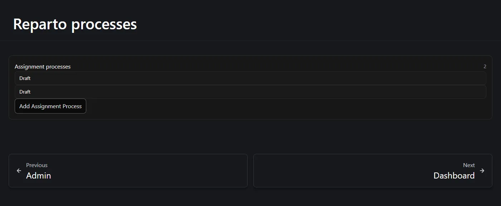
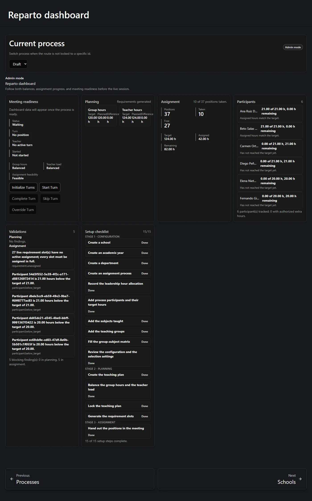
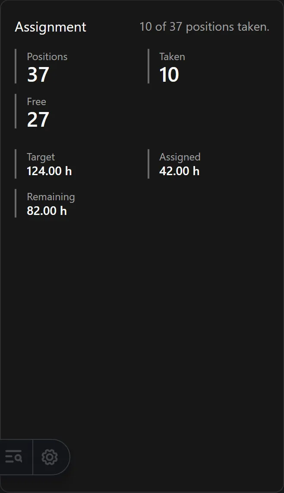

This page gets you from a blank browser to a working screen. It assumes somebody has
already installed and switched on the Reparto plugin for this site — see
[Is Reparto Docente switched on here?](/en/docs/reparto/#is-reparto-docente-switched-on-here)

**On this page:** [sign in](#1-sign-in) · [find the menu](#2-find-the-menu) ·
[choose a process](#3-choose-a-process) · [the checklist](#4-read-the-setup-checklist) ·
[what to do first](#5-what-to-do-first)

:::tip[Two buttons at the top of every page]
**?** answers *what is this page, and how do I work it*. **Setup checklist** answers
*where am I in the whole workflow*. Neither one takes over the page you are on.
:::

---

## 1. Sign in

Use the account link at the bottom of the left-hand menu, or go to the site's sign-in
page directly. Reparto Docente has no login of its own — it uses the same account you
use for the rest of this site.

What your account is allowed to do depends on its **role**. In short:

- **Administrator** or **Super administrator** — you are the *department head* here. You
  can do everything in this guide.
- **Writer** — you can act on your own records: your own teacher profile, your own
  position choices, your own turn.
- **Reader** — you can use the reader-floor pages and change nothing. Eight pages that
  contain other teachers' figures require Administrator even to view.
- **User** — this application is not available to you at all.

The full table is on [Who can do what](/en/docs/reparto/roles/).

## 2. Find the menu

When the plugin is switched on, a **Reparto Docente** entry appears in the left-hand
menu. Open it and you will find the three stages:

```text
Reparto Docente
├── Stage 1 · Configuration
│     Dashboard · Processes · Schools · Academic years · Departments
│     Classroom stages · Teacher roster · Leadership allocation
│     Process participants · Subjects · Teaching groups
│     Group-subject matrix · Process settings
├── Stage 2 · Planning
│     Planning · Requirements · Planning exports
└── Stage 3 · Assignment
      Assignments · Meeting · My view · Shared screen
      Versions · Exports · Audit
```

That menu **is** the running order. Working straight down it, top to bottom, is a valid
way to set up a department from scratch.

**Dashboard** and **Processes** sit at the head of Stage 1 because nothing else opens
until a process is selected — but neither is a step you perform. They report on the work
rather than do it, which is why their **?** panel says **Overview** rather than *Stage 1*.

:::tip
Every Reparto page also has **Previous** and **Next** links at the bottom, following the
same order. You can walk the whole application with those alone.
:::

## 3. Choose a process

Almost everything in Reparto Docente belongs to an **assignment process**: one
department, in one school, for one academic year. A process is the container for a whole
year's work.

Most pages carry a **Current process** bar at the top. If no process is selected yet,
the page shows **No process selected** in place of its content, with a single dropdown of
the processes that exist. Pick one and the page fills in. Your choice is remembered on
this browser, so you only do it once.



That screen only *chooses*. If no process exists yet, follow its **Create an assignment
process** link — or go straight to the **Processes** page, which is where processes are
created. Press **Create** there and pick the academic year, then the school, then the
department. All three must exist first, and each dropdown offers a **Create new** option,
so you can do the whole thing from that one screen.

:::note[Why creating is not on the dashboard]
A dashboard reports on a process, and it cannot report on one that does not exist. It
used to open on the create form, so the first thing you met on a fresh browser was a form
rather than the page you asked for. Creating now lives on **Processes** alone.
:::

:::note[The picker never asks for an identifier]
You choose a process by year, school and department — never by typing an internal code.
Validation findings that concern a participant use the participant's display name.
:::

## 4. Read the setup checklist

**Set up your reparto** is a checklist of fifteen steps, grouped by the three stages,
that tells you right now what is done and what is missing. You reach it two ways.

**From any page.** Every Reparto page carries a **Setup checklist** button at the top,
beside the **?** button. Press it and the checklist opens over the page; close it and you
are back where you were. The page you came for is never buried underneath it.

**On the dashboard.** The **Dashboard** shows the same checklist laid out in full,
because reporting on where the process stands is what a dashboard is for. It opens with a
progress bar and a count per stage — *Configuration 9/9, Planning 2/4, Assignment 0/2*
— then **Next**, naming the one step to do now, and then the full fifteen rows.



Each step reads **Done**, **Open**, or **Not checked here**. The last one is not a
failure: it means this particular screen does not read that piece of information — for
example, no process has been selected yet, so the process-level steps cannot be checked.
Those steps are counted separately and never counted as missing: *11 of 15 done, 2 not
checked here* says something different from *11 of 15 done*.

**Every step name is a link** to the page where that step is done, so you never have to
go looking for it in the menu.

The fifteen steps are:

| # | Step | Stage |
| --- | --- | --- |
| 1 | Create a school | 1 |
| 2 | Create an academic year | 1 |
| 3 | Create a department | 1 |
| 4 | Create an assignment process | 1 |
| 5 | Record the leadership hour allocation | 1 |
| 6 | Add process participants and their target hours | 1 |
| 7 | Add the subjects taught | 1 |
| 8 | Add the teaching groups | 1 |
| 9 | Fill the group-subject matrix | 1 |
| 10 | Review the configuration and the selection settings | 1 |
| 11 | Create the teaching plan | 2 |
| 12 | Balance the group hours and the teacher load | 2 |
| 13 | Lock the teaching plan | 2 |
| 14 | Generate the requirement slots | 2 |
| 15 | Hand out the positions in the meeting | 3 |

Beside the checklist, the dashboard shows the two balances, the three invariants, how
many positions are still free, and where each participant stands.



## 5. What to do first

If you are starting from nothing, do this in order. Each link goes to the detailed
instructions.

1. **[Create the school, academic year and department](/en/docs/reparto/stage-1-configuration/#global-setup)** —
   these are shared across the whole site, so they may already exist.
2. **[Add the classroom stages](/en/docs/reparto/stage-1-configuration/#classroom-stages)** —
   *ESO*, *Bachillerato*, and so on. Also shared, also possibly already there.
3. **[Add the teachers to the roster](/en/docs/reparto/stage-1-configuration/#teacher-roster)**.
4. **[Create the assignment process](/en/docs/reparto/stage-1-configuration/#the-assignment-process)**.
5. **[Record the leadership allocation](/en/docs/reparto/stage-1-configuration/#leadership-allocation)**.
6. **[Add the participants and their hours](/en/docs/reparto/stage-1-configuration/#participants)**.
7. **[Add the subjects and the teaching groups](/en/docs/reparto/stage-1-configuration/#subjects)**.
8. **[Fill the group-subject matrix](/en/docs/reparto/stage-1-configuration/#the-group-subject-matrix)**.
9. **[Check the process settings](/en/docs/reparto/stage-1-configuration/#process-settings)**.
10. Move on to **[Stage 2 — Planning](/en/docs/reparto/stage-2-planning/)**.

:::tip[You cannot break anything by looking]
Nothing in Reparto Docente changes when you open a page. Every action that changes
something asks you to confirm it first, and the ones that matter also ask you for a
written reason.
:::

---

**Previous:** [← How the plugin works](/en/docs/reparto/how-it-works/) ·
**Next:** [Who can do what →](/en/docs/reparto/roles/)
