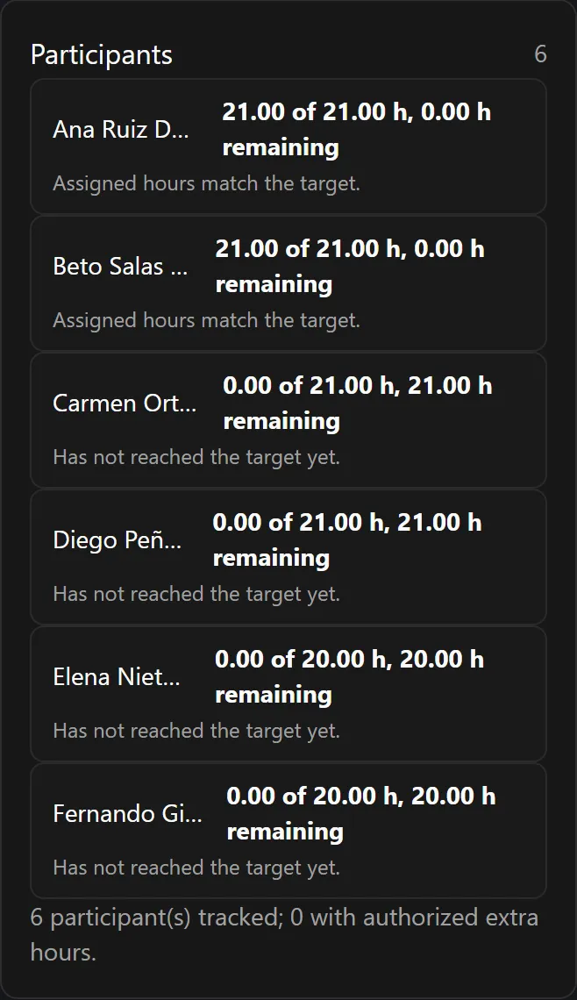
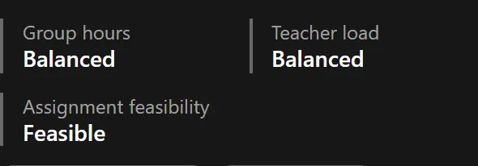

This is the page to read if a number on screen looks wrong. Nine times out of ten it is
not wrong — it is the *other* total.

**On this page:** [two balances](#two-balances-never-one) ·
[the worked example](#the-worked-example-120-and-124) ·
[tutoring](#a-second-example-tutoring) ·
[several classes](#a-third-example-one-activity-several-classes) ·
[indivisible positions](#indivisible-positions) ·
[exact targets](#exact-targets-and-authorized-extra-hours) ·
[feasibility](#the-third-check-feasibility) ·
[decimals](#how-hours-are-written)

---

## Two balances, never one

Reparto Docente tracks two completely separate totals.

**Group hours** — what the *classes* receive.

```text
group hours = Σ ( activity group hours per group × number of linked classes )
target      = the current leadership allocation
```

**Teacher hours** — what the *teachers* work.

```text
teacher hours = Σ ( activity teacher hours per position × teacher positions )
target        = Σ ( each participant's base hours + authorized extra hours )
```

Both are shown side by side, each with its target, its planned total and the difference.
The plan is **exact** when both differences are `0.00`.


:::danger[Never add them together]
120 + 124 is not a number that means anything. They measure different things. The
application never sums them, never averages them, and never shows a single combined
"total hours" figure — and neither should any report you build from it.
:::

## The worked example: 120 and 124

The department has been allocated **120** weekly group hours. Its six teachers have
contracted targets summing to **124** weekly hours. Here is how a plan satisfies both at
once:

| | Group hours | Teacher hours |
| --- | ---: | ---: |
| 31 ordinary main activities | 116 | 116 |
| 2 tutoring activities (1 h each, 2 teachers each) | 2 | 4 |
| 1 co-teaching activity (2 h, 2 teachers) | 2 | 4 |
| **Total** | **120** | **124** |

The gap of 4 hours is not an error and it is not slack. It is the *second teacher* in
each of those three activities. Two teachers standing in the same classroom for two
hours cost the class two hours and cost the department four.

## A second example: tutoring

A tutoring activity might be recorded as:

```text
group hours per group          1.00
teacher hours per position     2.00
teacher positions              1
```

That means: the class receives **one** weekly hour of tutoring, the teacher spends
**two** weekly hours on it (the session plus the preparation and follow-up), and it
produces **one** indivisible position of two hours.

Group hours and teacher hours are independent inputs. There is nothing odd about a
1-hour class costing a teacher 2 hours.

## A third example: one activity, several classes

If an activity is linked to several classes, its group hours count **once for each
class**:

```text
2 weekly hours × 2 classes = 4 group hours
```

The teacher side does not multiply by classes — it multiplies by positions:

```text
teacher hours per position × teacher positions
```

## Indivisible positions

Once the plan is locked, the application generates one **position** per teacher that the
plan needs. Each position carries a fixed number of hours, and:

- it goes to **one** teacher, in full;
- a 4-hour position cannot be split into 3 + 1;
- two teachers cannot share it;
- a teacher with 3 hours left cannot take it;
- two positions of the *same* activity must go to *different* teachers.

This is why the assignment board has no hours box. There is nothing to type — the hours
belong to the position, not to the assignment.


## Exact targets and authorized extra hours

Each participant has:

```text
base weekly hours        their contracted load
authorized extra hours   an explicit, reasoned, audited addition
target                   base + authorized extra
```

Every active participant must reach that target **exactly** before the process can be
closed. Below is refused, above is refused, and there is no override control anywhere in
the application.

When somebody genuinely needs a heavier load, the department head raises their
**authorized extra hours** first. That is a separate action, it requires a written
reason, and it is recorded in the audit trail. Reducing extra hours is refused if the
new target would fall below what the teacher has already been assigned.

Anyone carrying authorized extra hours is flagged as **authorized overload** wherever
they appear.



The teacher's own view shows the same five figures for themselves and nobody else:

```text
Base · Authorized extra · Target · Assigned · Remaining
```

## The third check: feasibility

Two matching totals do **not** prove the plan can actually be carried out.

Imagine three teachers who each need exactly 5 hours, and positions of 4, 4, 4, 2 and 1
hours. The totals match — 15 and 15 — but there is no way to give each teacher exactly
5 hours out of pieces that cannot be cut.

So Reparto Docente runs a third check, **assignment feasibility**, which asks: *is there
at least one way to hand out these indivisible positions so that every participant lands
exactly on their target?* It answers one of four things:

| Answer | Meaning |
| --- | --- |
| **Feasible** | Yes, and the application is holding a concrete example of how. |
| **Infeasible** | No. There is no arrangement that works. The plan must change. |
| **Unknown** | The check ran out of its allowed effort without deciding. Treated as "not proven", so it blocks. |
| **Not evaluated** | Nothing has been checked since the last relevant change. Run the evaluation. |

All three must hold before the plan can be locked:



:::note[Feasibility resets — that is normal]
Feasibility is deliberately *not* a status of the plan. It is its own answer, and any
relevant change resets it to **Not evaluated** rather than leaving a stale result on
screen. Seeing "Not evaluated" after you edited a participant is expected. Re-run the
evaluation from the Planning page.
:::

When a plan is infeasible, the department head — and only the department head — gets a
diagnostics panel explaining why, with concrete suggestions.


### What feasibility does *not* consider

In this version, **any active participant may take any position**. There is no notion of
a teacher being qualified for a subject, restricted to a stage, or tied to a class.
Legality depends only on: the participant being active, their exact remaining hours, the
positions they already hold, the rule that two positions of the same activity go to
different teachers, and the meeting rules.

Subject qualifications and similar restrictions are a documented future extension, not a
hidden feature — see
[Limitations](/en/docs/reparto/limitations/#no-teacher-qualifications-or-eligibility-rules).

## How hours are written

Every hour value is a two-decimal quantity: `2.50`, `21.00`, `0.00`. Differences may be
negative: `-4.00`. Values are always shown to two decimals so that two figures can be
compared by eye.

There is no forced quarter-hour or half-hour step. Any non-negative value with at most
two decimal places is accepted. A third decimal is refused rather than rounded — the
application will not silently change a number you typed.

:::note[Empty is not zero]
An empty hour field means *"inherit the default"*. A typed `0` means *"really zero"*.
The application keeps these apart everywhere, and no form collapses them. If you want a
matrix cell to follow its subject's default, **clear** the box; do not type `0`.
:::

---

**Previous:** [← Who can do what](/en/docs/reparto/roles/) ·
**Next:** [Stage 1 — Configuration →](/en/docs/reparto/stage-1-configuration/)
