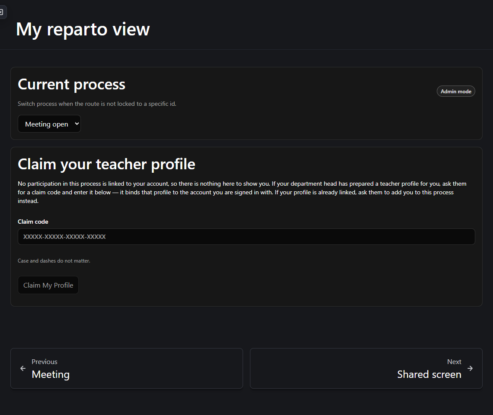
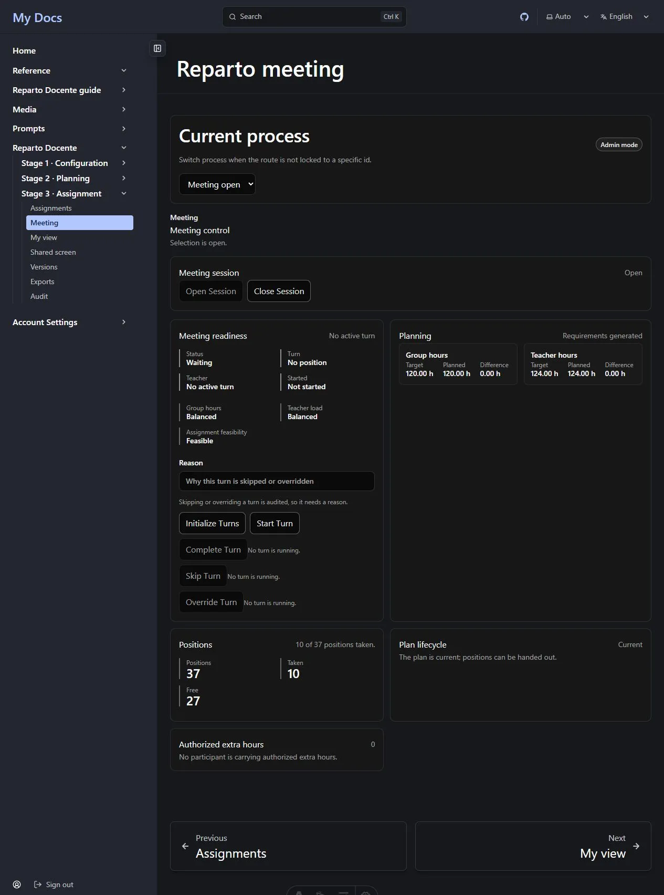

This page is deliberately blunt. It separates **blockers** — things that are meant to work
and currently do not — from **deliberate limits**, which are design decisions you should
not expect to change.

Read the blockers before you plan a real meeting.

**On this page:** [blockers](#blockers) · [rough edges](#rough-edges) ·
[deliberate limits](#deliberate-limits) · [operational limits](#operational-limits) ·
[what this means in practice](#what-this-means-in-practice)

---

## Blockers

### The live meeting cannot be run from the interface

This is the largest gap in the current version. Stage 3 can be completed **only** by the
department head, from the assignment board. The live selection meeting — where teachers
take their own positions in turn — cannot be driven from these screens.

Five distinct problems combine to that:

#### Teachers cannot be linked to their accounts (L1)

The teacher roster's **Link user** button links the account that is **currently signed
in**. A department head pressing it links *themselves*, not the teacher. There is no
control anywhere for linking a colleague's account.

Because *My view* is reached through that link, **no teacher can reach their own screen in
a deployment as shipped**. Opening *My view* as an unlinked account shows:

> *No teacher profile is linked to this auth user.*

A fix is not a one-line change: the accounts service restricts its user directory to super
administrators, so any working "link this colleague" control needs a directory that the
host supplies.

**Workaround:** none from the interface. The department head assigns every position from
the assignment board.

#### A meeting session cannot be opened or closed (L2)

Creating and closing a meeting session, and recording a participant's **selection
position** during the meeting, all exist underneath — with their data shapes, labels and
error messages — but no screen offers them. There is no button and no form field.

The direct consequence is that turn initialisation always fails, because there is no
session for it to initialise.

#### The turn controls do nothing (L3)

The meeting's five turn buttons — *Initialize Turns*, *Start Turn*, *Complete Turn*, *Skip
Turn*, *Override Turn* — and the teacher's *choose* and *pass turn* buttons are rendered
but **carry no action**. Pressing them has no effect.

Worse for a first-time user: the readiness panel does not check whether a meeting session
exists at all, so **Initialize Turns renders enabled** when there is nothing to
initialise.

#### Feasibility goes "Not evaluated" mid-meeting (L4)

Any edit to a participant invalidates the feasibility result. Recording something as
ordinary as a selection order drops the plan to **Not evaluated** and puts *"Assignment
feasibility: Not evaluated"* on the head's meeting screen in the middle of a meeting.

It is a **false alarm** — the live assignment path uses cheap checks and does not depend
on the stored evaluation — but it is alarming to read, and the invalidation is broader
than it needs to be.

**Workaround:** re-run the evaluation from the Planning page. Nothing is wrong.

#### The shared screen is missing two aggregates (L5)

Two figures the design asks the projector to show are absent: **how many teachers are
balanced versus still pending**, and **how many are carrying an authorized overload**. The
aggregate data the shared screen receives does not carry either number.

Both would be nameless counts, so this is a genuine gap rather than a privacy redaction.

### The production build is unusable as shipped

When this site is built as a static production bundle, its Content Security Policy blocks
about six of the documentation framework's own inline scripts. The result is a **collapsed
layout**: the sidebar overlays the main column and intercepts clicks meant for the page
content. Separately, the site root returns a 404 from the built output.

**In practice:** this affects the *host site*, not the Reparto plugin, and it does not
occur under the development server, where the policy is deliberately inert. Until it is
fixed, run the development server for real use, or fix the policy before deploying.

## Rough edges

These are smaller. They do not stop you working.

### Participants are sometimes named by identifier

Some validation messages composed by the server address a participant by a long internal
code rather than by name:

> *Participant 54d3f552-5e39-4f2c-a171-d88126972414 is 21.00 hours below the target of
> 21.00.*

The rule being reported is correct; only the label is unhelpful. Cross-reference the code
on the participants page, or read the same information from the dashboard's participant
balances panel, which does use names.

### Assignment can pause for a feasibility re-evaluation

While assigning, you may be refused with:

> *Selection is blocked because the deterministic witness could not be repaired
> (local_repair_not_found); administrative feasibility evaluation is required.*

This is the system working as designed — it will not let you continue on an arrangement it
can no longer prove — but it arrives without warning in the middle of a run of
assignments. Re-run the evaluation from the Planning page and continue. See
[Troubleshooting](/en/docs/reparto/troubleshooting/#selection-is-blocked-because-the-deterministic-witness-could-not-be-repaired).

### Teachers can reach more data than their screens show

A teacher who is a participant currently receives a successful response from the process
dashboard and participant-list endpoints, which carry other participants' names, hours and
the extra-hours reason field.

**No teacher-facing screen requests those endpoints**, so nothing is displayed, and both
the teacher's live-update stream and the shared screen are correctly redacted. But the
underlying permission is broader than the screens are, and the two rules that govern it
have not been reconciled. This is recorded as an open question, not a fixed decision.

### Two refresh paths are not coordinated

The authentication package holds two uncoordinated single-flight token-refresh guards, one
used by the API client and one used by the provider's own start-up check. If a page mounts
both against one expired token, both can issue a rotation instead of one, which is wasted
work and, latently, a race.

In practice this mostly shows up as one refused refresh per page load that survives
harmlessly, and one duplicate identity lookup per screen mount.

**Operational note:** signing in manually on an account while an automated run (a test
suite, a scripted session) already holds that same account open causes the accounts service
to revoke every session for it — two clients presenting one rotating refresh token is
exactly the reuse pattern it is built to catch. That is the identity service working
correctly, not this rough edge; do not sign in manually on an account an automated run is
using.

## Deliberate limits

These are decisions, not defects. Do not expect them to change.

### No teacher qualifications or eligibility rules

**Any active participant may take any position.** There is no concept of a teacher being
qualified for a subject, restricted to a stage or grade, tied to particular classes, or
flagged as a bilingual or specialist.

Legality depends only on: the participant being active; their exact remaining hours; the
positions they already hold; the rule that two positions of one activity go to different
teachers; and the meeting and turn rules.

Restricted eligibility is a documented future extension. Adding it is a large change — it
would need new data, a different feasibility calculation and revised interfaces — so it is
not something that can be switched on.

:::caution
Because there are no qualifications, the application will happily let you give a
Bachillerato statistics position to any participant. Deciding *who should* teach *what* is
your judgement, not the application's.
:::

### No automatic optimiser

Reparto Docente does **not** solve the plan for you. It gives you live balances, hard
limits and immediate validation, and you make the decisions. Secondary activities in
particular are added manually, because choosing them is the planning work.

### No manual editing of generated positions

There is no create, edit, bulk-create or delete for requirement slots. Their identity and
hours change only through generation or explicit reconciliation. This is what makes a
position safe to hand to a teacher.

### No partial or shared assignments

A position goes to one teacher in full. There is no hour box, no share type and no
over-assignment override anywhere in the application. A teacher who needs more hours gets
**authorized extra hours** first — a separate, reasoned, audited act that raises their
target.

### No status control

The process status is owned by the server. There is no transition control anywhere, and a
request that tries to set a status is refused. Opening a meeting session sets the status
itself.

### Archived is terminal

A **final** process can be reopened, with a written reason. An **archived** process cannot
— the screen explains this and offers no control. The final assignment export archives the
process, which is why it asks for an explicit confirmation.

### Nothing is deleted

Activities and matrix cells are **retired**, assignments are **undone** or **reassigned**,
and allocation figures are **superseded**. If you were looking for a delete button, there
isn't one, and that is the point.

### Development databases are reset, not migrated

There is no backward data migration and no compatibility layer for the older two-stage
assignment semantics. A development database from an earlier version is reset rather than
upgraded.

### Naming a department head requires the accounts directory

Setting a department's **Department head** field requires looking the target account up in
the accounts directory, and that lookup is restricted to super administrators. An
administrator can *clear* the field but usually cannot *set* it. This is the identity
service's own decision about who may use its directory, not a Reparto restriction, and it
is not something Reparto can widen.

Since the field authorizes nothing at all
([why](/en/docs/reparto/roles/#who-is-the-department-head)), this changes nothing about who
can run a department.

### The projector runs on a participant's session

Read access to a process follows participation. An account that takes part in no process in a
department gets no read access to that department's process at all — not even the read-only
shared screen.

**In practice:** a "plain projector account" that is not a participant sees *"No processes
yet."* and does not even ask the server about the process. This is accepted as a permanent
boundary rather than pursued as a fix: a dedicated read-only projector permission, separate
from participation, does not exist. Run the shared screen from the department head's session
or from a participant's session.

### The schema revision is generated at first start-up

No schema revision file ships in the repository. Migrations are generated from the declared
model metadata, and never authored disconnected from them: the revision is produced the
first time the stack is brought up, from the models as they stand at that moment, and
applied then. This is a deliberate policy, not an oversight.

**Operator note:** a deployment must complete one successful first start-up before the
application is usable. If you expect a pre-written migration file in the repository, you
will not find one — that absence is the design, not a gap.

## Operational limits

The feasibility check solves a genuinely hard problem, so it is bounded rather than
unlimited:

- It may answer **Unknown** when it runs out of its allowed effort. Unknown is treated as
  *not proven* and blocks the same way *Infeasible* does.
- The validated operating target is roughly **30 participants and 100 active positions**.
  Larger departments are not refused, but Unknown becomes likelier.
- The full solver runs only on administrative paths. It is never triggered by a teacher and
  never runs during the live assignment path, which uses cheap checks and a stored
  arrangement instead.

## What this means in practice

For a department running a reparto **today**:

| You want to… | Can you? |
| --- | --- |
| Configure a department and its matrix | ✅ Yes, fully. |
| Build, balance, validate and lock a plan | ✅ Yes, fully. |
| Generate the teacher positions | ✅ Yes, fully. |
| Assign every position as department head | ✅ Yes, fully, including undo and reassign. |
| Record allocation changes and reconcile them | ✅ Yes, fully. |
| Produce draft, provisional and final documents | ✅ Yes. |
| Capture versions, compare, back up and audit | ✅ Yes. |
| Let teachers pick their own positions live | ❌ No — see [the meeting blockers](#the-live-meeting-cannot-be-run-from-the-interface). |
| Run an ordered turn-based meeting | ❌ No — the controls carry no action. |
| Project a screen from a non-participant account | ❌ No — use the head's or a participant's session. |
| Deploy as a static production build | ⚠️ Not as shipped — the layout collapses. |

In short: **the whole reparto can be completed by the department head today. The live,
teacher-driven meeting cannot.**

---

**Previous:** [← Versions, exports and audit](/en/docs/reparto/versions-exports-audit/) ·
**Next:** [Troubleshooting →](/en/docs/reparto/troubleshooting/)
