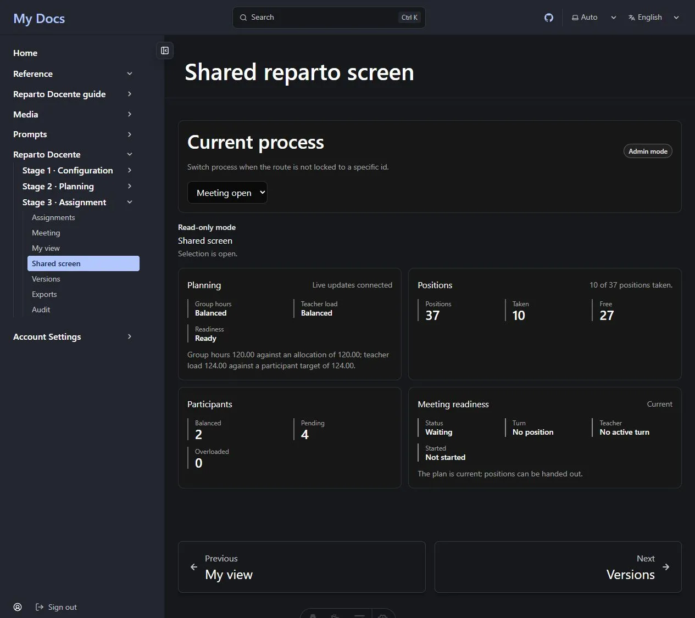

Stage 3 can be run from the [assignment board](/en/docs/reparto/stage-3-assignment/)
or as a **live selection meeting** in which teachers take their own positions in turn.
The live workflow is wired end to end in the current version.

The **Meeting** page contains department-head data and therefore requires
**Administrator** or **Super administrator** even to view. *My view* and *Shared screen*
remain Reader-floor projections because they never receive another teacher's figures.

**On this page:** [prepare teachers](#before-the-meeting-link-each-teacher) ·
[open a session](#open-the-meeting-session) · [turn controls](#drive-the-turns) ·
[teacher view](#my-view-the-teacher-screen) · [shared screen](#the-shared-screen) ·
[live updates](#live-updates)

---

## Before the meeting: link each teacher

An Administrator opens **Teacher roster** and chooses **Issue claim code** on each
unlinked profile. The code is shown once, works once and expires. Give it privately to
the named teacher.

The teacher signs in with their own account, opens **My view**, enters the code under
**Claim my profile**, and submits it. The profile is bound to the account that is signed
in; the department head never searches or selects an account from the protected accounts
directory. If the code is lost or expires, issue another.

The teacher must also be an active participant in the selected process. If an already
linked teacher still sees no process, add that roster profile under **Process
participants**.

## Open the meeting session

The **Meeting session** panel sits above the turn controls. It shows the latest session
or **No session open**.

1. Confirm the plan is current, requirements have been generated, and the process
   settings for LAN access, direct selection and selection order are correct.
2. Choose **Open session**. The new session carries those current settings forward and
   moves the process into its meeting state.
3. When the meeting is finished, choose **Close session** and confirm. Closing removes
   teachers' LAN access to that meeting.

With no open session, every turn action is disabled and visibly says **No meeting session
is open**. The interface no longer offers an action that the service would refuse for
lack of a session.


## Drive the turns

Five controls drive the ordered meeting:

| Control | Effect |
| --- | --- |
| **Initialize Turns** | Builds the turn order for the open session from participating teachers and their recorded positions. |
| **Start Turn** | Starts the next pending turn. |
| **Complete Turn** | Completes the active turn after its choice is resolved. |
| **Skip Turn** | Skips the active turn. A written reason is required and audited. |
| **Override Turn** | Overrides the active turn. A written reason is required and audited. |

Each control is connected to the selection-turn API. While one request is running the row
closes, and a refusal is shown beside the controls instead of becoming a silent no-op.
The active turn comes from the server; the buttons never let the browser invent a turn id.

The control room also shows both hour balances, plan lifecycle, positions taken and free,
assignment feasibility, and the authoritative **Overloaded** participant count with the
named authorized-overload rows. The aggregate three-way count belongs to Shared screen.

## My view: the teacher screen

**My view** shows only the signed-in teacher's own figures:

```text
Base · Authorized extra · Target · Assigned · Remaining
```

It also shows complete free positions, the current turn and the nameless aggregate plan
balance. It never receives another participant's hours or the written reason behind an
extra-hours authorization.

When direct selection is enabled, the meeting is open, the plan is ready and it is the
teacher's turn, they can select a free row and choose **Take this position**. The server
rechecks availability, ownership, exact remaining hours and the stored feasibility
witness. The teacher can also choose **Pass** for their own turn; that audited action uses
a safe default reason so an empty text field cannot trap a valid pass.

If no profile is linked, *My view* renders the claim-code form instead of a raw 404. If a
profile is linked but the teacher is not a participant in this process, it tells them to
ask the department head to add them.


## The shared screen

**Shared screen** is the projector view. It shows:

- group and teacher-hour balances;
- plan readiness and assignment feasibility;
- positions taken and free;
- the current turn by position number;
- balanced, pending and overloaded participant counts.



The response used by this view contains **no participant name, no per-teacher hours and no
written extra-hours reason**. The redaction happens in the server response, not in CSS or
a display option, so the projector cannot reveal those values.

There is no separate projector grant. A non-administrator account must already participate
in the department to see the process. Use the department head's session or a participant's
session for the projected screen.

## Live updates

Stage 2 and Stage 3 screens follow the process event stream. The page states whether live
updates are **connected**, **delayed** or **disconnected**. After a reconnect, sequence gap
or out-of-order event, it refetches the authoritative process rather than applying a
possibly incomplete patch.

Recording meeting-only metadata such as selection order does not invalidate the stored
feasibility evaluation. Solver-relevant changes still reset it to **Not evaluated** and
require a new administrative evaluation.

Each audience receives its own event tier. A teacher stream contains no other
participant's data, and the shared-screen payload names nobody.

---

**Previous:** [← Stage 3 — Assignment](/en/docs/reparto/stage-3-assignment/) ·
**Next:** [Versions, exports and audit →](/en/docs/reparto/versions-exports-audit/)
