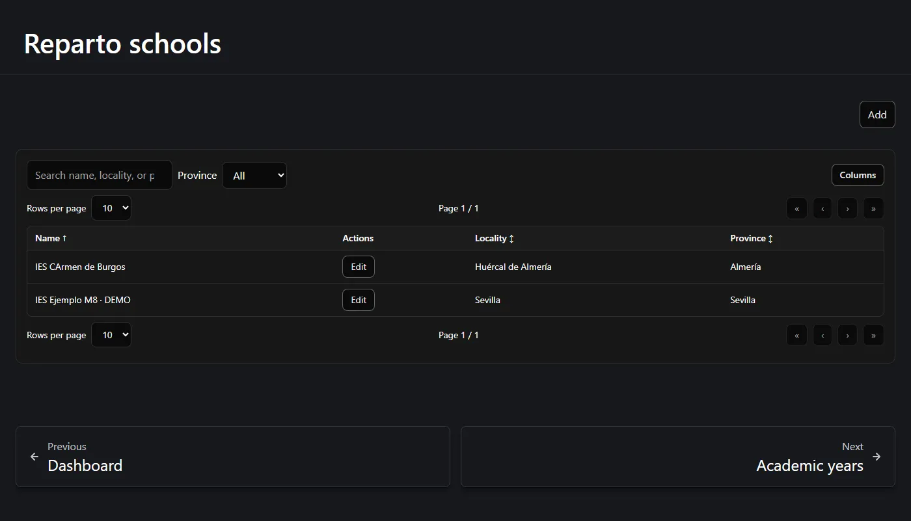
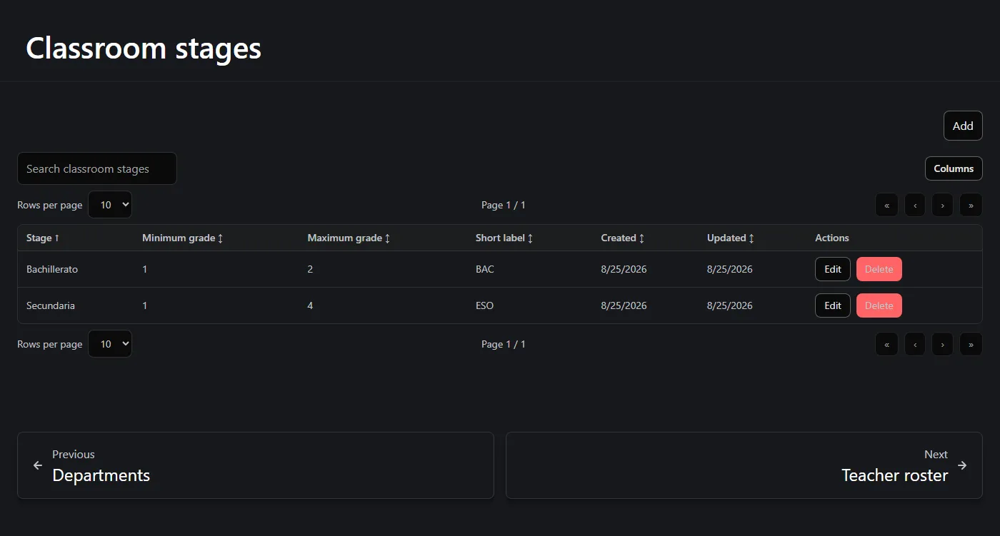
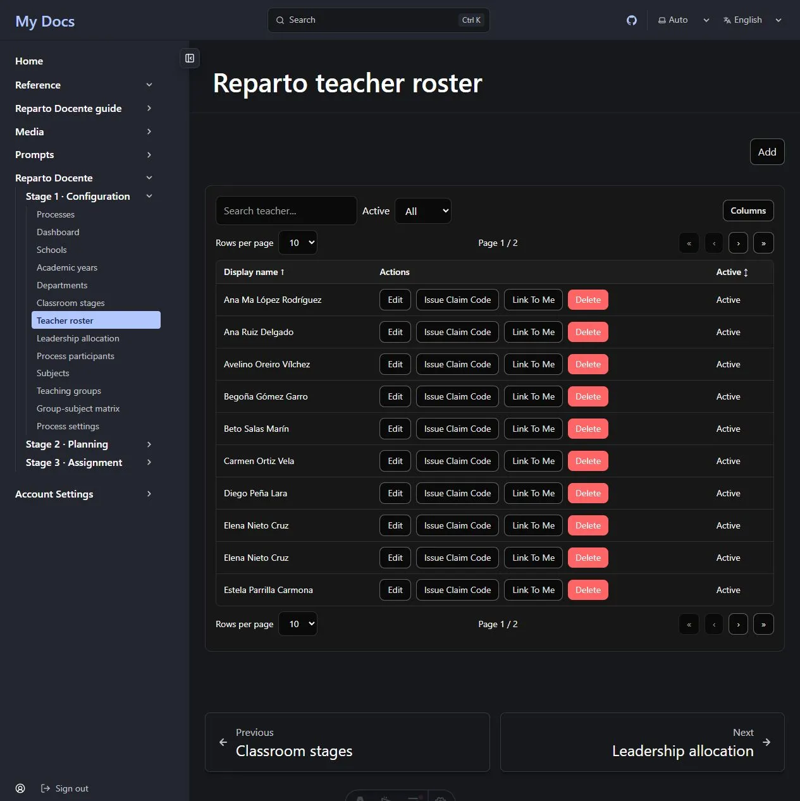
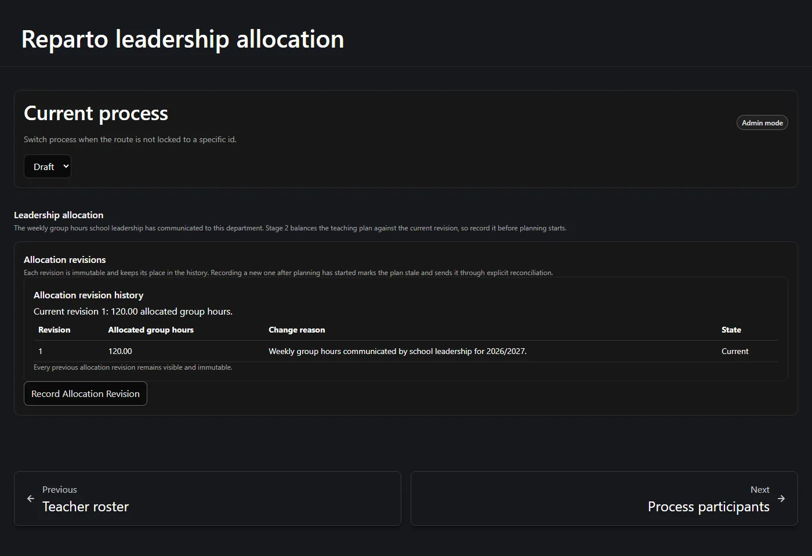
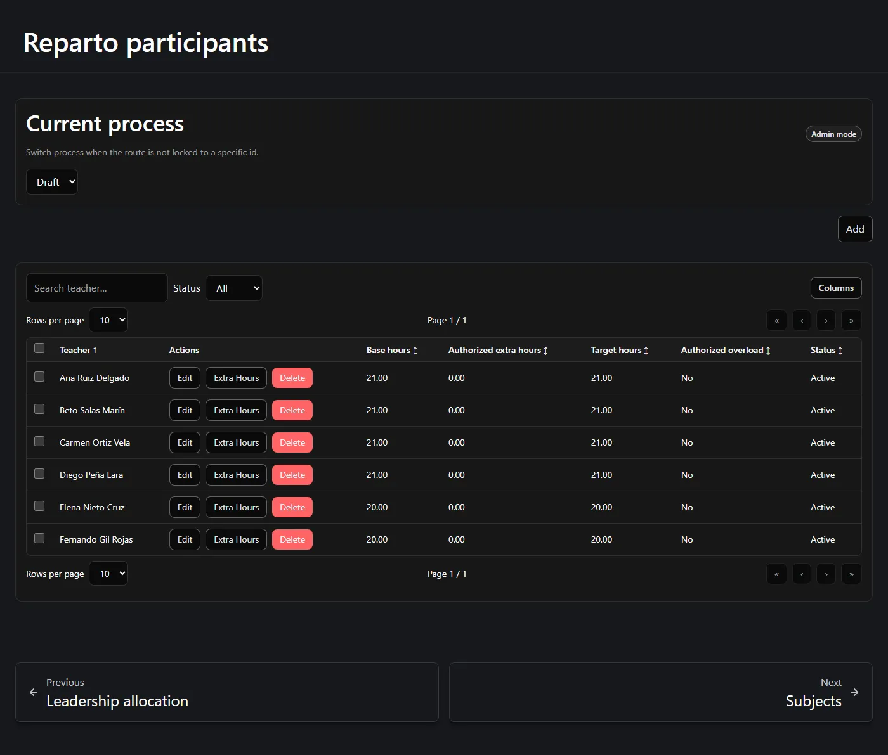
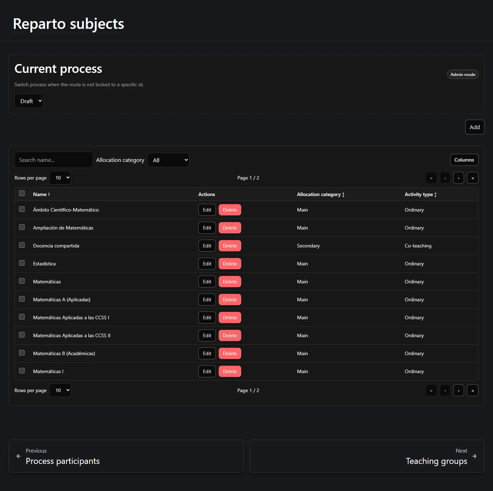
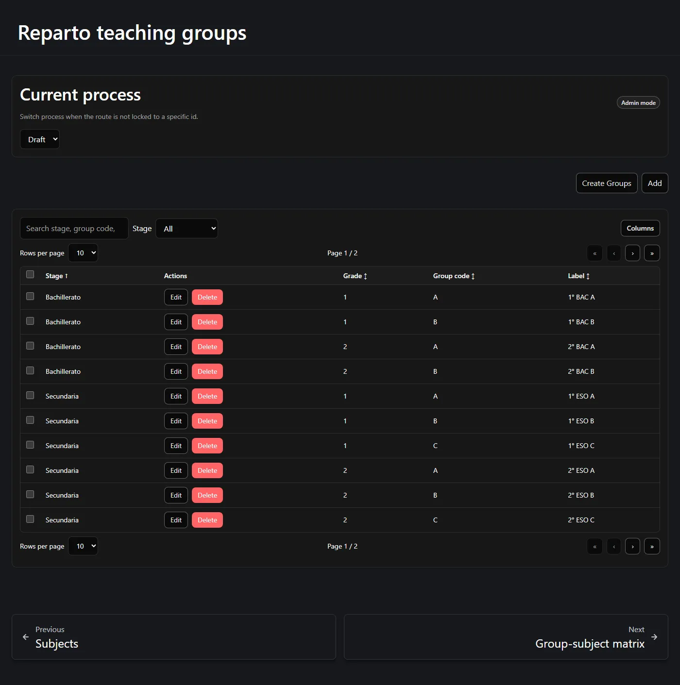
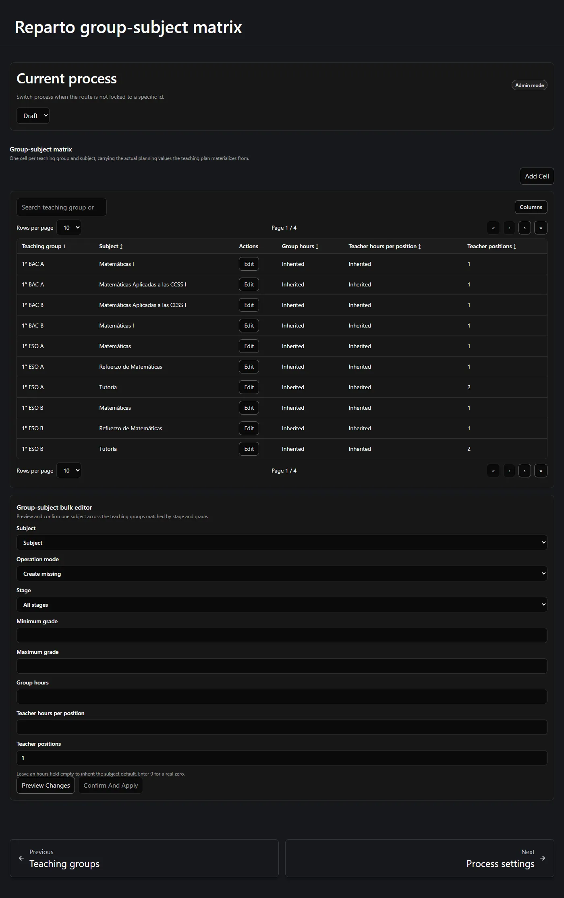
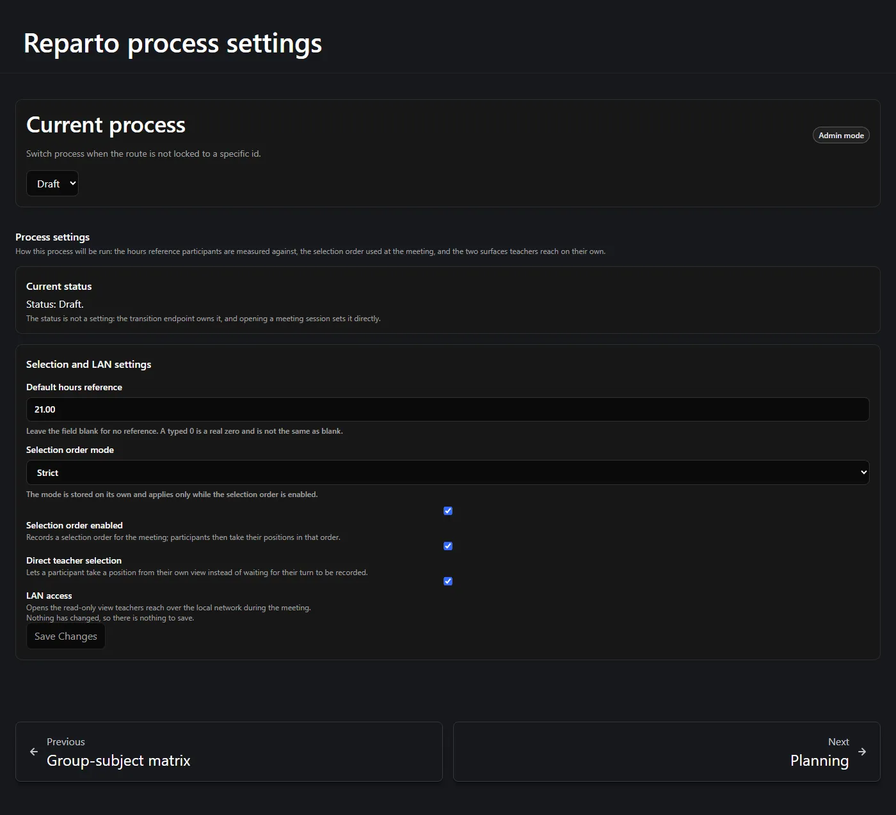

Stage 1 records the facts. Nothing is calculated here — you are simply telling the
application what exists. Work down the *Stage 1 · Configuration* group in the left-hand
menu and you will do these in the right order.

**On this page:** [global setup](#global-setup) · [class levels](#classroom-stages) ·
[teacher roster](#teacher-roster) · [the process](#the-assignment-process) ·
[allocation](#leadership-allocation) · [participants](#participants) ·
[subjects](#subjects) · [teaching groups](#teaching-groups) ·
[the matrix](#the-group-subject-matrix) · [settings](#process-settings) ·
[checklist](#before-you-move-on)

---

## Global setup

**Schools**, **Academic years** and **Departments** are shared by the whole site, not by
one process. If your school already uses Reparto Docente, they probably exist already —
check before creating duplicates.



- **School** — name, and optionally locality, province, region, address and notes.
- **Academic year** — a label such as *2026/2027*, a start date and an end date. A year
  belongs to a school and can point at the previous year, which is what makes
  "copy from last year" possible later.
- **Department** — belongs to a school, has a name and a short slug. The **Department
  head** field is descriptive only and grants no permission
  ([why](/en/docs/reparto/roles/#who-is-the-department-head)).

Creating these needs **Administrator** or above.

## Classroom stages

A **classroom stage** is a level of schooling: *Secundaria* (short label `ESO`, grades
1–4), *Bachillerato* (`BAC`, grades 1–2). They are shared site-wide, and they exist so
that a class can be named consistently.



Each stage has a name, a **short label** used in class names, and a minimum and maximum
grade. When you later create a teaching group, its grade is constrained to the stage you
picked, and its label is generated as:

```text
{grade}° {short label} {group code}     →     3° ESO B
```

A **Reader** or above may read the stages; creating and editing them needs **Administrator**.

## Teacher roster

The **Teacher roster** is the list of teaching staff known to the site — separate from
the site's user accounts. A roster entry has a display name, an active flag and notes.



A roster entry can be **linked** to a site account, which is what lets that teacher use
*My view* during a meeting.

:::note[Link a teacher without opening the accounts directory]
On an unlinked row, an Administrator chooses **Issue claim code**. The code is shown once,
works once and expires; give it privately to that teacher. The teacher signs in with their
own account, opens **My view**, and chooses **Claim my profile**. The service binds the
profile to the signed-in account, never to an account selected by the department head.

If a code is lost, issue another. The service stores only its hash, so it cannot display
the old code again. A linked row offers **Unlink user**; **Link to me** remains available
only for intentionally linking the signed-in Administrator's own profile.
:::

Editing a roster entry's own details is available to a **Writer** for their own entry;
creating profiles, issuing codes, linking, unlinking and deleting need **Administrator**.

## The assignment process

An **assignment process** is one department, in one school, for one academic year. It is
the container for everything that follows.

Create it from the **Processes** page, choosing the year, school and department. A new
process starts in status **Draft**.


:::note[You never set the status by hand]
The status moves on its own as the process progresses, and opening a meeting session
sets it directly. There is no status control anywhere in the application, and the server
refuses a request that tries to set one. The settings page shows the current status and
explains this.
:::

## Leadership allocation

This is step 2 of the workflow and it has its own page: **Leadership allocation**.
Record the weekly group hours that school leadership has given your department.



To record one you must supply:

- **Allocated group weekly hours** — greater than zero, at most two decimals.
- **A reason** — mandatory. This is a permanent record of *why* this figure is what it is.

What happens then:

- The figure becomes the **current** revision.
- Any previous revision is **superseded** and kept as history — nothing is overwritten.
- An audit event is recorded with your name and the time.

:::note[404 before the first revision is normal]
Until you record the first allocation, the "current allocation" simply does not exist
yet, and the page shows an empty state rather than an error. That is expected for a new
process.
:::

There is no edit and no delete. To change the figure you record a **new revision**, with
its own reason. If the process is already `final` or `archived`, you must reopen it
first.

## Participants

**Process participants** are the teachers taking part in *this* process. Add each one
from the roster and give them:

| Field | Meaning |
| --- | --- |
| **Base hours** | Their contracted weekly teaching load. |
| **Authorized extra hours** | Always starts at 0. Raised only through the separate, reason-required action. |
| **Target hours** | Calculated: base + authorized extra. Not editable. |
| **Participates in selection** | Whether they take a turn in the meeting. |
| **Selection position** | Their place in the meeting order. |
| **Status** | Active or inactive. |



The sum of every active participant's **target** is the teacher-hours target the plan
must hit exactly. In the worked example six teachers at 21, 21, 21, 21, 20 and 20 hours
give a target of **124**.

:::caution[Extra hours are not edited here]
**Authorized extra hours** cannot be typed into the participant form on either side of
the wire. Raising or lowering them is a distinct action that requires a written reason
and is audited, in both directions — withdrawing an authorization is the same action
with a value of `0`. Lowering is refused if the new target would fall below what the
teacher already holds.
:::

## Subjects

A **subject** is what is taught. Each one carries:

| Field | Meaning |
| --- | --- |
| **Name** | *Matemáticas*, *Tutoría*, *Docencia compartida*… |
| **Allocation category** | **Main** or **Secondary**. Main subjects are mandatory planning inputs; secondary ones are optional additions. |
| **Activity type** | *Ordinary*, *Tutoring*, *Co-teaching*, *Support*, *Department level*, *Other*. **Descriptive only** — it never changes how the application behaves. |
| **Default group hours** | Suggested hours the class receives. |
| **Default teacher hours per position** | Suggested hours one teacher spends. |
| **Default teacher positions** | How many teachers, by default. |
| **Allows multiple / zero groups** | Whether an activity of this subject may link several classes, or none. |



:::note[Defaults only seed; they never rewrite]
These defaults are used when a **new** matrix cell is created. Changing a default later
does **not** alter cells or activities that already exist. That is deliberate: your
per-class decisions are never silently overwritten.
:::

There is no "is main" checkbox — the distinction is the **allocation category**, which is
an extensible list rather than a yes/no.

## Teaching groups

A **teaching group** is a class: *1° ESO A*, *2° BAC B*. Create each one with its
classroom stage, its grade and its group code. The label is generated for you until you
change it by hand.



There is also a **Create Groups** bulk dialog: pick a stage, a grade and a range of group
codes (`A` to `D`, inclusive), preview the exact list, and create them all in one atomic
request.

## The group-subject matrix

This is the heart of Stage 1. The **matrix** holds one cell per (class, subject) pair
that actually exists — and it carries the **actual** planning values that Stage 2 works
from.



Each cell holds:

- **Group hours** — or *Inherited*, meaning "use the subject default".
- **Teacher hours per position** — or *Inherited*.
- **Teacher positions** — always an explicit positive number; this one has no default to
  fall back on.
- **Active** — whether the cell counts.

The class and the subject are the cell's **identity** and cannot be changed. To point a
cell at a different class or subject you retire it and create another.

### Filling the matrix one subject at a time

Adding thirty cells one at a time is tedious, so the page also carries the **bulk
editor** below the list. It fills **one subject** across a filtered range of classes:

1. Pick the **Subject**.
2. Pick the **Operation mode** — *Create missing*, or the modes that also update existing
   cells.
3. Narrow the classes with **Stage**, **Minimum grade** and **Maximum grade**. Leave them
   open to match everything.
4. Optionally set **Group hours**, **Teacher hours per position** and **Teacher
   positions**. A field you leave empty is left untouched on existing cells.
5. Press **Preview Changes**.
6. Read the preview: how many cells will be **created**, **updated** and left
   **unchanged**, plus any conflicts and any errors with your selection.
7. Only then does **Confirm And Apply** become available.

:::caution[Apply is never sent without a preview]
The application will not issue an apply request that has not been previewed, and the
preview carries the exact number of rows it expects to touch. If anything changed in
between, the server refuses the apply and the preview is discarded. **Preview again**
rather than pressing apply a second time.
:::

The screen states the rule about empty fields directly: *"Leave an hours field empty to
inherit the subject default. Enter 0 for a real zero."*

## Process settings

The last Stage 1 step. This page decides how the process will be run.



| Setting | What it does |
| --- | --- |
| **Default hours reference** | The reference load participants are measured against. Leave blank for none — a typed `0` is a real zero and is not the same as blank. |
| **Selection order mode** | *Strict*, *Informative* or *None*. Applies only while the selection order is enabled. |
| **Selection order enabled** | Records a selection order for the meeting; participants then take positions in that order. |
| **Direct teacher selection** | Lets a participant take a position from their own view instead of waiting for their turn to be recorded. |
| **LAN access** | Opens the read-only view teachers reach over the local network during the meeting. |

Only the fields you actually changed are sent. If you have changed nothing, the page
says so and the save button stays inert.

### Reopening a closed process

This page also carries the **reopen** control, which appears only while the process is
frozen:

- **Final** — every change to the process is refused. Reopening is offered, and requires a
  written reason.
- **Archived** — terminal. The page explains this and offers no control, because there is
  nothing to offer.

## Before you move on

Stage 2 has nothing to work with until all of this is true:

- [x] A school, an academic year and a department exist.
- [x] Classroom stages exist.
- [x] An assignment process exists and is selected.
- [x] A leadership allocation revision has been recorded.
- [x] Participants exist with their base hours.
- [x] Subjects exist with sensible defaults.
- [x] Teaching groups exist.
- [x] **At least one matrix cell exists.**
- [x] The process settings have been reviewed.

The dashboard checklist tells you which of these are still open at any moment — as does
the **Setup checklist** button at the top of whichever page you are on. Every line in it
links to the page that step is done on.

---

**Previous:** [← Hours, balances and feasibility](/en/docs/reparto/hours-and-balances/) ·
**Next:** [Stage 2 — Planning →](/en/docs/reparto/stage-2-planning/)
