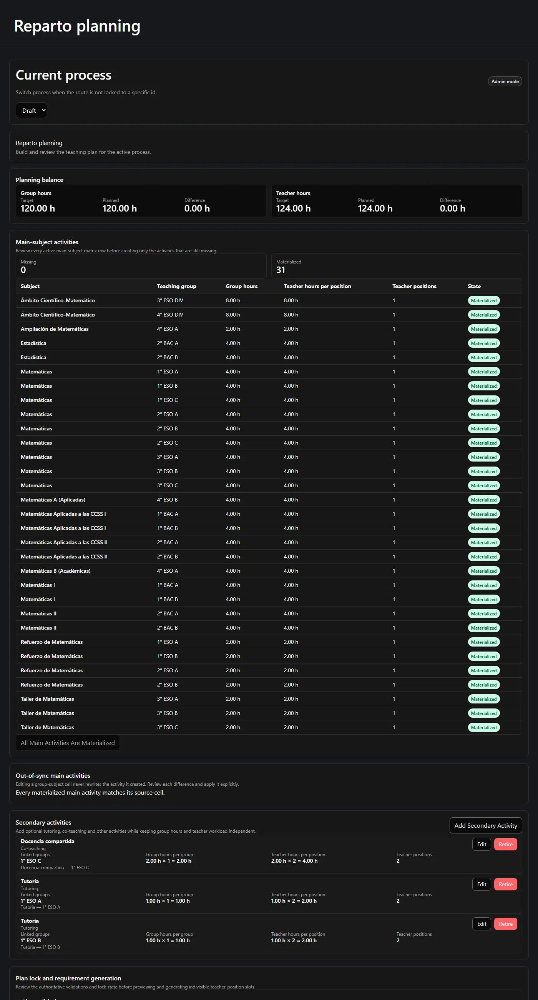
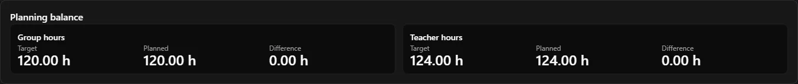
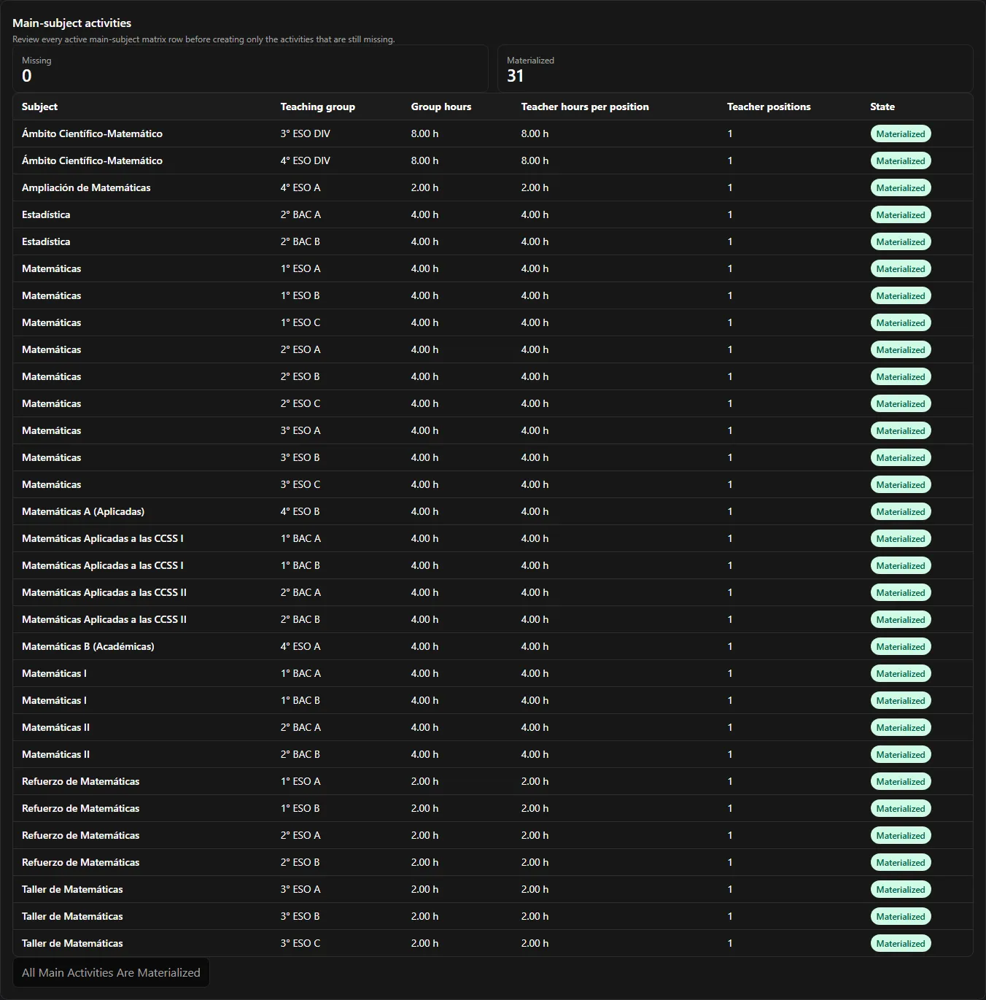
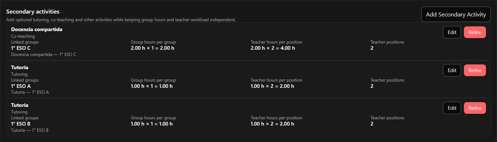
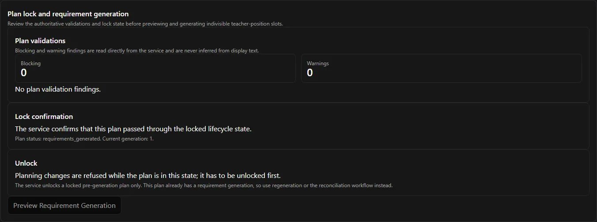
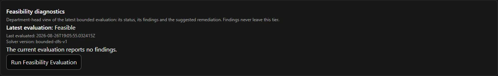
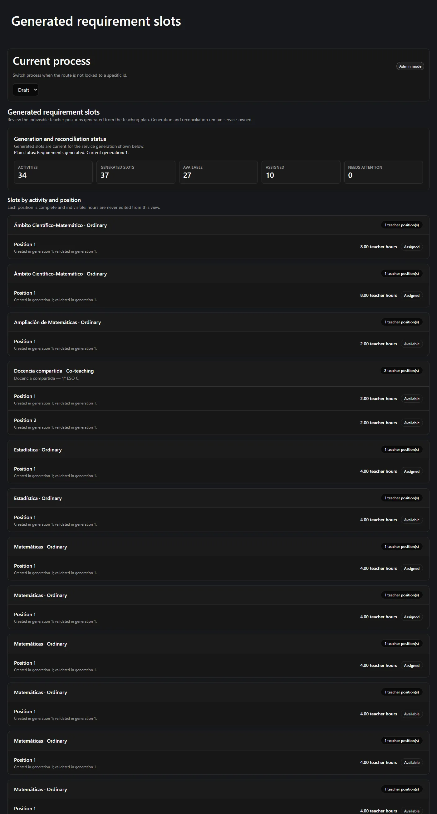
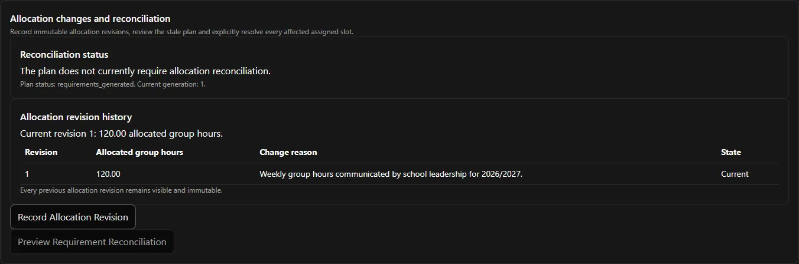

Stage 2 turns your configuration into a **teaching plan**: what is actually taught, by
how many teachers, for how many hours. When it is balanced, feasible and locked, the
application generates the indivisible teacher positions that Stage 3 hands out.

Everything on this page happens on one screen: **Planning**.



**On this page:** [create the plan](#0-create-the-teaching-plan) ·
[balances](#1-watch-the-two-balances) ·
[materialise main activities](#2-materialise-the-main-activities) ·
[out-of-sync cells](#out-of-sync-main-activities) ·
[secondary activities](#3-add-the-secondary-activities) ·
[validations](#4-read-the-validations) ·
[feasibility](#5-check-feasibility) · [lock](#6-lock-the-plan) ·
[generate](#7-generate-the-positions) ·
[requirements](#the-requirements-page) ·
[allocation changes](#when-the-allocation-changes)

---

## 0. Create the teaching plan

A process owns **at most one** teaching plan, and the plan is not created with the
process. Until somebody creates it, every Stage 2 screen is empty — not broken.

The Planning page shows that as an empty state and offers a **create** action. Once the
plan exists, the panel disappears. If two people press create at the same time, the
second attempt is refused in the server's own words; nothing is duplicated.

Creating the plan needs **Administrator** or above.

## 1. Watch the two balances

The balance header sits at the top of the Planning page and stays visible while you
work. It never leaves the screen, because it is the thing you are steering by.



Two axes, each with **Target**, **Planned** and **Difference**:

- **Group hours** — planned against the current leadership allocation.
- **Teacher hours** — planned against the sum of participant targets.

They are two different measurements and are never summed. If that seems odd, read
[Hours, balances and feasibility](/en/docs/reparto/hours-and-balances/) first.

Your goal in Stage 2 is to get **both** differences to `0.00`.

## 2. Materialise the main activities

**Main-subject activities** are created for you from the matrix. The panel compares every
active main-subject matrix cell against the activities that already exist, and labels
each row **Missing** or **Materialized**.



The row shows exactly what will be — or was — created:

| Column | From |
| --- | --- |
| Subject | the matrix cell |
| Teaching group | the matrix cell |
| Group hours | the cell, or the subject default if the cell inherits |
| Teacher hours per position | the cell, or the subject default |
| Teacher positions | the cell |

The create action is available only while rows are missing, and it asks for a separate
confirmation that it will create the **missing ones only**. It is safe to press twice:
the server's endpoint is idempotent, so an already-materialised row is skipped rather
than duplicated.

In the worked example this creates **31** activities totalling **116** group hours and
**116** teacher hours.

### Out-of-sync main activities

Editing a matrix cell never rewrites the activity it created. Instead the activity is
marked **out of sync**, and a panel below shows each difference so you can review and
apply it explicitly.

When everything agrees, that panel simply says *"Every materialized main activity matches
its source cell."*

## 3. Add the secondary activities

Secondary activities are the discretionary part of the plan — tutoring, co-teaching,
support, department duties. You add them by hand, because deciding them *is* the
planning work.



Each secondary activity takes:

| Field | Notes |
| --- | --- |
| **Subject** | Chosen from the process subjects. |
| **Activity type** | Descriptive label only — it never drives behaviour. |
| **Linked groups** | One, several or none, according to what the subject allows. |
| **Group hours per group** | What each linked class receives. |
| **Teacher hours per position** | What one teacher spends. |
| **Teacher positions** | A positive whole number. |

The row then shows you the arithmetic, so you can see the two balances moving:

```text
Docencia compartida · Co-teaching
  Group hours per group        2.00 h × 1 = 2.00 h
  Teacher hours per position   2.00 h × 2 = 4.00 h
  Teacher positions            2
```

That single activity adds **2** to the group total and **4** to the teacher total — which
is exactly how a plan reaches 120 and 124 at the same time.

Every change refreshes the balances, the validations, the requirement view and the
dashboard immediately.

:::note[Activities are retired, not deleted]
The row action is **Retire**, not delete. A retired activity stops counting but stays
visible with its retirement date. Nothing disappears from the record.
:::

## 4. Read the validations

The **Plan validations** panel shows what the *server* thinks, split into **Blocking**
and **Warning** counts.



Findings are printed from the server's own message with a stable code attached. The
interface holds no copy of the rules and never guesses a finding from what it can see on
screen — so what you read here is authoritative.

A finding you will meet early is `plan.requirements_not_generated`. That one is expected
before generation and does **not** stop you locking.

## 5. Check feasibility

Feasibility is the third invariant
([what it means](/en/docs/reparto/hours-and-balances/#the-third-check-feasibility)). Run
the evaluation from the Planning page.



- **Feasible** — the application holds a concrete arrangement proving the positions can be
  handed out exactly.
- **Infeasible** — no arrangement exists. A department-head-only diagnostics report
  explains why and suggests remedies.
- **Unknown** — the check ran out of its allowed effort. Treated as not proven, so it
  blocks.
- **Not evaluated** — the default, and what any relevant change resets it to.

:::note[Only solver inputs reset it]
Changing participant hours or active status, activities, the matrix, positions or
assignments resets feasibility to **Not evaluated** rather than leaving a stale answer on
screen. Meeting-only metadata such as selection order does not invalidate it, so recording
turns no longer creates a false alarm during a live meeting. Re-run the evaluation after
the last change that affects targets or positions.
:::

## 6. Lock the plan

Locking freezes the plan so positions can be generated from it. The lock action becomes
available only when **all** of these hold:

- group hours balanced exactly;
- teacher hours balanced exactly;
- feasibility **Feasible**, evaluated against the plan as it stands now;
- no blocking findings that count against the lock.

It then asks for a focused confirmation. The server is the final authority — the
interface's check is only about whether to offer the button.

Locking is **not** a one-way door. The same panel carries **Unlock**, which appears
whenever the plan's state refuses planning edits. The server accepts an unlock for a
**locked, pre-generation** plan only. Once positions have been generated, the panel says
so plainly and points you at regeneration or reconciliation instead of offering a
control that would be refused:

> *The service unlocks a locked pre-generation plan only. This plan already has a
> requirement generation, so use regeneration or the reconciliation workflow instead.*

## 7. Generate the positions

Generation becomes available once the server reports the plan as **locked** (or
**stale**). It runs in two steps.

**Preview.** *Preview Requirement Generation* shows the deterministic difference:

| Bucket | Meaning |
| --- | --- |
| **Create** | New positions this generation will add. |
| **Preserve** | Positions that already exist and are unchanged. |
| **Retire** | Positions no longer supported by the plan. |
| **Conflict** | Positions that cannot be changed automatically — usually because somebody already holds them. |

**Apply.** Confirming performs the generation. The result shows the **generation number**
and the authoritative count of live positions.

In the worked example this produces **37** positions at generation **1**:

```text
21 positions × 4.00 h   (ordinary main subjects)
 2 positions × 8.00 h   (the Ámbito activities)
10 positions × 2.00 h   (support, workshop and co-teaching)
 4 positions × 1.00 h   (tutoring)
───────────────────────
37 positions, 124.00 teacher hours
```

:::caution[Conflicts disable apply]
If the preview reports conflicts, apply is disabled and you are directed to the
reconciliation workflow. Conflicts mean somebody already holds a position that
generation would have to change, and that is never done silently.
:::

## The requirements page

**Requirements** is the read-only result. It groups the generated positions by teaching
activity and by position number (shown starting at 1), and states each one's lifecycle:
**Available**, **Assigned**, **Stale** or **Reconciliation required**.



There is deliberately **no** manual create, edit, bulk-create or delete here. Position
identity and hours change only through generation or explicit reconciliation — that is
what makes a position trustworthy enough to hand to a teacher.

## When the allocation changes

School leadership may revise the allocation at any time, including after you have planned
and assigned. Recording a new revision:

1. supersedes the previous one, which stays visible and immutable;
2. marks the teaching plan **stale**;
3. recomputes both balances;
4. **blocks new assignment operations**;
5. leaves every existing activity, position and assignment in place;
6. requires explicit **reconciliation** before the process can continue.

The **Allocation changes and reconciliation** panel on the Planning page is where this
happens.



The panel carries the revision history — *"Every previous allocation revision remains
visible and immutable"* — and two actions: **Record Allocation Revision** and **Preview
Requirement Reconciliation**.

The reconciliation preview keeps unchanged positions and existing assignments visible,
identifies every affected assigned position, and offers the manual **release/replace** or
**release/retire** action for each. Applying requires a written reason **and** the
preview's exact conflict count.

:::caution[A stale preview is discarded, never retried]
If anything changed between preview and apply, the server refuses and the preview is
thrown away. Preview again — do not press apply a second time. Nothing is ever corrected
destructively or automatically: no allocation change deletes an assignment behind your
back.
:::

Once conflicts are resolved, regeneration creates a **new generation number** and the
plan returns to a generated state.

If the process is `final`, it must be reopened before its allocation can change at all.

---

**Previous:** [← Stage 1 — Configuration](/en/docs/reparto/stage-1-configuration/) ·
**Next:** [Stage 3 — Assignment →](/en/docs/reparto/stage-3-assignment/)
