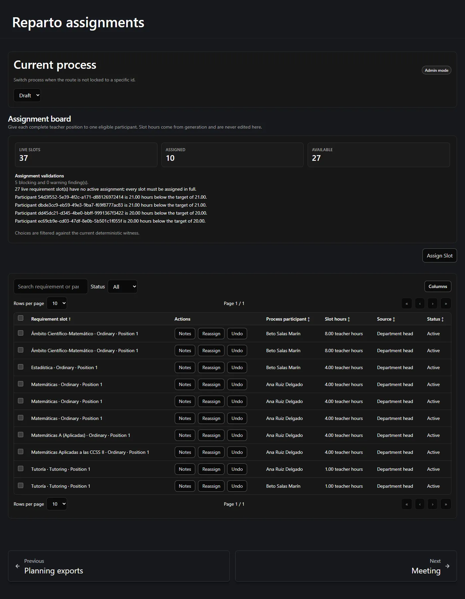
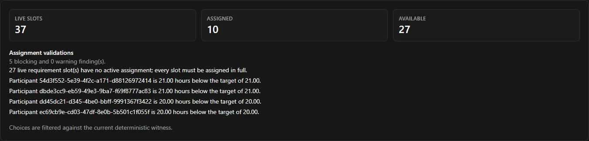

Stage 3 hands out the positions that Stage 2 generated. One row is one participant
holding one complete position, in full.

**On this page:** [the board](#the-assignment-board) ·
[assigning](#giving-a-position-to-a-teacher) ·
[why a choice is blocked](#why-a-choice-is-offered-blocked-or-absent) ·
[undo](#undo-cancelling-an-assignment) ·
[reassign](#reassign-moving-a-position) ·
[bulk undo](#undoing-several-rows-at-once) ·
[finishing](#when-is-stage-3-finished)

---

## The assignment board

Open **Assignments**. The board opens with a count of the live positions, how many are
assigned and how many are still free, followed by the server's own validation findings.

Each row of the table states:

| Column | Meaning |
| --- | --- |
| **Requirement slot** | The activity, its type, and the position number — *Matemáticas · Ordinary · Position 1*. |
| **Process participant** | Who holds it. |
| **Slot hours** | The teacher hours this position costs. **Read-only.** |
| **Source** | How it was assigned — *Department head*, or a teacher's own choice. |
| **Status** | *Active* or *Cancelled*. |

:::note[There is no hours box, and that is deliberate]
The board has no hour input, no share type and no over-assignment override. The hours
come from the generated position and cannot be edited here. A position is taken whole or
not at all.
:::

## Giving a position to a teacher

Press **Assign Slot**. The dialog offers:

1. **A position** — only positions that are live and free.
2. **A participant** — only participants the server would actually accept.

The second list is the important one. Participants who cannot take the selected position
are **listed with the reason** rather than silently dropped, so you can see why:

| Reason | Meaning |
| --- | --- |
| The participant is inactive | They are not active in this process. |
| They already hold another position of the same activity | Two positions of one activity must go to different teachers. |
| It would push them past their remaining target | The position is bigger than the hours they have left, and it cannot be split. |

Because a position cannot be split, "exact fit" is checked everywhere: a teacher with 3
hours remaining will never be offered a 4-hour position.

### The safe-choice filter

When the plan is currently feasible, the board also consults the server's stored
arrangement and applies a conservative extra filter. A choice that provably breaks it is
shown **disabled**; the choice the arrangement itself uses is marked **safe**; the rest
stay available and are checked authoritatively by the server when you confirm.

The board tells you which state it is in — *"Choices are filtered against the current
deterministic witness."* If that information is stale or unavailable, the filter **fails
closed**: it stops offering guidance rather than offering wrong guidance.

:::note[This is guidance, not the rule]
The filter is a convenience. The server re-checks every assignment when you confirm it,
and it is the one that decides. It is also never shown to teachers or on the projector —
they see only the plain readiness status.
:::

## Why a choice is offered, blocked or absent

Three different things can stop an assignment, and they read differently:

| What you see | What it means | What to do |
| --- | --- | --- |
| The participant is listed with a reason | A domain rule refuses this pairing. | Pick a different participant or a different position. |
| A refusal mentioning the deterministic witness | The stored arrangement could not be adjusted for this choice on the spot. | Re-run the feasibility evaluation from the Planning page, then try again. |
| The whole board refuses new assignments | The plan is stale or needs reconciliation. | Go to [Stage 2 — when the allocation changes](/en/docs/reparto/stage-2-planning/#when-the-allocation-changes). |

The second one is worth expecting. A message such as:

> *Selection is blocked because the deterministic witness could not be repaired
> (local_repair_not_found); administrative feasibility evaluation is required.*

is not a fault. It means the cheap on-the-spot check could not prove the remaining
positions still work out, and it wants a proper re-evaluation. Run it and continue — see
[Troubleshooting](/en/docs/reparto/troubleshooting/#selection-is-blocked-because-the-deterministic-witness-could-not-be-repaired).

## Undo: cancelling an assignment

**Undo** releases a position and re-opens the holder's completed meeting turn. It
requires a **written reason** and it is restricted to **Administrator** and above.

The cancelled row stays on the board as history, with no action buttons — it is a record
of a decision that was made and then reversed, not a mistake to be erased.

## Reassign: moving a position

**Reassign** moves a position from one teacher to another. It is a single atomic
operation, not a delete followed by a create, so the position is never briefly
unassigned. It also requires a **written reason** and **Administrator** or above.

The replacement participant list is filtered the same way as for a new assignment.

## Undoing several rows at once

Several active rows can be undone together from the table's selection checkboxes. One
dialog collects **one** reason, records it against each row, and applies them one at a
time.

If one of them is refused, the run **stops there** and reports how many went through. The
rows already undone stay undone — the operation is not rolled back. Read the count in the
result before assuming everything was released.

## When is Stage 3 finished?

The board's validation panel tells you what is still outstanding. The process is complete
when:

- every live position has an active assignment;
- every active participant has reached their target **exactly**;
- the plan is not stale and needs no reconciliation.

Only then does the strict final export become available — and it archives the process.
See [Versions, exports and audit](/en/docs/reparto/versions-exports-audit/#the-final-assignment-export).

Validation findings name the affected participant and quote the relevant hours, so the
person and the rule can be identified from the message itself.

---

**Previous:** [← Stage 2 — Planning](/en/docs/reparto/stage-2-planning/) ·
**Next:** [The meeting, teacher view and shared screen →](/en/docs/reparto/meeting-and-lan/)
