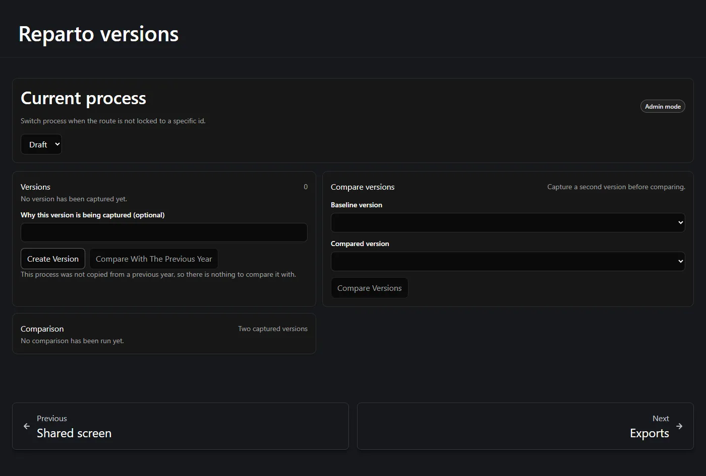
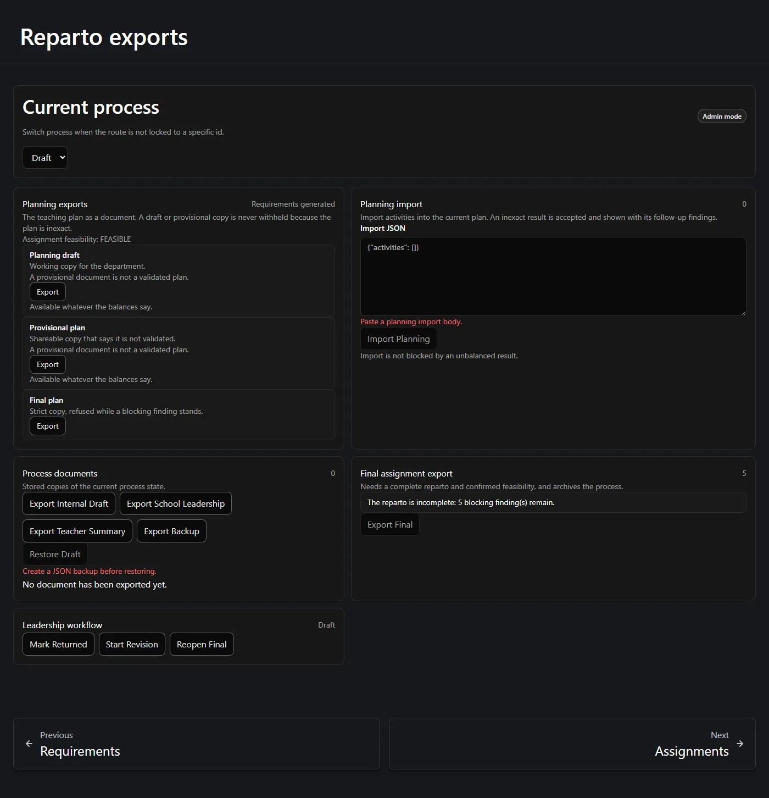
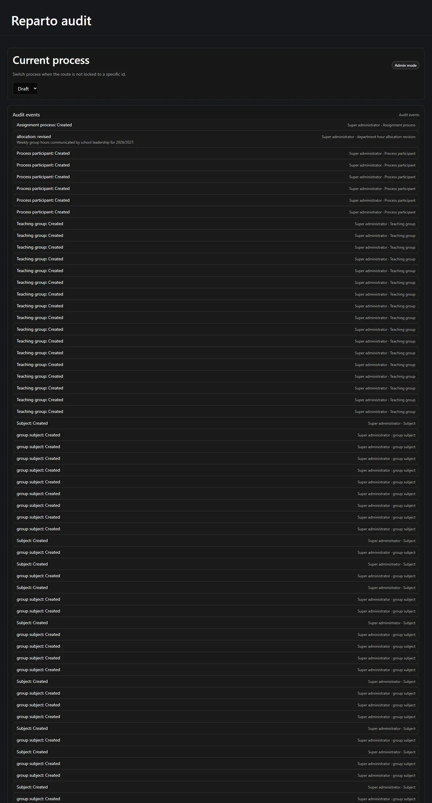

These three screens are how a reparto leaves the application: as a snapshot you can come
back to, as a document you can send, and as a record of who did what.

**On this page:** [versions](#versions) · [comparison](#comparing-two-versions) ·
[planning exports](#planning-exports) · [import](#planning-import) ·
[process documents](#process-documents-and-backup) ·
[final export](#the-final-assignment-export) · [audit](#the-audit-trail)

---

## Versions

A **version** is an immutable snapshot of the whole process, taken on request. Give it an
optional note saying why you are capturing it, and press create.

A snapshot captures everything that matters:

- the allocation revisions and which one was current;
- the teaching plan and its status;
- the group-subject matrix;
- the teaching activities and their linked groups;
- both hour summaries;
- the generated positions;
- each participant's base and extra hours;
- the reconciliation state.

## Comparing two versions

The comparison is the server's own answer, not a text diff. It reports **nine named
dimensions**, each with a signed difference where one applies:

| Dimension |
| --- |
| Leadership allocation changed |
| Group hours changed |
| Teacher load changed |
| Subject category changed |
| Activity added or removed |
| Group link added or removed |
| Teacher-position count changed |
| Participant base/extra target changed |
| Requirement generation changed |

A dimension may read **not comparable** — for example, an allocation difference where one
side has no allocation at all. That is a real answer, distinct from "no change".

The same screen also drives the **previous-year comparison**, which is what makes a
year-on-year review possible.

:::note[What "copy from last year" does and does not bring]
Copying from a previous year brings the subjects and their defaults, the teaching groups,
the matrix rows, and the participants **without** their extra-hour approvals. It
deliberately does **not** bring the leadership allocation as an active revision, nor any
assignment, meeting, turn or extra-hour approval. A previous allocation may be displayed
as a suggestion, never adopted silently.
:::

## Planning exports

The **Exports** page separates three different families of document, because they follow
different rules.

**Planning exports** are the teaching plan as a document:

| Document | Rule |
| --- | --- |
| **Planning draft** | A working copy for the department. *Available whatever the balances say.* |
| **Provisional plan** | A shareable copy that states it is not validated. *Available whatever the balances say.* |
| **Final plan** | Strict. Refused while a blocking finding stands. |

:::note[Draft and provisional are never withheld]
An unbalanced, inexact or stale plan can still be saved, imported, exported as a draft or
provisional copy, sent provisionally to leadership, backed up and versioned. Being
imperfect blocks starting the assignment stage — it does not block writing it down. Every
provisional offer prints the current assignment feasibility so the reader knows what they
are holding: *"Assignment feasibility: FEASIBLE"*.
:::

## Planning import

**Planning import** takes a planning document back into the current plan. Paste the body
and import.

Import is deliberately **not** gated on the balances: *"Import is not blocked by an
unbalanced result."* What you get back is the authoritative dual balance after the import
plus every follow-up finding, so an imperfect import is visible rather than silently
accepted.

## Process documents and backup

**Process documents** are stored copies of the current process state, rather than the
plan alone:

- **Export Internal Draft** — for the department's own use.
- **Export School Leadership** — the copy that goes upstairs.
- **Export Teacher Summary** — the per-teacher summary.
- **Export Backup** — a full JSON backup.
- **Restore Draft** — restores a backup into an empty draft process.

Restore is deliberately awkward. It is available only behind a focused confirmation, it
restores into a **draft** process, and the page refuses to offer it until a backup exists
— *"Create a JSON backup before restoring."*

A backup keeps decimal precision, restores the allocation history, the plan and the
activities, and never carries any secret or authentication token.

The **Leadership workflow** panel carries the process-level steps that come after a
reparto is sent upstairs — *Mark Returned*, *Start Revision* and *Reopen Final*.

## The final assignment export

This one is strict, and it is on its own for a reason.

> *Needs a complete reparto and confirmed feasibility, and archives the process.*

It becomes available only when every live position is assigned, every participant has hit
their target exactly, and feasibility is confirmed. Until then the panel lists exactly
what is missing as stable, countable findings:

> *The reparto is incomplete: 5 blocking finding(s) remain.*

Because it **archives the process**, it also asks for an explicit confirmation. Archived
is terminal — an archived process cannot be reopened
([see Stage 1](/en/docs/reparto/stage-1-configuration/#reopening-a-closed-process)).

## The audit trail

**Audit** lists what happened to this process, in order, with who did it.

Everything consequential is recorded: process creation, allocation revisions, extra-hour
authorizations and their reasons, plan locks, generations, reconciliations, assignments,
undos and reassignments.

The reason you typed when the application asked for one is stored here. It is visible to
the department head and is **never** shown to teachers or on the shared screen.

---

**Previous:** [← The meeting, teacher view and shared screen](/en/docs/reparto/meeting-and-lan/) ·
**Next:** [Limits and operational notes →](/en/docs/reparto/limitations/)
