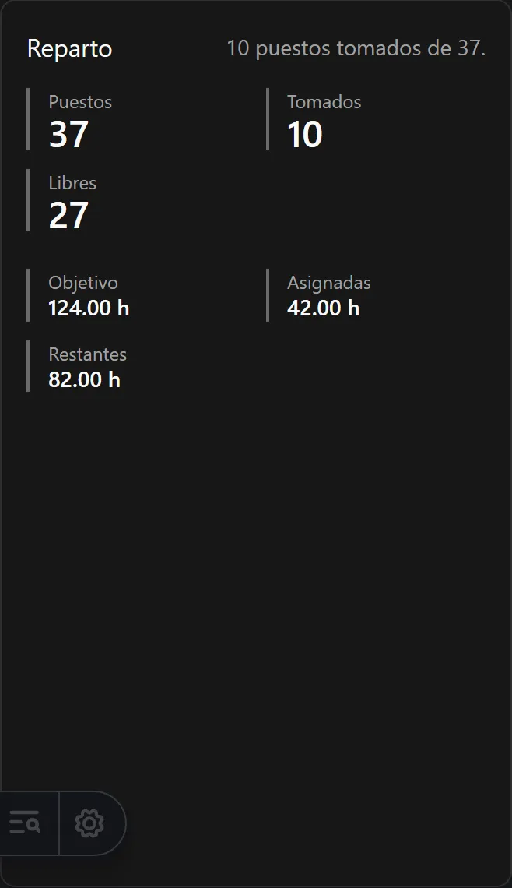

Esta página le lleva de un navegador en blanco a una pantalla funcionando. Damos por hecho
que alguien ya ha instalado y activado el complemento Reparto en este sitio; consulte
[¿Está activado aquí Reparto Docente?](/es/docs/reparto/#está-activado-aquí-reparto-docente)

**En esta página:** [iniciar sesión](#1-iniciar-sesión) · [el menú](#2-encontrar-el-menú) ·
[elegir proceso](#3-elegir-un-proceso) ·
[la lista de comprobación](#4-leer-la-lista-de-comprobación) ·
[qué hacer primero](#5-qué-hacer-primero)

:::tip[Dos botones arriba en cada página]
**?** responde a *qué es esta página y cómo se usa*. **Lista de configuración** responde a
*dónde estoy dentro de todo el recorrido*. Ninguno de los dos tapa la página en la que está.
:::

---

## 1. Iniciar sesión

Use el enlace de cuenta al final del menú de la izquierda, o vaya directamente a la página
de acceso del sitio. Reparto Docente no tiene sesión propia: usa la misma cuenta que el
resto del sitio.

Lo que su cuenta puede hacer depende de su **rol**. En resumen:

- **Administrador** o **Superadministrador** — usted es aquí la *jefatura de
  departamento*. Puede hacer todo lo que describe esta guía.
- **Editor** — puede actuar sobre sus propios registros: su ficha de profesorado, sus
  propias elecciones de puesto, su propio turno.
- **Lector** — puede mirarlo todo y no cambiar nada.
- **Usuario** — esta aplicación no está disponible para usted en absoluto.

La tabla completa está en [Quién puede hacer qué](/es/docs/reparto/roles/).

## 2. Encontrar el menú

Cuando el complemento está activado, aparece una entrada **Reparto docente** en el menú de
la izquierda. Ábrala y encontrará las tres etapas:

```text
Reparto docente
├── Etapa 1 · Configuración
│     Panel · Procesos · Centros · Cursos académicos · Departamentos
│     Etapas educativas · Listado del profesorado · Dotación de dirección
│     Participantes en el proceso · Materias · Grupos
│     Matriz grupo-materia · Ajustes del proceso
├── Etapa 2 · Planificación
│     Planificación · Horas necesarias · Exportaciones de planificación
└── Etapa 3 · Asignación
      Repartos · Sesión · Mi vista · Pantalla compartida
      Versiones · Exportaciones · Auditoría
```

Ese menú **es** el orden de trabajo. Recorrerlo de arriba abajo es una forma válida de
configurar un departamento desde cero.

**Panel** y **Procesos** encabezan la etapa 1 porque nada más se abre hasta que hay un
proceso seleccionado, pero ninguno de los dos es un paso que se ejecute. Informan sobre el
trabajo en lugar de hacerlo, y por eso su panel **?** pone **Vista general** en lugar de
*Etapa 1*.

:::tip
Todas las páginas de Reparto tienen además enlaces **Anterior** y **Siguiente** al pie, con
el mismo orden. Puede recorrer toda la aplicación solo con ellos.
:::

## 3. Elegir un proceso

Casi todo en Reparto Docente pertenece a un **proceso de reparto**: un departamento, en un
centro, para un curso académico. El proceso es el contenedor del trabajo de todo un curso.

La mayoría de las páginas llevan arriba una barra **Proceso actual**. Si todavía no hay un
proceso seleccionado, la página muestra **Ningún proceso seleccionado** en lugar de su
contenido, con un único desplegable de los procesos que existen. Elija uno y la página se
rellena. Su elección se recuerda en este navegador, así que solo lo hará una vez.


Esa pantalla solo *elige*. Si todavía no existe ningún proceso, siga su enlace **Crear un
proceso de reparto**, o vaya directamente a la página **Procesos**, que es donde se crean.
Allí pulse **Crear** y elija el curso académico, después el centro y después el
departamento. Los tres tienen que existir antes, y cada desplegable ofrece una opción
**Crear nuevo**, así que puede hacerlo todo desde esa sola pantalla.

:::note[Por qué crear no está en el panel]
Un panel informa sobre un proceso, y no puede informar sobre uno que no existe. Antes se
abría con el formulario de creación, de modo que lo primero que veía en un navegador nuevo
era un formulario y no la página que había pedido. Crear vive ahora solo en **Procesos**.
:::

:::note[El selector nunca le pide un identificador]
El proceso se elige por curso, centro y departamento, nunca por un código largo. Los
mensajes de validación compuestos por el servidor también nombran al participante afectado.
:::

## 4. Leer la lista de comprobación

**Configura tu reparto** es una lista de quince pasos, agrupados por las tres etapas, que
le dice ahora mismo qué está hecho y qué falta. Se llega a ella de dos maneras.

**Desde cualquier página.** Todas las páginas de Reparto llevan arriba un botón **Lista de
configuración**, junto al botón **?**. Púlselo y la lista se abre sobre la página;
ciérrela y vuelve a donde estaba. La página a la que venía nunca queda enterrada debajo.

**En el panel.** El **Panel** muestra la misma lista entera, porque informar de cómo va el
proceso es justo para lo que sirve un panel. Empieza con una barra de progreso y un
recuento por etapa — *Configuración 9/9, Planificación 2/4, Reparto 0/2* —, después
**Siguiente**, que nombra el único paso que toca ahora, y después las quince filas
completas.


Cada paso pone **Hecho**, **Abrir** o **No comprobado aquí**. Este último no es un fallo:
significa que esta pantalla concreta no lee ese dato; por ejemplo, si todavía no ha
seleccionado un proceso, los pasos de nivel de proceso no se pueden comprobar. Esos pasos
se cuentan aparte y nunca como pendientes: *11 de 15 hechas, 2 sin comprobar aquí* no dice
lo mismo que *11 de 15 hechas*.

**El nombre de cada paso es un enlace** a la página donde ese paso se hace, así que nunca
tiene que buscarlo en el menú.

Los quince pasos son:

| # | Paso | Etapa |
| --- | --- | --- |
| 1 | Crear un centro | 1 |
| 2 | Crear un curso académico | 1 |
| 3 | Crear un departamento | 1 |
| 4 | Crear un proceso de reparto | 1 |
| 5 | Registrar la dotación horaria de la dirección | 1 |
| 6 | Añadir participantes y sus horas objetivo | 1 |
| 7 | Añadir las materias impartidas | 1 |
| 8 | Añadir los grupos | 1 |
| 9 | Rellenar la matriz grupo-materia | 1 |
| 10 | Revisar la configuración y los ajustes de selección | 1 |
| 11 | Crear el plan docente | 2 |
| 12 | Equilibrar las horas de grupo y la carga del profesorado | 2 |
| 13 | Bloquear el plan docente | 2 |
| 14 | Generar los puestos horarios | 2 |
| 15 | Repartir los puestos en la sesión | 3 |

Junto a la lista, el panel muestra los dos balances, los tres invariantes, cuántos
puestos quedan libres y cómo va cada participante.



## 5. Qué hacer primero

Si empieza de cero, haga esto en orden. Cada enlace lleva a las instrucciones detalladas.

1. **[Crear el centro, el curso académico y el departamento](/es/docs/reparto/stage-1-configuration/#configuración-global)** —
   son compartidos por todo el sitio, así que puede que ya existan.
2. **[Añadir las etapas educativas](/es/docs/reparto/stage-1-configuration/#etapas-educativas)** —
   *ESO*, *Bachillerato*… También compartidas, y también posiblemente ya creadas.
3. **[Añadir el profesorado al listado](/es/docs/reparto/stage-1-configuration/#listado-del-profesorado)**.
4. **[Crear el proceso de reparto](/es/docs/reparto/stage-1-configuration/#el-proceso-de-reparto)**.
5. **[Registrar la dotación de dirección](/es/docs/reparto/stage-1-configuration/#dotación-de-dirección)**.
6. **[Añadir los participantes y sus horas](/es/docs/reparto/stage-1-configuration/#participantes)**.
7. **[Añadir las materias y los grupos](/es/docs/reparto/stage-1-configuration/#materias)**.
8. **[Rellenar la matriz grupo-materia](/es/docs/reparto/stage-1-configuration/#la-matriz-grupo-materia)**.
9. **[Revisar los ajustes del proceso](/es/docs/reparto/stage-1-configuration/#ajustes-del-proceso)**.
10. Pase a la **[Etapa 2 — Planificación](/es/docs/reparto/stage-2-planning/)**.

:::tip[No puede romper nada mirando]
Nada cambia en Reparto Docente por abrir una página. Toda acción que cambia algo le pide
antes que lo confirme, y las que importan le piden además un motivo escrito.
:::

---

**Anterior:** [← Cómo funciona el complemento](/es/docs/reparto/how-it-works/) ·
**Siguiente:** [Quién puede hacer qué →](/es/docs/reparto/roles/)
