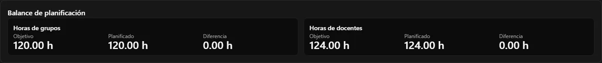
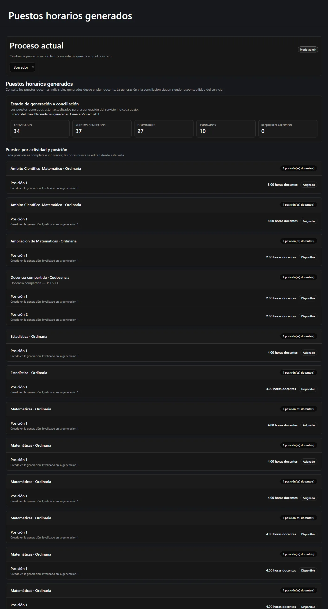
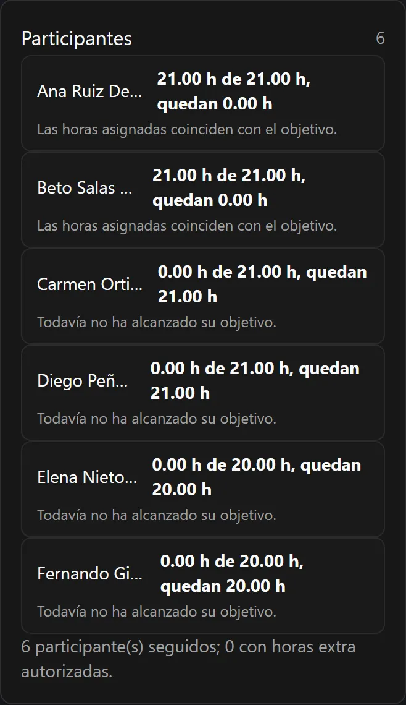
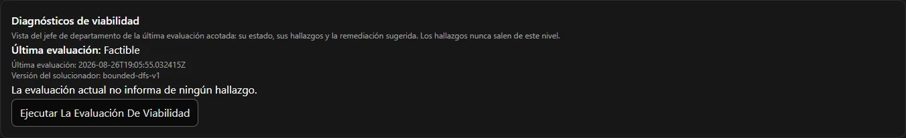

Esta es la página que hay que leer si un número de la pantalla le parece equivocado. Nueve
de cada diez veces no lo está: es *el otro* total.

**En esta página:** [dos balances](#dos-balances-nunca-uno) ·
[el ejemplo](#el-ejemplo-120-y-124) · [tutoría](#segundo-ejemplo-la-tutoría) ·
[varios grupos](#tercer-ejemplo-una-actividad-varios-grupos) ·
[puestos indivisibles](#puestos-indivisibles) ·
[objetivos exactos](#objetivos-exactos-y-horas-extra-autorizadas) ·
[viabilidad](#la-tercera-comprobación-la-viabilidad) ·
[decimales](#cómo-se-escriben-las-horas)

---

## Dos balances, nunca uno

Reparto Docente lleva dos totales completamente separados.

**Horas de grupo** — lo que reciben las *clases*.

```text
horas de grupo = Σ ( horas de grupo por grupo × número de grupos vinculados )
objetivo       = la dotación de dirección actual
```

**Horas de docente** — lo que trabaja el *profesorado*.

```text
horas de docente = Σ ( horas por puesto docente × puestos docentes )
objetivo         = Σ ( horas base + horas extra autorizadas de cada participante )
```

Ambos se muestran uno al lado del otro, cada uno con su objetivo, su total planificado y la
diferencia. El plan es **exacto** cuando ambas diferencias son `0.00`.



:::danger[No los sume nunca]
120 + 124 no es un número que signifique nada. Miden cosas distintas. La aplicación nunca
los suma, nunca los promedia y nunca muestra un único «total de horas» combinado; y
ningún informe que usted construya a partir de ella debería hacerlo tampoco.
:::

## El ejemplo: 120 y 124

El departamento ha recibido una dotación de **120** horas de grupo semanales. Sus seis
docentes tienen objetivos contratados que suman **124** horas semanales. Así satisface un
plan ambas cosas a la vez:

| | Horas de grupo | Horas de docente |
| --- | ---: | ---: |
| 31 actividades principales ordinarias | 116 | 116 |
| 2 actividades de tutoría (1 h cada una, 2 docentes cada una) | 2 | 4 |
| 1 actividad de docencia compartida (2 h, 2 docentes) | 2 | 4 |
| **Total** | **120** | **124** |

La diferencia de 4 horas no es un error ni es holgura. Es el *segundo docente* de cada una
de esas tres actividades. Dos docentes en la misma aula durante dos horas le cuestan dos
horas a la clase y cuatro al departamento.

## Segundo ejemplo: la tutoría

Una actividad de tutoría puede registrarse así:

```text
horas de grupo por grupo       1.00
horas por puesto docente       2.00
puestos docentes               1
```

Es decir: la clase recibe **una** hora semanal de tutoría, el docente dedica **dos** horas
semanales (la sesión más la preparación y el seguimiento) y se genera **un** puesto
indivisible de dos horas.

Las horas de grupo y las de docente son datos independientes. No tiene nada de raro que una
clase de 1 hora le cueste 2 horas a un docente.

## Tercer ejemplo: una actividad, varios grupos

Si una actividad está vinculada a varios grupos, sus horas de grupo cuentan **una vez por
cada grupo**:

```text
2 horas semanales × 2 grupos = 4 horas de grupo
```

El lado docente no se multiplica por grupos, sino por puestos:

```text
horas por puesto docente × puestos docentes
```

## Puestos indivisibles

Una vez bloqueado el plan, la aplicación genera un **puesto** por cada docente que el plan
necesita. Cada puesto lleva un número fijo de horas, y:

- va a **un** docente, entero;
- un puesto de 4 horas no se puede partir en 3 + 1;
- dos docentes no pueden compartirlo;
- un docente al que le quedan 3 horas no puede cogerlo;
- dos puestos de la *misma* actividad tienen que ir a docentes *distintos*.

Por eso el tablero de reparto no tiene casilla de horas. No hay nada que escribir: las
horas pertenecen al puesto, no a la asignación.



## Objetivos exactos y horas extra autorizadas

Cada participante tiene:

```text
horas base semanales     su carga contratada
horas extra autorizadas  una adición explícita, motivada y auditada
objetivo                 base + extra autorizadas
```

Cada participante activo debe alcanzar ese objetivo **exactamente** antes de poder cerrar
el proceso. Por debajo se rechaza, por encima se rechaza, y en toda la aplicación no hay
ningún control para saltárselo.

Cuando alguien necesita realmente una carga mayor, la jefatura de departamento sube antes
sus **horas extra autorizadas**. Es una acción aparte, exige un motivo escrito y queda
registrada en la auditoría. Bajar las horas extra se rechaza si el nuevo objetivo quedara
por debajo de lo que ese docente ya tiene asignado.

Quien lleve horas extra autorizadas queda marcado como **sobrecarga autorizada** allí donde
aparezca.



La vista propia del docente muestra esas mismas cinco cifras solo de sí mismo:

```text
Base · Extra autorizadas · Objetivo · Asignadas · Restantes
```

## La tercera comprobación: la viabilidad

Que los dos totales coincidan **no** demuestra que el plan se pueda llevar a cabo.

Imagine tres docentes que necesitan exactamente 5 horas cada uno, y puestos de 4, 4, 4, 2 y
1 horas. Los totales cuadran —15 y 15— pero no hay forma de dar exactamente 5 horas a cada
docente con piezas que no se pueden cortar.

Por eso Reparto Docente hace una tercera comprobación, la **viabilidad del reparto**, que
pregunta: *¿existe al menos una manera de repartir estos puestos indivisibles de forma que
cada participante caiga exactamente en su objetivo?* Responde una de cuatro cosas:

| Respuesta | Significado |
| --- | --- |
| **Realizable** | Sí, y la aplicación guarda un ejemplo concreto de cómo. |
| **Irrealizable** | No. No existe ninguna combinación que funcione. El plan tiene que cambiar. |
| **Desconocida** | La comprobación agotó su esfuerzo permitido sin decidir. Se trata como «no demostrada», así que bloquea. |
| **Sin evaluar** | No se ha comprobado nada desde el último cambio relevante. Lance la evaluación. |

Las tres deben cumplirse antes de poder bloquear el plan:


:::note[La viabilidad se reinicia, y es normal]
La viabilidad *no* es un estado del plan a propósito. Es una respuesta propia, y cualquier
cambio relevante la devuelve a **Sin evaluar** en vez de dejar en pantalla un resultado
caducado. Ver «Sin evaluar» después de editar un participante es lo esperado. Vuelva a
lanzar la evaluación desde la página de planificación.
:::

Cuando un plan es irrealizable, la jefatura de departamento —y solo ella— recibe un panel
de diagnóstico que explica por qué, con sugerencias concretas.



### Qué *no* tiene en cuenta la viabilidad

En esta versión, **cualquier participante activo puede coger cualquier puesto**. No existe
la idea de que un docente esté habilitado para una materia, restringido a una etapa o
vinculado a un grupo. La legalidad depende solo de: que el participante esté activo, sus
horas restantes exactas, los puestos que ya tiene, la regla de que dos puestos de la misma
actividad van a docentes distintos, y las reglas de la sesión.

Las habilitaciones por materia y restricciones similares son una extensión futura
documentada, no una función oculta; consulte
[Limitaciones](/es/docs/reparto/limitations/#sin-cualificaciones-ni-reglas-de-elegibilidad).

## Cómo se escriben las horas

Todos los valores horarios son cantidades con dos decimales: `2.50`, `21.00`, `0.00`. Las
diferencias pueden ser negativas: `-4.00`. Los valores se muestran siempre con dos
decimales para que dos cifras se puedan comparar a simple vista.

No se impone ningún paso de cuarto ni de media hora. Se acepta cualquier valor no negativo
con dos decimales como mucho. Un tercer decimal se rechaza en vez de redondearse: la
aplicación no cambia en silencio un número que usted ha escrito.

:::note[Vacío no es cero]
Un campo de horas vacío significa *«heredar el valor por defecto»*. Un `0` escrito
significa *«cero de verdad»*. La aplicación los mantiene separados en todas partes y ningún
formulario los confunde. Si quiere que una celda de la matriz siga al valor por defecto de
su materia, **borre** la casilla; no escriba `0`.
:::

---

**Anterior:** [← Quién puede hacer qué](/es/docs/reparto/roles/) ·
**Siguiente:** [Etapa 1 — Configuración →](/es/docs/reparto/stage-1-configuration/)
