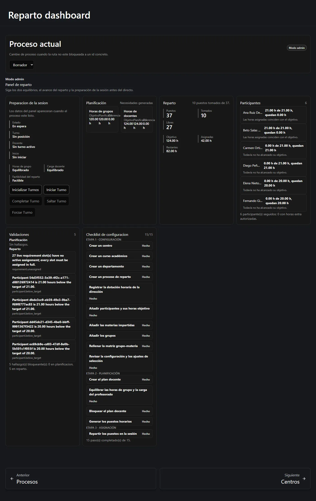

**Reparto Docente** reparte las horas lectivas semanales de un departamento entre el
profesorado de ese departamento. Sustituye a la hoja de cálculo que la jefatura de
departamento suele llevar a mano, y comprueba las cuentas por usted en cada paso.

Esta guía está escrita para personas que no han usado nunca la aplicación. No hace falta
saber nada de programación, de bases de datos ni del vocabulario que usan quienes la
desarrollan. Todas las pantallas que se muestran aquí son capturas reales de la
aplicación en funcionamiento.

## Qué problema resuelve

La dirección del centro comunica a un departamento: *«tenéis 120 horas lectivas
semanales»*. El departamento tiene unos grupos, unas materias y unos docentes. Alguien
tiene que convertir esas 120 horas en una lista concreta de «quién imparte qué», donde:

- cada grupo reciba las horas que le corresponden;
- cada docente acabe con **exactamente** su carga contratada: ni una hora más, ni una
  menos;
- nada se pierda ni se cuente dos veces por el camino.

Reparto Docente le lleva de la mano por **tres etapas**, y no le deja saltarse ninguna.

## Las tres etapas de un vistazo

| Etapa | Qué hace usted | Dónde |
| --- | --- | --- |
| **1 · Configuración** | Registrar el centro, el curso, el departamento, el profesorado, los grupos, las materias y cuántas horas ha dado la dirección. | [Etapa 1 — Configuración](/es/docs/reparto/stage-1-configuration/) |
| **2 · Planificación** | Convertir esa configuración en un *plan docente*: qué se imparte realmente, con cuántos docentes y durante cuántas horas. Después, bloquearlo y generar los puestos. | [Etapa 2 — Planificación](/es/docs/reparto/stage-2-planning/) |
| **3 · Asignación** | Entregar cada puesto generado a un docente, en sesión o uno a uno. | [Etapa 3 — Asignación](/es/docs/reparto/stage-3-assignment/) |

El orden no es una sugerencia. El servidor rechaza el trabajo de la etapa 3 sobre un plan
que no ha terminado la etapa 2, y la etapa 2 no tiene con qué trabajar hasta que la
etapa 1 esté rellenada.

## Cómo leer esta guía

Si está configurando la aplicación por primera vez, lea las páginas en orden. Si busca
algo concreto, vaya directamente a ello.

### Empiece por aquí

1. **[Cómo funciona el complemento](/es/docs/reparto/how-it-works/)** — las diez ideas
   que hay detrás de toda la aplicación, en palabras llanas. Léalo una vez y el resto
   cobrará sentido.
2. **[Primeros pasos](/es/docs/reparto/getting-started/)** — iniciar sesión, encontrar el
   menú, elegir un proceso y la lista de comprobación que le dice qué falta todavía.
3. **[Quién puede hacer qué](/es/docs/reparto/roles/)** — los cinco roles de cuenta, y
   por qué a veces un botón simplemente no está en vez de aparecer desactivado.

### Las tres etapas, paso a paso

1. **[Etapa 1 — Configuración](/es/docs/reparto/stage-1-configuration/)** — centros,
   cursos, departamentos, etapas educativas, listado del profesorado, dotación de
   dirección, participantes, materias, grupos, la matriz grupo-materia y los ajustes del
   proceso.
2. **[Etapa 2 — Planificación](/es/docs/reparto/stage-2-planning/)** — crear el plan,
   materializar las actividades principales, añadir tutoría y docencia compartida, leer
   las validaciones, bloquear y generar los puestos.
3. **[Etapa 3 — Asignación](/es/docs/reparto/stage-3-assignment/)** — el tablero de
   reparto, entregar un puesto a un docente, deshacer y mover un puesto.

### Conceptos y referencia

1. **[Horas, balances y viabilidad](/es/docs/reparto/hours-and-balances/)** — por qué hay
   **dos** totales de horas que son correctos a la vez y que nunca deben sumarse, y qué
   significa «viable».
2. **[La sesión, la vista del docente y la pantalla compartida](/es/docs/reparto/meeting-and-lan/)** —
   cómo se celebra la sesión de selección en directo y qué ven el profesorado y el
   proyector.
3. **[Versiones, exportaciones y auditoría](/es/docs/reparto/versions-exports-audit/)** —
   guardar instantáneas, comparar cursos, generar documentos y el rastro de quién hizo qué.
4. **[Referencia](/es/docs/reparto/reference/)** — todas las direcciones de página, el
   permiso que exige cada una y un glosario de todos los términos de la aplicación.

### Cuando algo va mal

1. **[Límites y notas operativas](/es/docs/reparto/limitations/)** — las fronteras
   deliberadas del producto, los límites del solver y el primer arranque.
2. **[Solución de problemas](/es/docs/reparto/troubleshooting/)** — los mensajes que
   puede encontrarse y qué significa realmente cada uno.

:::tip[La sesión en directo está disponible]
La jefatura puede abrir y cerrar la sesión, dirigir las cinco acciones de turno y seguir
los recuentos de participantes. Los límites restantes son deliberados u operativos.
:::

## ¿Está activado aquí Reparto Docente?

Reparto Docente es una parte **opcional** de este sitio. Solo está presente cuando quien
lo administra lo ha instalado y además lo ha conectado a un servicio Reparto en
funcionamiento. Si está activado, aparece una entrada **Reparto docente** en el menú de la
izquierda, con tres grupos dentro: *Etapa 1 · Configuración*, *Etapa 2 · Planificación* y
*Etapa 3 · Asignación*.

Si no ve esa entrada, el complemento no está habilitado en esta instalación y nada de lo
que haga en esta guía le será aplicable. Pregunte a quien administra el sitio.

## Sobre las capturas de esta guía

Todas las capturas están tomadas de la aplicación en funcionamiento sobre un departamento
de demostración llamado **Matemáticas · DEMO**: 17 grupos, 14 materias, 6 docentes, una
dotación de dirección de 120 horas semanales y un plan terminado de 37 puestos docentes.
Los números que verá —120 horas de grupo frente a 124 horas de profesorado— son el ejemplo
al que esta guía vuelve una y otra vez, y se explica en
[Horas, balances y viabilidad](/es/docs/reparto/hours-and-balances/).

---

**Siguiente:** [Cómo funciona el complemento →](/es/docs/reparto/how-it-works/)
