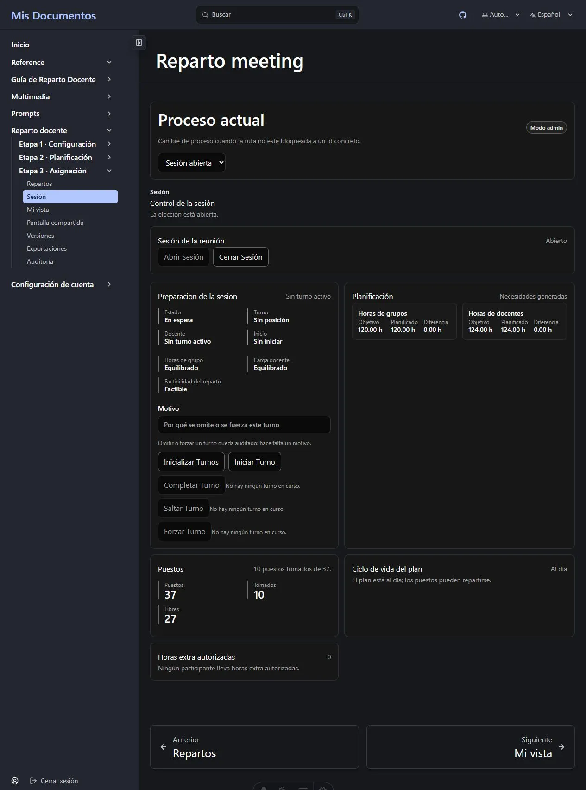
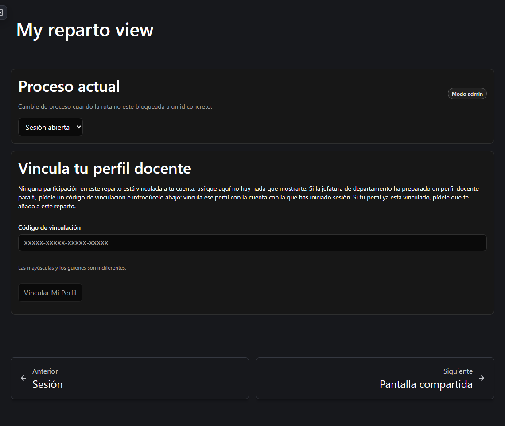
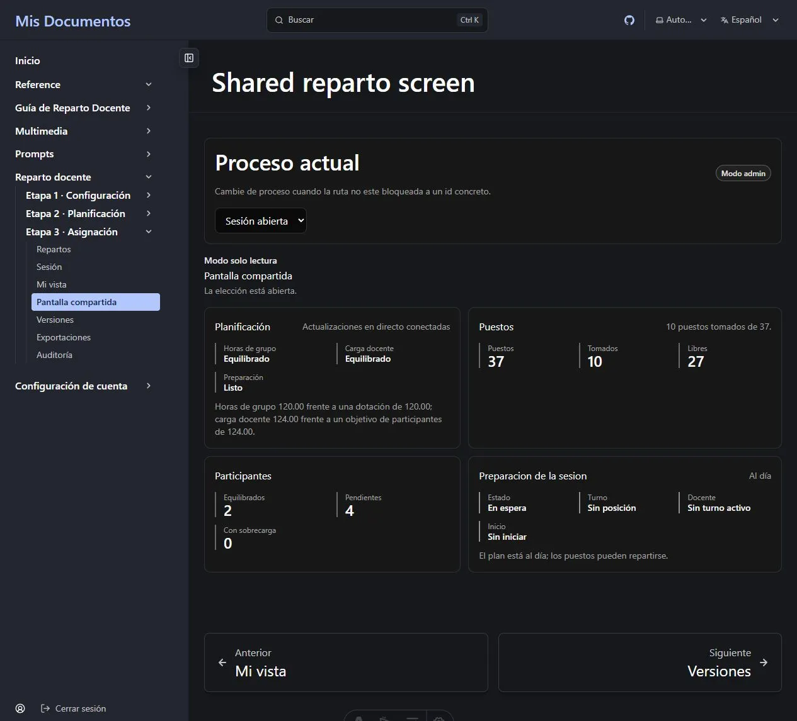

La etapa 3 se puede dirigir desde el [panel de repartos](/es/docs/reparto/stage-3-assignment/)
o como una **sesión de selección en directo** donde cada docente toma sus propios puestos
por turno. El flujo en directo está conectado de extremo a extremo en la versión actual.

La página **Sesión** contiene datos de jefatura, por lo que incluso verla exige
**Administrador** o **Superadministrador**. *Mi vista* y *Pantalla compartida* siguen
siendo vistas con suelo **Lector**, porque nunca reciben cifras de otro docente.

**En esta página:** [vincular al profesorado](#antes-de-la-sesión-vincular-a-cada-docente) ·
[abrir la sesión](#abrir-la-sesión) · [dirigir turnos](#dirigir-los-turnos) ·
[Mi vista](#mi-vista-la-pantalla-del-docente) · [pantalla compartida](#la-pantalla-compartida) ·
[tiempo real](#actualizaciones-en-directo)

---

## Antes de la sesión: vincular a cada docente

En **Listado del profesorado**, un Administrador elige **Emitir código de vinculación** en
cada ficha sin vincular. El código se muestra una vez, funciona una vez y caduca. Entréguelo
en privado al docente indicado.

El docente inicia sesión con su cuenta, abre **Mi vista**, escribe el código en **Vincular
mi perfil** y confirma. La ficha se vincula a la cuenta activa; la jefatura nunca busca ni
selecciona una cuenta en el directorio protegido. Si se pierde o caduca, emita otro código.

El docente también debe ser participante activo del proceso. Si una ficha ya vinculada no
ve ningún proceso, añádala en **Participantes en el proceso**.

## Abrir la sesión

El panel **Sesión de la reunión**, situado sobre los turnos, muestra la última sesión o
**No hay ninguna sesión abierta**.

1. Compruebe el plan, los puestos generados y los ajustes de acceso LAN, selección directa
   y orden de selección.
2. Elija **Abrir sesión**. La sesión conserva esos ajustes y mueve el proceso a su estado de
   reunión.
3. Al terminar, elija **Cerrar sesión** y confirme. El acceso LAN del profesorado a esa
   reunión queda retirado.

Sin sesión abierta, todas las acciones de turno están deshabilitadas y muestran claramente
que **no hay ninguna sesión de reunión abierta**.



## Dirigir los turnos

| Control | Efecto |
| --- | --- |
| **Inicializar turnos** | Construye el orden con participantes y posiciones. |
| **Iniciar turno** | Inicia el siguiente turno pendiente. |
| **Completar turno** | Completa el turno activo después de resolver la elección. |
| **Saltar turno** | Salta el turno activo con un motivo escrito y auditado. |
| **Forzar turno** | Fuerza el turno activo con un motivo escrito y auditado. |

Los cinco controles llaman a la API de turnos. Mientras hay una petición se cierran, y
cualquier rechazo se muestra junto a ellos. El turno activo siempre viene del servidor.
La sala muestra además los dos balances, el ciclo del plan, los puestos, la viabilidad y
el recuento **Sobrecargados**, con las filas nominales autorizadas. El recuento agregado
de tres estados pertenece a Pantalla compartida.

## Mi vista: la pantalla del docente

**Mi vista** solo muestra las cinco cifras del docente conectado:

```text
Base · Extra autorizada · Objetivo · Asignado · Restante
```

También muestra puestos completamente libres, el turno actual y el balance agregado sin
nombres. Con selección directa activa, sesión abierta, plan listo y turno correcto, puede
elegir **Tomar este puesto**. El servidor vuelve a comprobar disponibilidad, propiedad,
horas restantes y testigo de viabilidad. **Pasar** su propio turno usa un motivo seguro por
defecto y queda auditado.

Sin ficha vinculada, *Mi vista* presenta el formulario del código en lugar de un 404. Si la
ficha está vinculada pero no participa, pide contactar con la jefatura para añadirla.



## La pantalla compartida

La **Pantalla compartida** muestra ambos balances, estado y viabilidad del plan, puestos
ocupados y libres, número del turno actual y recuentos equilibrados, pendientes y
sobrecargados.



La respuesta del servidor no contiene **ningún nombre**, horas por docente ni motivos de
horas extra. No existe un permiso separado de proyector: use la sesión de un Administrador
o de un participante del departamento.

## Actualizaciones en directo

Las pantallas de las etapas 2 y 3 siguen el flujo de eventos e indican si está
**conectado**, **retrasado** o **desconectado**. Tras reconectar, detectar un salto o recibir
eventos fuera de orden, la página recarga el estado autoritativo.

Los metadatos propios de la reunión, como el orden, no invalidan la viabilidad. Solo los
cambios relevantes para el solver vuelven a **Sin evaluar**. Cada audiencia recibe su flujo
expurgado: el de un docente no lleva a otros participantes y el de proyección no nombra a
nadie.

---

**Anterior:** [← Etapa 3 — Asignación](/es/docs/reparto/stage-3-assignment/) ·
**Siguiente:** [Versiones, exportaciones y auditoría →](/es/docs/reparto/versions-exports-audit/)
