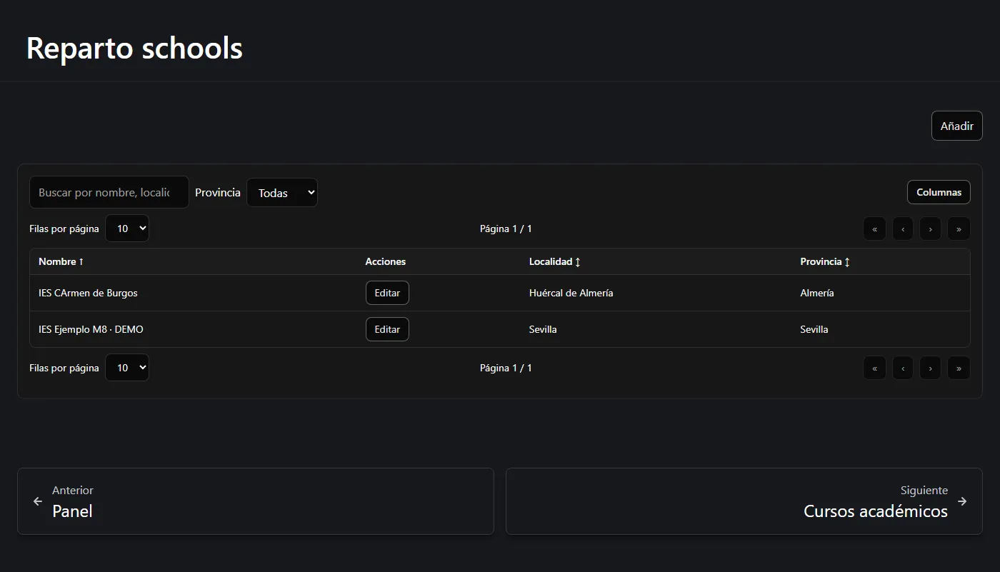
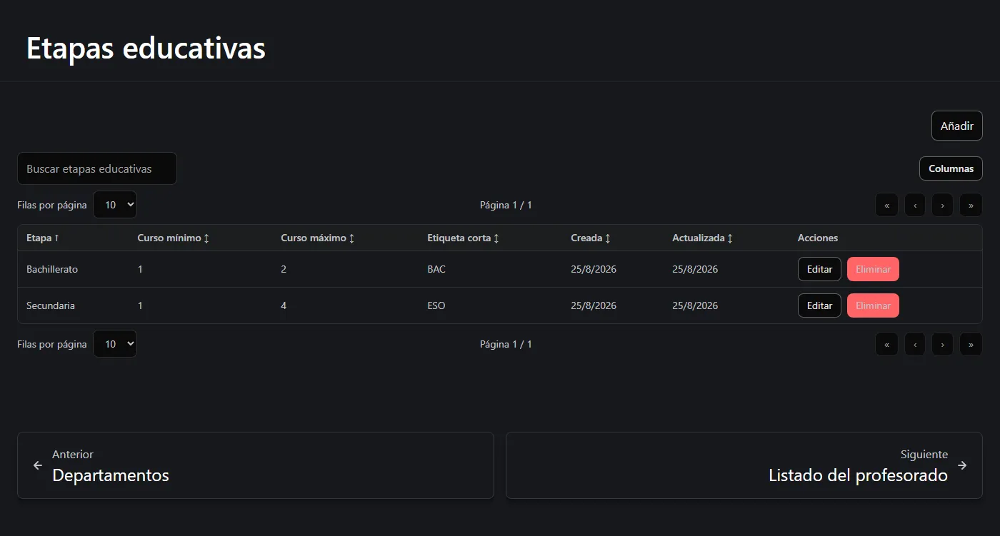
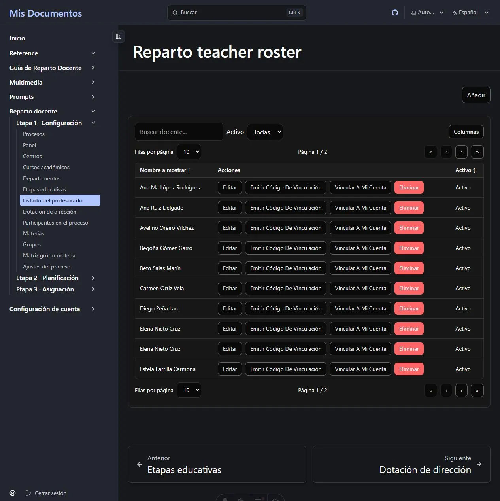
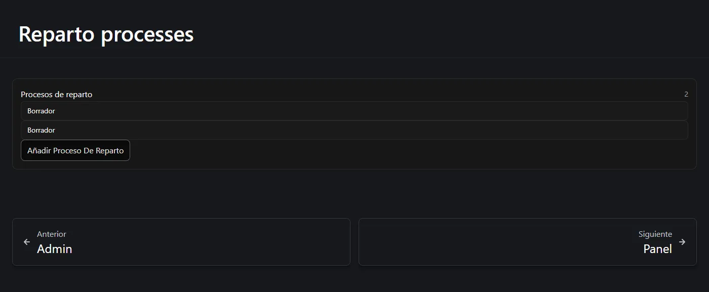
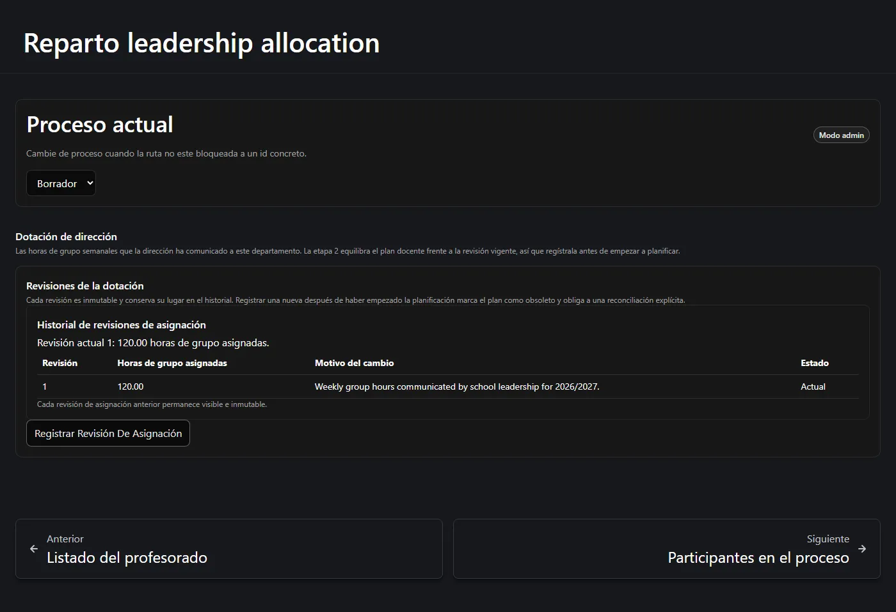
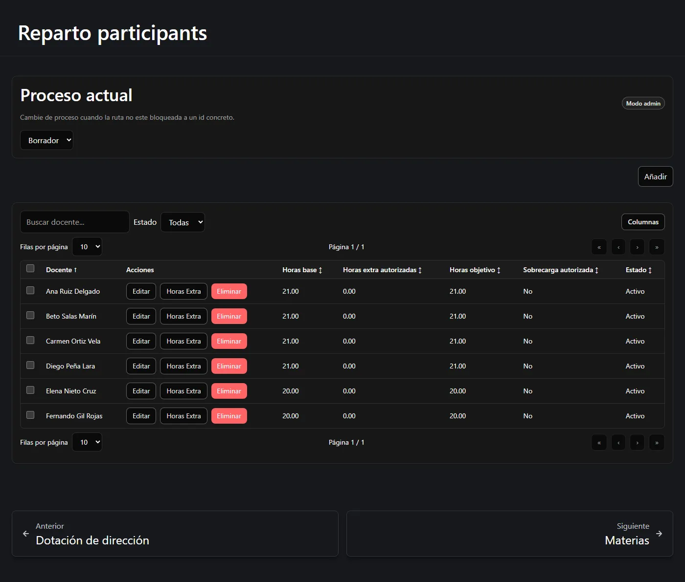
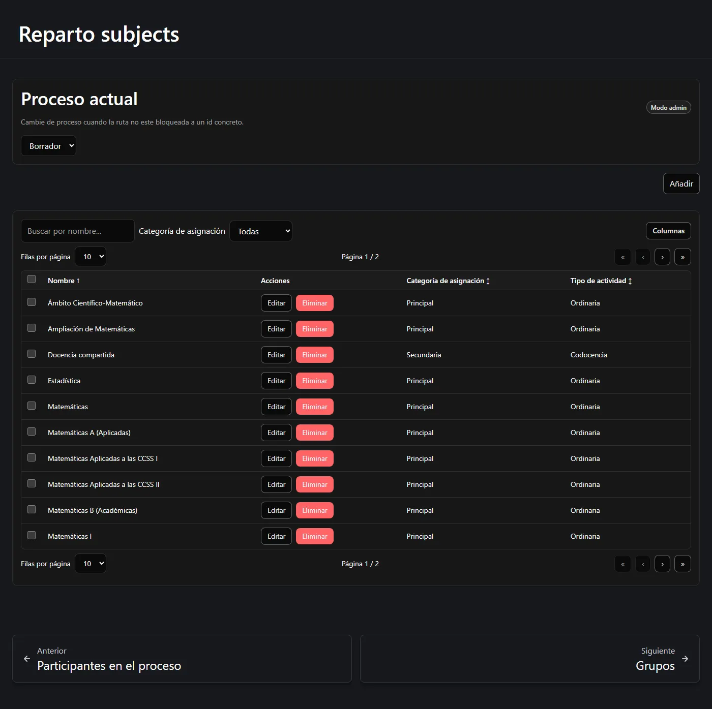
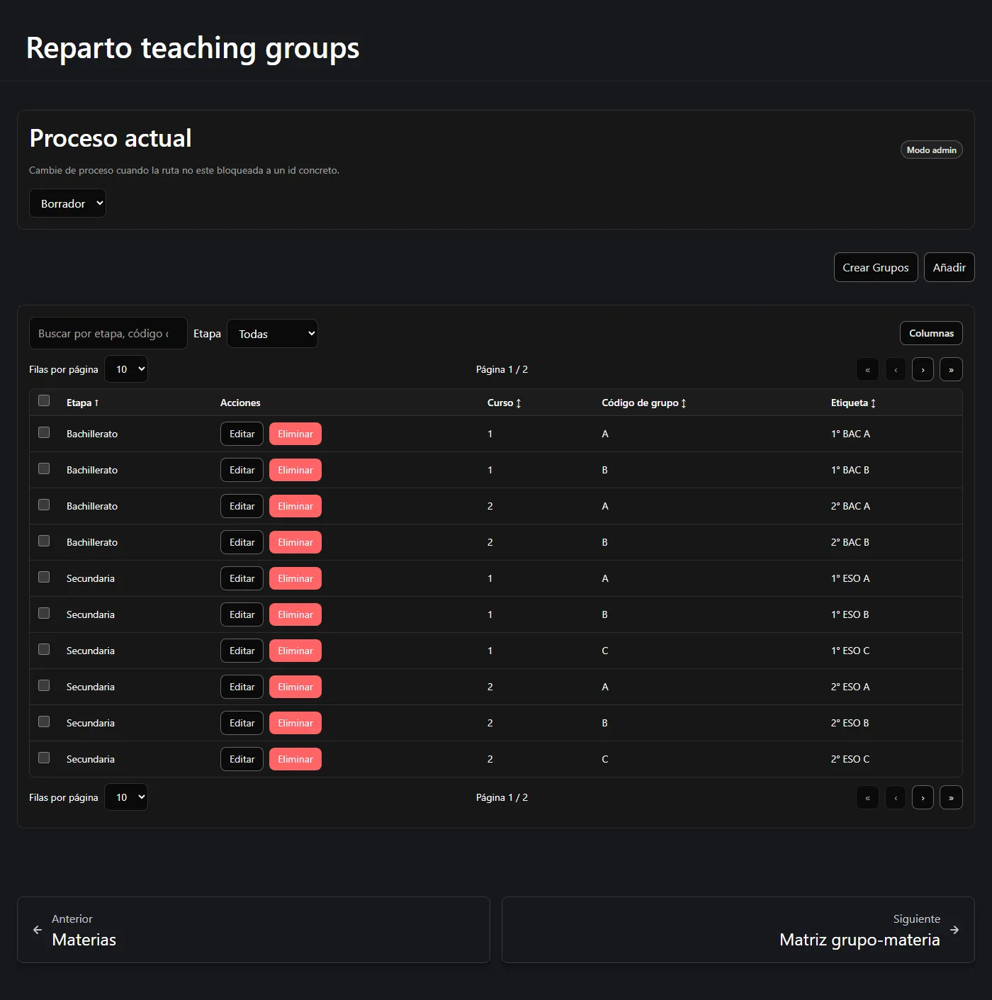
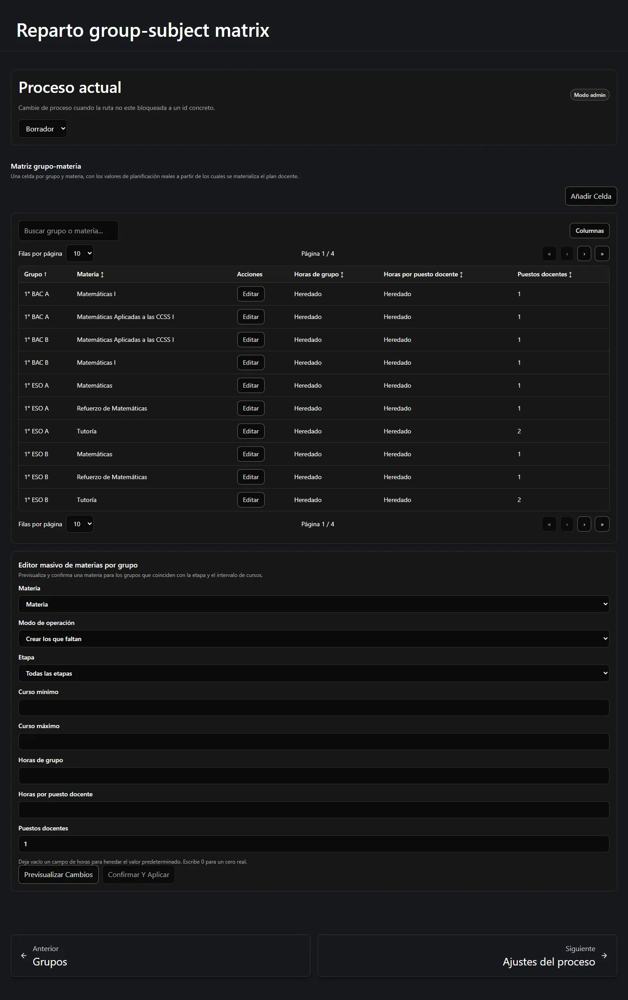
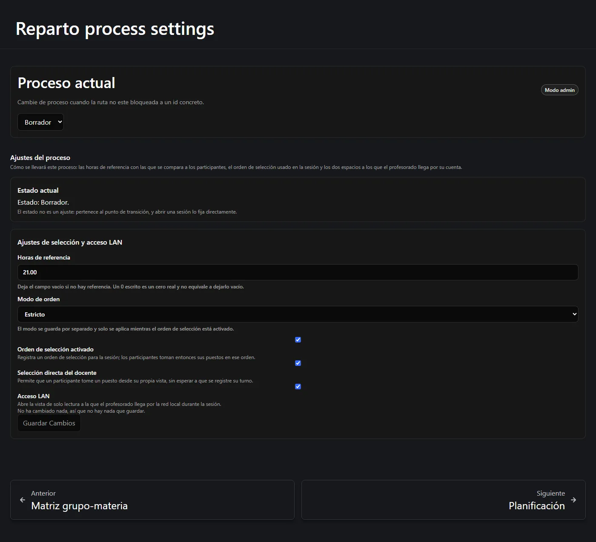

La etapa 1 registra los hechos. Aquí no se calcula nada: simplemente le está contando a la
aplicación qué existe. Recorra el grupo *Etapa 1 · Configuración* del menú de la izquierda
y los hará en el orden correcto.

**En esta página:** [configuración global](#configuración-global) ·
[etapas educativas](#etapas-educativas) · [listado del profesorado](#listado-del-profesorado) ·
[el proceso](#el-proceso-de-reparto) · [dotación](#dotación-de-dirección) ·
[participantes](#participantes) · [materias](#materias) · [grupos](#grupos) ·
[la matriz](#la-matriz-grupo-materia) · [ajustes](#ajustes-del-proceso) ·
[comprobación final](#antes-de-continuar)

---

## Configuración global

**Centros**, **Cursos académicos** y **Departamentos** son compartidos por todo el sitio,
no por un proceso. Si su centro ya usa Reparto Docente, probablemente ya existan;
compruébelo antes de crear duplicados.



- **Centro** — nombre y, opcionalmente, localidad, provincia, comunidad autónoma, dirección
  y notas.
- **Curso académico** — una etiqueta como *2026/2027*, una fecha de inicio y una de fin. El
  curso pertenece a un centro y puede apuntar al curso anterior, que es lo que después hace
  posible «copiar del curso pasado».
- **Departamento** — pertenece a un centro, tiene un nombre y un slug corto. El campo **Jefe
  de departamento** es solo descriptivo y no concede permisos
  ([por qué](/es/docs/reparto/roles/#quién-es-la-jefatura-de-departamento)).

Crearlos exige **Administrador** o superior.

## Etapas educativas

Una **etapa educativa** es un nivel de escolarización: *Secundaria* (etiqueta corta `ESO`,
cursos 1–4), *Bachillerato* (`BAC`, cursos 1–2). Son compartidas por todo el sitio y
existen para que un grupo se nombre de forma coherente.



Cada etapa tiene un nombre, una **etiqueta corta** que se usa en los nombres de grupo, y un
curso mínimo y máximo. Cuando después cree un grupo, su curso quedará limitado a la etapa
elegida y su etiqueta se generará así:

```text
{curso}° {etiqueta corta} {código de grupo}     →     3° ESO B
```

Un **Lector** o superior puede leer las etapas; crearlas y editarlas exige
**Administrador**.

## Listado del profesorado

El **Listado del profesorado** es la lista del personal docente conocido por el sitio,
separada de las cuentas de usuario. Una ficha tiene un nombre a mostrar, un indicador de
activo y notas.



Una ficha puede **vincularse** a una cuenta del sitio, que es lo que permite a ese docente
usar *Mi vista* durante una sesión.

:::tip[Vincular al docente sin abrir el directorio de cuentas]
Un Administrador elige **Emitir código de vinculación**. El código, mostrado una sola vez,
caduca y funciona una vez. El docente conectado lo escribe en **Mi vista**, bajo
**Vincular mi perfil**. Una ficha vinculada ofrece **Desvincular usuario**; **Vincularme a
mí** sigue disponible para una vinculación administrativa deliberada.
:::

Editar los datos propios de una ficha está disponible para un **Editor** en su propia
ficha; crear una ficha, emitir un código, vincular, desvincular y borrar exige
**Administrador**. Canjear el código propio sigue accesible desde Lector.

## El proceso de reparto

Un **proceso de reparto** es un departamento, en un centro, para un curso académico. Es el
contenedor de todo lo que viene después.

Créelo desde la página **Procesos**, eligiendo el curso, el centro y el departamento. Un
proceso nuevo empieza en estado **Borrador**.



:::note[El estado nunca se pone a mano]
El estado avanza solo según progresa el proceso, y abrir una sesión de selección lo cambia
directamente. En toda la aplicación no hay ningún control de estado, y el servidor rechaza
cualquier petición que intente ponerlo. La página de ajustes muestra el estado actual y lo
explica.
:::

## Dotación de dirección

Este es el paso 2 del flujo y tiene su propia página: **Dotación de dirección**. Registre
las horas de grupo semanales que la dirección del centro ha dado a su departamento.



Para registrar una tiene que aportar:

- **Horas de grupo semanales asignadas** — mayores que cero, dos decimales como mucho.
- **Un motivo** — obligatorio. Es el registro permanente de *por qué* esa cifra es la que
  es.

Lo que ocurre entonces:

- La cifra pasa a ser la revisión **actual**.
- Cualquier revisión anterior queda **sustituida** y se conserva como historial: nada se
  sobrescribe.
- Se registra un evento de auditoría con su nombre y la hora.

:::note[Que no exista dotación al principio es normal]
Hasta que registre la primera dotación, la «dotación actual» simplemente todavía no existe,
y la página muestra un estado vacío en vez de un error. Es lo esperado en un proceso nuevo.
:::

No hay edición ni borrado. Para cambiar la cifra se registra una **revisión nueva**, con su
propio motivo. Si el proceso ya está `final` o `archivado`, hay que reabrirlo antes.

## Participantes

Los **Participantes en el proceso** son el profesorado que toma parte en *este* proceso.
Añada a cada uno desde el listado y asígnele:

| Campo | Significado |
| --- | --- |
| **Horas base** | Su carga lectiva semanal contratada. |
| **Horas extra autorizadas** | Siempre empieza en 0. Solo se sube mediante la acción aparte que exige motivo. |
| **Horas objetivo** | Calculado: base + extra autorizadas. No editable. |
| **Participa en la selección** | Si toma turno en la sesión. |
| **Posición** | Su lugar en el orden de la sesión. |
| **Estado** | Activo o inactivo. |



La suma del **objetivo** de todos los participantes activos es el objetivo de horas de
profesorado que el plan debe alcanzar exactamente. En el ejemplo, seis docentes de 21, 21,
21, 21, 20 y 20 horas dan un objetivo de **124**.

:::caution[Las horas extra no se editan aquí]
Las **horas extra autorizadas** no se pueden escribir en el formulario de participante en
ninguno de los dos extremos de la comunicación. Subirlas o bajarlas es una acción distinta
que exige un motivo escrito y queda auditada, en ambos sentidos: retirar una autorización es
la misma acción con el valor `0`. Bajarlas se rechaza si el nuevo objetivo quedara por
debajo de lo que ese docente ya tiene.
:::

## Materias

Una **materia** es lo que se imparte. Cada una lleva:

| Campo | Significado |
| --- | --- |
| **Nombre** | *Matemáticas*, *Tutoría*, *Docencia compartida*… |
| **Categoría de asignación** | **Principal** o **Secundaria**. Las principales son datos obligatorios de planificación; las secundarias son añadidos opcionales. |
| **Tipo de actividad** | *Ordinaria*, *Tutoría*, *Docencia compartida*, *Apoyo*, *De departamento*, *Otro*. **Solo descriptivo**: nunca cambia el comportamiento. |
| **Horas de grupo por defecto** | Horas sugeridas que recibe la clase. |
| **Horas por puesto docente por defecto** | Horas sugeridas que dedica un docente. |
| **Puestos docentes por defecto** | Cuántos docentes, por defecto. |
| **Permite varios / cero grupos** | Si una actividad de esta materia puede vincular varias clases, o ninguna. |



:::note[Los valores por defecto solo siembran; nunca reescriben]
Estos valores se usan cuando se crea una celda **nueva** de la matriz. Cambiar un valor por
defecto más tarde **no** altera celdas ni actividades ya existentes. Es deliberado: sus
decisiones grupo a grupo nunca se sobrescriben en silencio.
:::

No hay ninguna casilla «es principal»: la distinción es la **categoría de asignación**, que
es una lista ampliable y no un sí/no.

## Grupos

Un **grupo** es una clase: *1° ESO A*, *2° BAC B*. Cree cada uno con su etapa educativa, su
curso y su código de grupo. La etiqueta se genera automáticamente hasta que usted la cambie
a mano.



Hay además un diálogo masivo **Crear grupos**: elija una etapa, un curso y un rango de
códigos (`A` a `D`, ambos incluidos), previsualice la lista exacta y créelos todos en una
única petición atómica.

## La matriz grupo-materia

Este es el corazón de la etapa 1. La **matriz** contiene una celda por cada par (grupo,
materia) que realmente existe, y lleva los valores de planificación **reales** con los que
trabaja la etapa 2.



Cada celda contiene:

- **Horas de grupo** — o *Heredado*, que significa «usar el valor por defecto de la
  materia».
- **Horas por puesto docente** — o *Heredado*.
- **Puestos docentes** — siempre un número positivo explícito; este no tiene valor por
  defecto al que recurrir.
- **Activa** — si la celda cuenta.

El grupo y la materia son la **identidad** de la celda y no se pueden cambiar. Para apuntar
una celda a otro grupo u otra materia se retira y se crea otra.

### Rellenar la matriz materia a materia

Añadir treinta celdas de una en una es tedioso, así que la página lleva además el **editor
masivo** debajo de la lista. Rellena **una materia** sobre un rango filtrado de grupos:

1. Elija la **Materia**.
2. Elija el **Modo de operación** — *Crear las que faltan*, o los modos que además
   actualizan celdas existentes.
3. Acote los grupos con **Etapa**, **Curso mínimo** y **Curso máximo**. Déjelos abiertos
   para abarcarlo todo.
4. Opcionalmente fije **Horas de grupo**, **Horas por puesto docente** y **Puestos
   docentes**. Un campo que deje vacío no se toca en las celdas existentes.
5. Pulse **Previsualizar cambios**.
6. Lea la vista previa: cuántas celdas se **crearán**, se **actualizarán** y quedarán **sin
   cambios**, más los conflictos y los errores de su selección.
7. Solo entonces se habilita **Confirmar y aplicar**.

:::caution[Aplicar nunca se envía sin vista previa]
La aplicación no envía una petición de aplicación que no se haya previsualizado, y la vista
previa lleva el número exacto de filas que espera tocar. Si algo cambió mientras tanto, el
servidor rechaza la aplicación y la vista previa se descarta. **Vuelva a previsualizar** en
vez de pulsar aplicar otra vez.
:::

La propia pantalla enuncia la regla de los campos vacíos: *«Deje vacío un campo de horas
para heredar el valor por defecto de la materia. Escriba 0 para un cero real.»*

## Ajustes del proceso

El último paso de la etapa 1. Esta página decide cómo se va a llevar el proceso.



| Ajuste | Qué hace |
| --- | --- |
| **Horas de referencia** | La carga de referencia con la que se miden los participantes. Déjelo en blanco para no fijar ninguna: un `0` escrito es un cero real y no es lo mismo que dejarlo en blanco. |
| **Modo de orden** | *Estricto*, *Informativo* o *Ninguno*. Solo se aplica mientras el orden de selección esté activado. |
| **Orden de selección activado** | Registra un orden de selección para la sesión; los participantes toman entonces sus puestos en ese orden. |
| **Selección directa del docente** | Permite a un participante coger un puesto desde su propia vista en vez de esperar a que se registre su turno. |
| **Acceso LAN** | Abre la vista de solo lectura a la que el profesorado llega por la red local durante la sesión. |

Solo se envían los campos que usted haya cambiado realmente. Si no ha cambiado nada, la
página lo dice y el botón de guardar queda inerte.

### Reabrir un proceso cerrado

Esta página lleva también el control de **reapertura**, que solo aparece mientras el
proceso está congelado:

- **Final** — se rechaza todo cambio. Se ofrece la reapertura, que exige un motivo escrito.
- **Archivado** — terminal. La página lo explica y no ofrece control, porque no hay nada que
  ofrecer.

## Antes de continuar

La etapa 2 no tiene con qué trabajar hasta que todo esto sea cierto:

- [x] Existen un centro, un curso académico y un departamento.
- [x] Existen las etapas educativas.
- [x] Existe un proceso de reparto y está seleccionado.
- [x] Se ha registrado una revisión de dotación de dirección.
- [x] Existen participantes con sus horas base.
- [x] Existen materias con valores por defecto razonables.
- [x] Existen los grupos.
- [x] **Existe al menos una celda de la matriz.**
- [x] Se han revisado los ajustes del proceso.

La lista de comprobación del panel le dice en cada momento cuáles siguen abiertos.

---

**Anterior:** [← Horas, balances y viabilidad](/es/docs/reparto/hours-and-balances/) ·
**Siguiente:** [Etapa 2 — Planificación →](/es/docs/reparto/stage-2-planning/)
