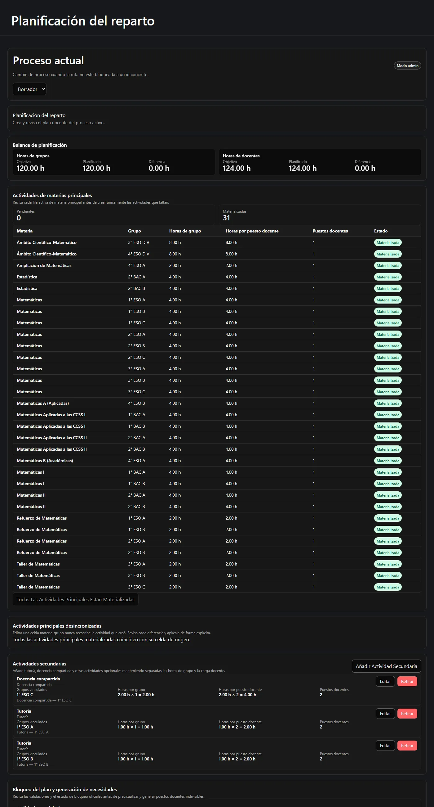
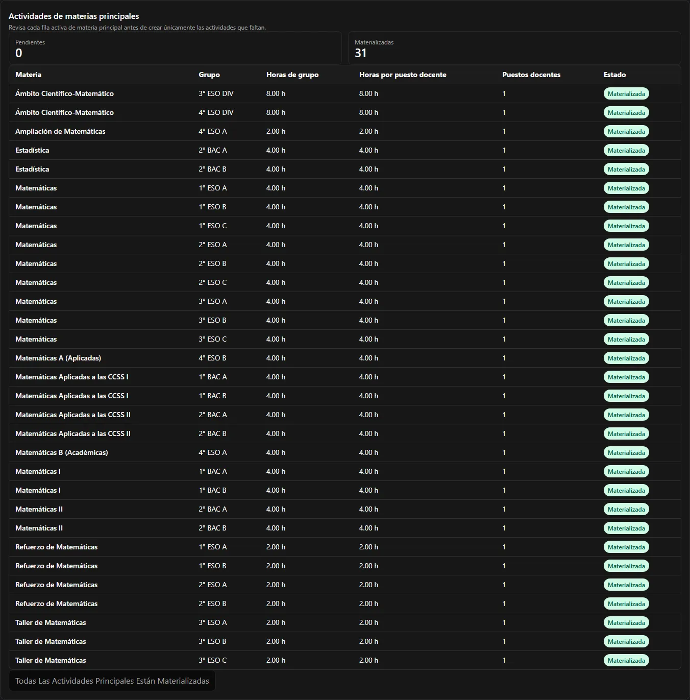
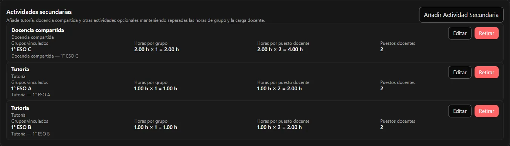
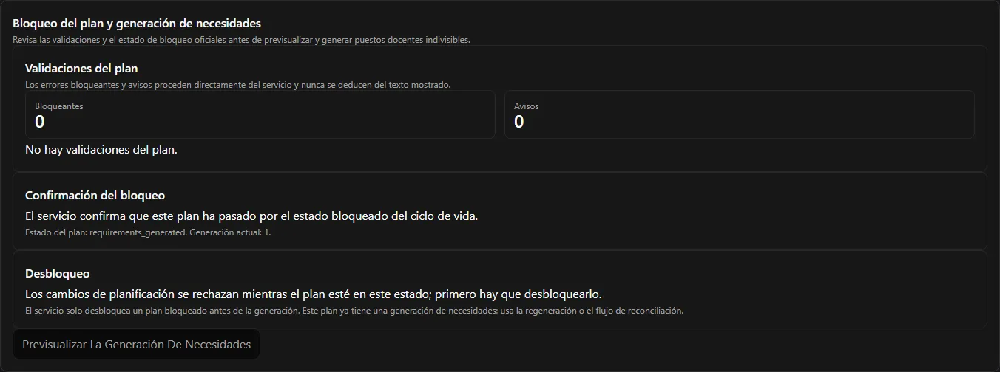
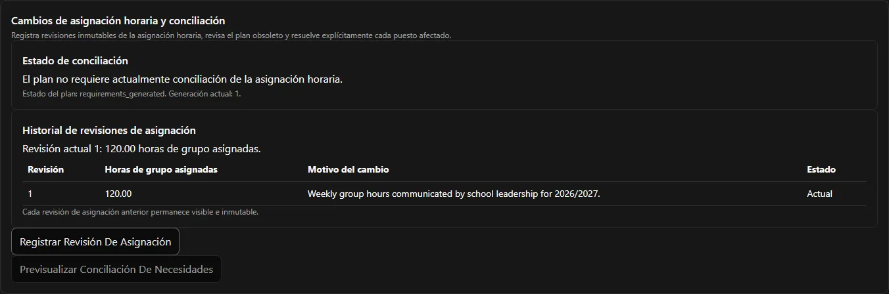

La etapa 2 convierte su configuración en un **plan docente**: qué se imparte realmente, con
cuántos docentes y durante cuántas horas. Cuando está equilibrado, es realizable y queda
bloqueado, la aplicación genera los puestos docentes indivisibles que reparte la etapa 3.

Todo lo de esta página ocurre en una sola pantalla: **Planificación**.



**En esta página:** [crear el plan](#0-crear-el-plan-docente) ·
[balances](#1-vigilar-los-dos-balances) ·
[materializar](#2-materializar-las-actividades-principales) ·
[celdas desincronizadas](#actividades-principales-desincronizadas) ·
[actividades secundarias](#3-añadir-las-actividades-secundarias) ·
[validaciones](#4-leer-las-validaciones) · [viabilidad](#5-comprobar-la-viabilidad) ·
[bloquear](#6-bloquear-el-plan) · [generar](#7-generar-los-puestos) ·
[horas necesarias](#la-página-de-horas-necesarias) ·
[cambios de dotación](#cuando-cambia-la-dotación)

---

## 0. Crear el plan docente

Un proceso posee **como mucho un** plan docente, y el plan no se crea junto con el proceso.
Hasta que alguien lo crea, todas las pantallas de la etapa 2 están vacías; no rotas.

La página de Planificación lo muestra como un estado vacío y ofrece la acción de **crear**.
Una vez que el plan existe, el panel desaparece. Si dos personas pulsan crear a la vez, el
segundo intento se rechaza con las palabras del propio servidor; no se duplica nada.

Crear el plan exige **Administrador** o superior.

## 1. Vigilar los dos balances

La cabecera de balance está en lo alto de la página de Planificación y permanece visible
mientras trabaja. No se va de la pantalla, porque es aquello por lo que usted se guía.


Dos ejes, cada uno con **Objetivo**, **Planificado** y **Diferencia**:

- **Horas de grupo** — lo planificado frente a la dotación de dirección actual.
- **Horas de profesorado** — lo planificado frente a la suma de objetivos de los
  participantes.

Son dos medidas distintas y nunca se suman. Si le resulta extraño, lea antes
[Horas, balances y viabilidad](/es/docs/reparto/hours-and-balances/).

Su objetivo en la etapa 2 es dejar **ambas** diferencias en `0.00`.

## 2. Materializar las actividades principales

Las **actividades de materia principal** se crean por usted a partir de la matriz. El panel
compara cada celda activa de materia principal con las actividades que ya existen y etiqueta
cada fila como **Falta** o **Materializada**.



La fila muestra exactamente lo que se creará —o se creó—:

| Columna | De dónde sale |
| --- | --- |
| Materia | la celda de la matriz |
| Grupo | la celda de la matriz |
| Horas de grupo | la celda, o el valor por defecto de la materia si la celda hereda |
| Horas por puesto docente | la celda, o el valor por defecto de la materia |
| Puestos docentes | la celda |

La acción de crear solo está disponible mientras faltan filas, y pide una confirmación
aparte de que creará **solo las que faltan**. Es seguro pulsarla dos veces: el punto de
acceso del servidor es idempotente, así que una fila ya materializada se salta en vez de
duplicarse.

En el ejemplo esto crea **31** actividades que suman **116** horas de grupo y **116** horas
de profesorado.

### Actividades principales desincronizadas

Editar una celda de la matriz nunca reescribe la actividad que creó. En su lugar, la
actividad se marca como **desincronizada**, y un panel inferior muestra cada diferencia para
que usted la revise y la aplique explícitamente.

Cuando todo concuerda, ese panel simplemente dice *«Todas las actividades principales
materializadas coinciden con su celda de origen.»*

## 3. Añadir las actividades secundarias

Las actividades secundarias son la parte discrecional del plan: tutoría, docencia
compartida, apoyo, tareas de departamento. Se añaden a mano, porque decidirlas *es* el
trabajo de planificación.



Cada actividad secundaria pide:

| Campo | Notas |
| --- | --- |
| **Materia** | Se elige entre las materias del proceso. |
| **Tipo de actividad** | Solo una etiqueta descriptiva: nunca dirige el comportamiento. |
| **Grupos vinculados** | Uno, varios o ninguno, según lo que permita la materia. |
| **Horas de grupo por grupo** | Lo que recibe cada clase vinculada. |
| **Horas por puesto docente** | Lo que dedica un docente. |
| **Puestos docentes** | Un número entero positivo. |

La fila le muestra después la aritmética, para que vea moverse los dos balances:

```text
Docencia compartida · Docencia compartida
  Horas de grupo por grupo      2.00 h × 1 = 2.00 h
  Horas por puesto docente      2.00 h × 2 = 4.00 h
  Puestos docentes              2
```

Esa única actividad añade **2** al total de grupo y **4** al de profesorado, que es
exactamente cómo un plan llega a 120 y 124 a la vez.

Cada cambio actualiza al instante los balances, las validaciones, la vista de horas
necesarias y el panel.

:::note[Las actividades se retiran, no se borran]
La acción de la fila es **Retirar**, no borrar. Una actividad retirada deja de contar pero
sigue visible con su fecha de retirada. Nada desaparece del registro.
:::

## 4. Leer las validaciones

El panel **Validaciones del plan** muestra lo que opina el *servidor*, separado en recuentos
de **Bloqueantes** y de **Avisos**.



Los hallazgos se imprimen con el mensaje del propio servidor y un código estable. La
interfaz no guarda ninguna copia de las reglas y nunca deduce un hallazgo a partir de lo que
ve en pantalla, así que lo que lee aquí es autoritativo.

Un hallazgo que encontrará pronto es `plan.requirements_not_generated`. Ese es esperable
antes de la generación y **no** le impide bloquear.

## 5. Comprobar la viabilidad

La viabilidad es el tercer invariante
([qué significa](/es/docs/reparto/hours-and-balances/#la-tercera-comprobación-la-viabilidad)).
Lance la evaluación desde la página de Planificación.


- **Realizable** — la aplicación guarda una combinación concreta que demuestra que los
  puestos se pueden repartir exactamente.
- **Irrealizable** — no existe ninguna combinación. Un informe de diagnóstico, visible solo
  para la jefatura de departamento, explica por qué y sugiere remedios.
- **Desconocida** — la comprobación agotó su esfuerzo permitido. Se trata como no
  demostrada, así que bloquea.
- **Sin evaluar** — el valor por defecto, y al que vuelve cualquier cambio relevante.

:::note[Se reinicia a menudo, y es a propósito]
Editar un campo de participante, una actividad o la matriz que afecte realmente al solver
devuelve la viabilidad a **Sin evaluar**. El orden de selección y los metadatos propios de
la reunión ya no la invalidan. Evalúe de nuevo tras un cambio relevante, antes de bloquear.
:::

## 6. Bloquear el plan

Bloquear congela el plan para poder generar puestos a partir de él. La acción de bloqueo solo
está disponible cuando se cumplen **todas** estas condiciones:

- horas de grupo equilibradas exactamente;
- horas de profesorado equilibradas exactamente;
- viabilidad **Realizable**, evaluada sobre el plan tal como está ahora;
- ningún hallazgo bloqueante que cuente contra el bloqueo.

Después pide una confirmación específica. El servidor es la autoridad final: la comprobación
de la interfaz solo decide si ofrecer el botón.

Bloquear **no** es una puerta de un solo sentido. El mismo panel lleva **Desbloquear**, que
aparece cuando el estado del plan rechaza las ediciones de planificación. El servidor acepta
un desbloqueo solo para un plan **bloqueado y sin generar**. Una vez generados los puestos, el
panel lo dice claramente y le remite a la regeneración o a la conciliación en vez de ofrecerle
un control que sería rechazado:

> *El servicio solo desbloquea un plan bloqueado antes de la generación. Este plan ya tiene
> una generación de puestos, así que use la regeneración o el flujo de conciliación.*

## 7. Generar los puestos

La generación está disponible cuando el servidor informa de que el plan está **bloqueado** (u
**obsoleto**). Se hace en dos pasos.

**Vista previa.** *Previsualizar la generación de puestos* muestra la diferencia
determinista:

| Grupo | Significado |
| --- | --- |
| **Crear** | Puestos nuevos que añadirá esta generación. |
| **Conservar** | Puestos que ya existen y no cambian. |
| **Retirar** | Puestos que el plan ya no sostiene. |
| **Conflicto** | Puestos que no se pueden cambiar automáticamente, normalmente porque alguien ya los tiene. |

**Aplicar.** Al confirmar se realiza la generación. El resultado muestra el **número de
generación** y el recuento autoritativo de puestos vivos.

En el ejemplo esto produce **37** puestos en la generación **1**:

```text
21 puestos × 4.00 h   (materias principales ordinarias)
 2 puestos × 8.00 h   (las actividades de Ámbito)
10 puestos × 2.00 h   (apoyo, taller y docencia compartida)
 4 puestos × 1.00 h   (tutoría)
───────────────────────
37 puestos, 124.00 horas de profesorado
```

:::caution[Los conflictos desactivan aplicar]
Si la vista previa informa de conflictos, aplicar queda desactivado y se le remite al flujo
de conciliación. Un conflicto significa que alguien ya tiene un puesto que la generación
tendría que cambiar, y eso nunca se hace en silencio.
:::

## La página de Horas necesarias

**Horas necesarias** es el resultado, de solo lectura. Agrupa los puestos generados por
actividad docente y por número de posición (mostrado empezando en 1), y enuncia el ciclo de
vida de cada uno: **Disponible**, **Asignado**, **Obsoleto** o **Requiere conciliación**.


Aquí **no** hay, deliberadamente, ninguna creación, edición, creación masiva ni borrado
manual. La identidad y las horas de un puesto solo cambian mediante generación o
conciliación explícita: eso es lo que hace que un puesto sea fiable para entregárselo a un
docente.

## Cuando cambia la dotación

La dirección del centro puede revisar la dotación en cualquier momento, incluso después de
que usted haya planificado y asignado. Registrar una revisión nueva:

1. sustituye a la anterior, que queda visible e inmutable;
2. marca el plan docente como **obsoleto**;
3. recalcula ambos balances;
4. **bloquea las nuevas operaciones de asignación**;
5. deja en su sitio todas las actividades, puestos y asignaciones existentes;
6. exige una **conciliación** explícita antes de que el proceso pueda continuar.

El panel **Cambios de dotación y conciliación** de la página de Planificación es donde
ocurre esto.



El panel lleva el historial de revisiones —*«Toda revisión de dotación anterior sigue visible
e inmutable»*— y dos acciones: **Registrar revisión de dotación** y **Previsualizar la
conciliación de puestos**.

La vista previa de conciliación mantiene visibles los puestos que no cambian y las
asignaciones existentes, identifica cada puesto asignado afectado y ofrece para cada uno la
acción manual de **liberar/sustituir** o **liberar/retirar**. Aplicar exige un motivo escrito
**y** el recuento exacto de conflictos de la vista previa.

:::caution[Una vista previa caducada se descarta, nunca se reintenta]
Si algo cambió entre la vista previa y la aplicación, el servidor la rechaza y la vista previa
se descarta. **Vuelva a previsualizar**; no pulse aplicar una segunda vez. Nada se corrige
nunca de forma destructiva ni automática: ningún cambio de dotación borra una asignación a sus
espaldas.
:::

Una vez resueltos los conflictos, la regeneración crea un **número de generación nuevo** y el
plan vuelve a un estado generado.

Si el proceso está `final`, hay que reabrirlo antes de poder cambiar su dotación.

---

**Anterior:** [← Etapa 1 — Configuración](/es/docs/reparto/stage-1-configuration/) ·
**Siguiente:** [Etapa 3 — Asignación →](/es/docs/reparto/stage-3-assignment/)
