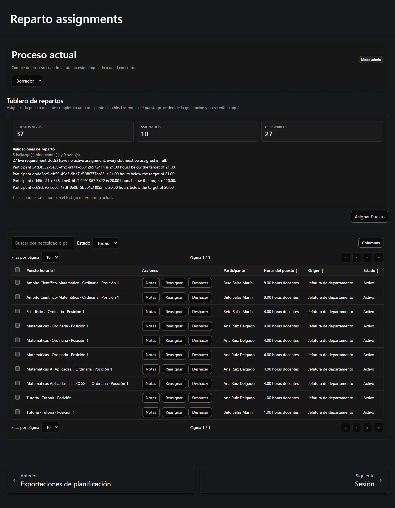
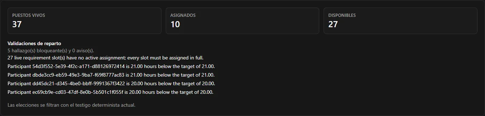

La etapa 3 reparte los puestos que generó la etapa 2. Una fila es un participante que tiene
un puesto completo, entero.

**En esta página:** [el tablero](#el-tablero-de-reparto) ·
[asignar](#entregar-un-puesto-a-un-docente) ·
[por qué se bloquea una elección](#por-qué-una-elección-se-ofrece-se-bloquea-o-no-está) ·
[deshacer](#deshacer-cancelar-una-asignación) ·
[reasignar](#reasignar-mover-un-puesto) ·
[deshacer en lote](#deshacer-varias-filas-a-la-vez) ·
[terminar](#cuándo-termina-la-etapa-3)

---

## El tablero de reparto

Abra **Repartos**. El tablero empieza con el recuento de puestos vivos, cuántos están
asignados y cuántos siguen libres, seguido de los hallazgos de validación del propio
servidor.

Cada fila de la tabla indica:

| Columna | Significado |
| --- | --- |
| **Puesto horario** | La actividad, su tipo y el número de posición: *Matemáticas · Ordinaria · Posición 1*. |
| **Participante** | Quién lo tiene. |
| **Horas del puesto** | Las horas de profesorado que cuesta este puesto. **Solo lectura.** |
| **Origen** | Cómo se asignó: *Jefatura de departamento*, o la elección propia de un docente. |
| **Estado** | *Activa* o *Cancelada*. |

:::note[No hay casilla de horas, y es deliberado]
El tablero no tiene entrada de horas, ni tipo de reparto, ni forma de saltarse el exceso de
asignación. Las horas vienen del puesto generado y no se pueden editar aquí. Un puesto se
coge entero o no se coge.
:::

## Entregar un puesto a un docente

Pulse **Asignar puesto**. El diálogo ofrece:

1. **Un puesto** — solo los que están vivos y libres.
2. **Un participante** — solo aquellos a quienes el servidor realmente aceptaría.

La segunda lista es la importante. Los participantes que no pueden coger el puesto
seleccionado **aparecen listados con el motivo** en vez de desaparecer en silencio, para que
usted vea por qué:

| Motivo | Significado |
| --- | --- |
| El participante está inactivo | No está activo en este proceso. |
| Ya tiene otro puesto de la misma actividad | Dos puestos de una actividad deben ir a docentes distintos. |
| Le haría pasar de sus horas restantes | El puesto es mayor que las horas que le quedan, y no se puede partir. |

Como un puesto no se puede partir, el «ajuste exacto» se comprueba en todas partes: a un
docente con 3 horas restantes nunca se le ofrecerá un puesto de 4 horas.

### El filtro de elección segura

Cuando el plan es realizable, el tablero consulta además la combinación guardada por el
servidor y aplica un filtro adicional conservador. Una elección que demostrablemente la rompe
se muestra **desactivada**; la elección que usa la propia combinación se marca como
**segura**; el resto quedan disponibles y las comprueba el servidor de forma autoritativa
cuando usted confirma.

El tablero le dice en qué estado está: *«Las opciones se filtran contra el testigo
determinista actual.»* Si esa información está caducada o no disponible, el filtro **falla en
cerrado**: deja de orientar en vez de orientar mal.

:::note[Es una ayuda, no la regla]
El filtro es una comodidad. El servidor vuelve a comprobar cada asignación cuando usted la
confirma, y es él quien decide. Además, nunca se muestra al profesorado ni en el proyector:
ellos solo ven el estado de preparación simple.
:::

## Por qué una elección se ofrece, se bloquea o no está

Tres cosas distintas pueden impedir una asignación, y se leen de forma distinta:

| Qué ve | Qué significa | Qué hacer |
| --- | --- | --- |
| El participante aparece con un motivo | Una regla del dominio rechaza esa combinación. | Elija otro participante u otro puesto. |
| Un rechazo que menciona el testigo determinista | La combinación guardada no se pudo ajustar sobre la marcha para esta elección. | Vuelva a lanzar la evaluación de viabilidad desde la página de Planificación e inténtelo de nuevo. |
| Todo el tablero rechaza asignaciones nuevas | El plan está obsoleto o necesita conciliación. | Vaya a [Etapa 2 — cuando cambia la dotación](/es/docs/reparto/stage-2-planning/#cuando-cambia-la-dotación). |

El segundo conviene esperarlo. Un mensaje como:

> *La selección está bloqueada porque el testigo determinista no se pudo reparar
> (local_repair_not_found); se requiere una evaluación administrativa de viabilidad.*

no es un fallo. Significa que la comprobación rápida sobre la marcha no pudo demostrar que
los puestos restantes siguen cuadrando, y quiere una reevaluación en condiciones. Lánzela y
continúe; consulte
[Solución de problemas](/es/docs/reparto/troubleshooting/#la-selección-está-bloqueada-porque-el-testigo-determinista-no-se-pudo-reparar).

## Deshacer: cancelar una asignación

**Deshacer** libera un puesto y reabre el turno completado de quien lo tenía. Exige un
**motivo escrito** y está restringido a **Administrador** o superior.

La fila cancelada permanece en el tablero como historial, sin botones de acción: es el
registro de una decisión que se tomó y luego se revirtió, no un error que haya que borrar.

## Reasignar: mover un puesto

**Reasignar** mueve un puesto de un docente a otro. Es una única operación atómica, no un
borrado seguido de una creación, así que el puesto nunca queda momentáneamente sin asignar.
También exige un **motivo escrito** y **Administrador** o superior.

La lista de participantes sustitutos se filtra igual que en una asignación nueva.

## Deshacer varias filas a la vez

Se pueden deshacer juntas varias filas activas usando las casillas de selección de la tabla.
Un único diálogo recoge **un** motivo, lo registra en cada fila y las aplica de una en una.

Si una de ellas se rechaza, la ejecución **se detiene ahí** e informa de cuántas salieron
adelante. Las filas ya deshechas siguen deshechas: la operación no se revierte. Lea el
recuento del resultado antes de dar por hecho que se ha liberado todo.

## Cuándo termina la etapa 3

El panel de validaciones del tablero le dice qué queda pendiente. El proceso está completo
cuando:

- cada puesto vivo tiene una asignación activa;
- cada participante activo ha alcanzado su objetivo **exactamente**;
- el plan no está obsoleto y no necesita conciliación.

Solo entonces queda disponible la exportación final estricta, que además archiva el proceso.
Consulte
[Versiones, exportaciones y auditoría](/es/docs/reparto/versions-exports-audit/#la-exportación-final-del-reparto).

:::note[Los hallazgos nombran al participante]
Los mensajes de validación compuestos por el servidor usan el nombre visible del participante,
y solo recurren al identificador si la ficha ya no está disponible.
:::

---

**Anterior:** [← Etapa 2 — Planificación](/es/docs/reparto/stage-2-planning/) ·
**Siguiente:** [La sesión, la vista del docente y la pantalla compartida →](/es/docs/reparto/meeting-and-lan/)
