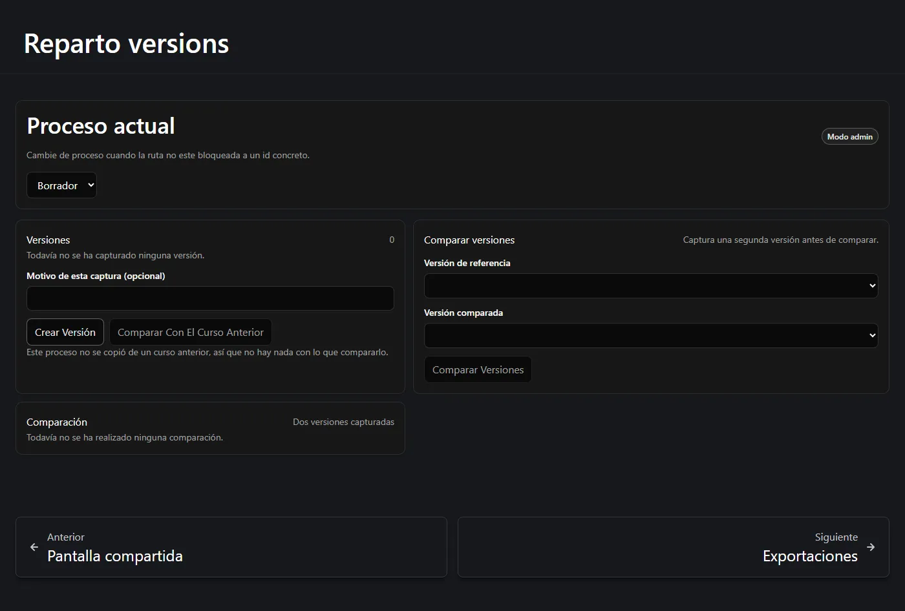
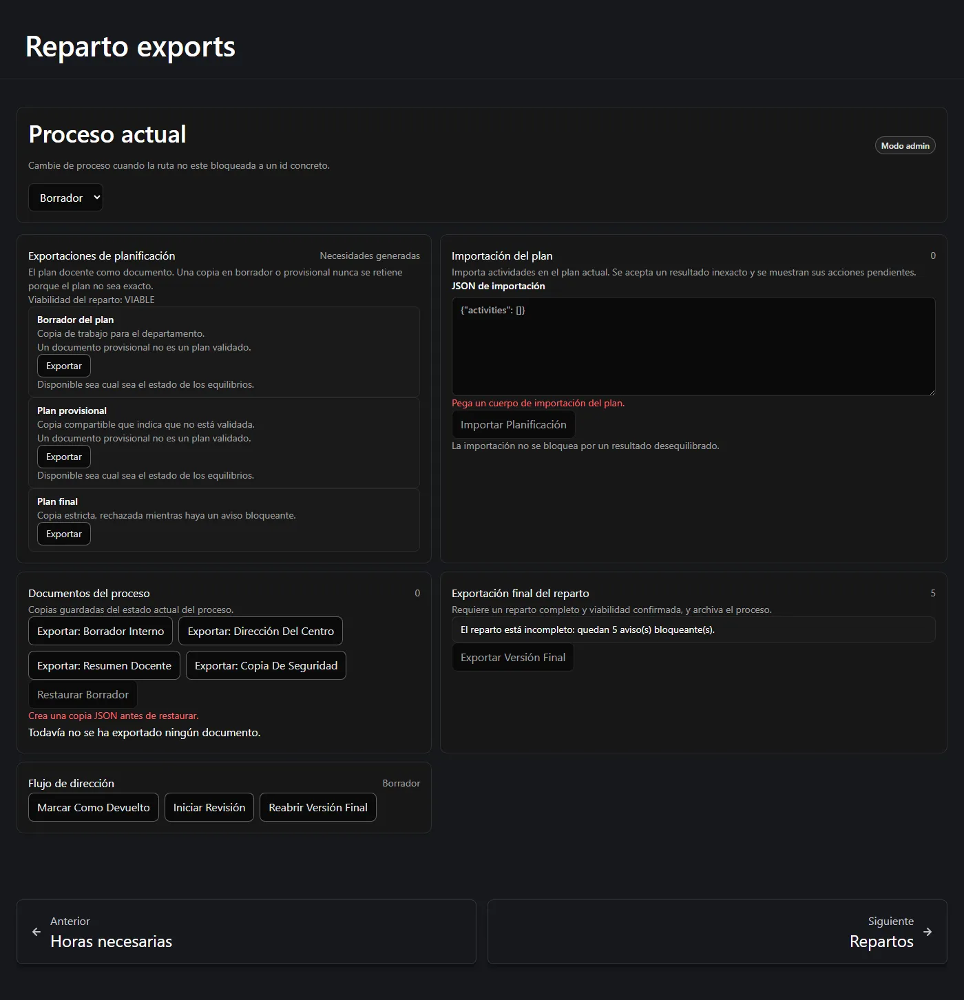
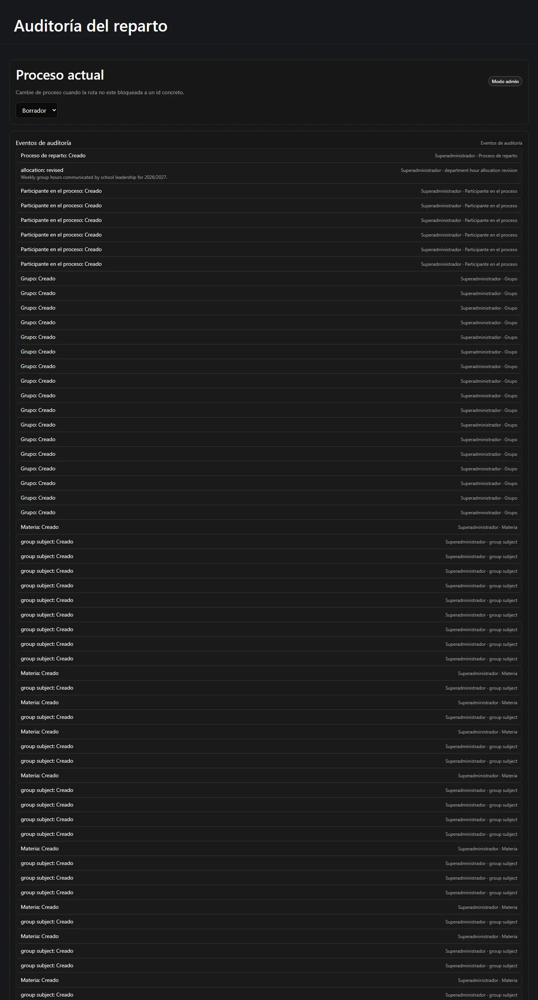

Estas tres pantallas son la forma en que un reparto sale de la aplicación: como una
instantánea a la que volver, como un documento que enviar y como un registro de quién hizo
qué.

**En esta página:** [versiones](#versiones) · [comparación](#comparar-dos-versiones) ·
[exportaciones de planificación](#exportaciones-de-planificación) ·
[importación](#importación-de-planificación) ·
[documentos y copia de seguridad](#documentos-del-proceso-y-copia-de-seguridad) ·
[exportación final](#la-exportación-final-del-reparto) · [auditoría](#el-rastro-de-auditoría)

---

## Versiones

Una **versión** es una instantánea inmutable de todo el proceso, tomada a petición. Póngale
una nota opcional que explique por qué la captura y pulse crear.

Una instantánea captura todo lo que importa:

- las revisiones de dotación y cuál era la actual;
- el plan docente y su estado;
- la matriz grupo-materia;
- las actividades docentes y sus grupos vinculados;
- ambos resúmenes horarios;
- los puestos generados;
- las horas base y extra de cada participante;
- el estado de conciliación.

## Comparar dos versiones

La comparación es la respuesta del propio servidor, no una diferencia de texto. Informa de
**nueve dimensiones con nombre**, cada una con una diferencia con signo cuando procede:

| Dimensión |
| --- |
| Ha cambiado la dotación de dirección |
| Han cambiado las horas de grupo |
| Ha cambiado la carga del profesorado |
| Ha cambiado la categoría de una materia |
| Se ha añadido o quitado una actividad |
| Se ha añadido o quitado un vínculo de grupo |
| Ha cambiado el número de puestos docentes |
| Ha cambiado el objetivo base/extra de un participante |
| Ha cambiado la generación de puestos |

Una dimensión puede leerse como **no comparable**: por ejemplo, una diferencia de dotación
cuando uno de los dos lados no tiene dotación alguna. Es una respuesta real, distinta de «sin
cambios».

La misma pantalla gobierna también la **comparación con el curso anterior**, que es lo que
hace posible una revisión de un curso a otro.

:::note[Qué trae y qué no trae «copiar del curso pasado»]
Copiar de un curso anterior trae las materias y sus valores por defecto, los grupos, las filas
de la matriz y los participantes **sin** sus aprobaciones de horas extra. Deliberadamente
**no** trae la dotación de dirección como revisión activa, ni ninguna asignación, sesión,
turno o aprobación de horas extra. Una dotación anterior puede mostrarse como sugerencia,
nunca adoptarse en silencio.
:::

## Exportaciones de planificación

La página **Exportaciones** separa tres familias distintas de documento, porque siguen reglas
distintas.

Las **exportaciones de planificación** son el plan docente como documento:

| Documento | Regla |
| --- | --- |
| **Borrador de planificación** | Copia de trabajo para el departamento. *Disponible digan lo que digan los balances.* |
| **Plan provisional** | Copia compartible que declara que no está validada. *Disponible digan lo que digan los balances.* |
| **Plan final** | Estricto. Se rechaza mientras haya un hallazgo bloqueante. |

:::note[El borrador y el provisional nunca se retienen]
Un plan desequilibrado, inexacto u obsoleto se puede guardar, importar, exportar como borrador
o copia provisional, enviar provisionalmente a dirección, incluir en una copia de seguridad y
versionar. Ser imperfecto bloquea *iniciar la etapa de asignación*; no bloquea ponerlo por
escrito. Cada oferta provisional imprime la viabilidad de reparto actual para que quien lo
reciba sepa qué tiene entre manos: *«Assignment feasibility: FEASIBLE»*.
:::

## Importación de planificación

La **importación de planificación** vuelve a meter un documento de planificación en el plan
actual. Pegue el contenido e importe.

La importación deliberadamente **no** está condicionada por los balances: *«La importación no
se bloquea por un resultado desequilibrado.»* Lo que recibe de vuelta es el balance doble
autoritativo tras la importación más todos los hallazgos posteriores, de modo que una
importación imperfecta queda a la vista en lugar de aceptarse en silencio.

## Documentos del proceso y copia de seguridad

Los **documentos del proceso** son copias guardadas del estado actual del proceso, no solo del
plan:

- **Exportar borrador interno** — para uso del propio departamento.
- **Exportar para dirección** — la copia que sube.
- **Exportar resumen del profesorado** — el resumen por docente.
- **Exportar copia de seguridad** — una copia de seguridad completa en JSON.
- **Restaurar borrador** — restaura una copia de seguridad en un proceso en borrador.

La restauración es deliberadamente incómoda. Solo está disponible tras una confirmación
específica, restaura sobre un proceso en **borrador**, y la página se niega a ofrecerla hasta
que exista una copia de seguridad: *«Cree una copia de seguridad JSON antes de restaurar.»*

Una copia de seguridad conserva la precisión decimal, restaura el historial de dotación, el
plan y las actividades, y nunca contiene ningún secreto ni credencial.

El panel **Flujo con dirección** lleva los pasos de nivel de proceso posteriores al envío de un
reparto: *Marcar como devuelto*, *Iniciar revisión* y *Reabrir final*.

## La exportación final del reparto

Esta es estricta, y está aparte por un motivo.

> *Necesita un reparto completo y viabilidad confirmada, y archiva el proceso.*

Solo queda disponible cuando todos los puestos vivos están asignados, todos los participantes
han alcanzado su objetivo exactamente y la viabilidad está confirmada. Hasta entonces, el panel
enumera exactamente lo que falta como hallazgos estables y contables:

> *El reparto está incompleto: quedan 5 hallazgo(s) bloqueante(s).*

Como **archiva el proceso**, además pide una confirmación explícita. Archivado es terminal: un
proceso archivado no se puede reabrir
([véase la etapa 1](/es/docs/reparto/stage-1-configuration/#reabrir-un-proceso-cerrado)).

## El rastro de auditoría

**Auditoría** enumera lo que le ha ocurrido a este proceso, en orden, con quién lo hizo.

Se registra todo lo relevante: la creación del proceso, las revisiones de dotación, las
autorizaciones de horas extra y sus motivos, los bloqueos del plan, las generaciones, las
conciliaciones, las asignaciones, los deshacer y las reasignaciones.

El motivo que usted escribió cuando la aplicación se lo pidió se guarda aquí. Es visible para
la jefatura de departamento y **nunca** se muestra al profesorado ni en la pantalla compartida.

---

**Anterior:** [← La sesión, la vista del docente y la pantalla compartida](/es/docs/reparto/meeting-and-lan/) ·
**Siguiente:** [Límites y notas operativas →](/es/docs/reparto/limitations/)
