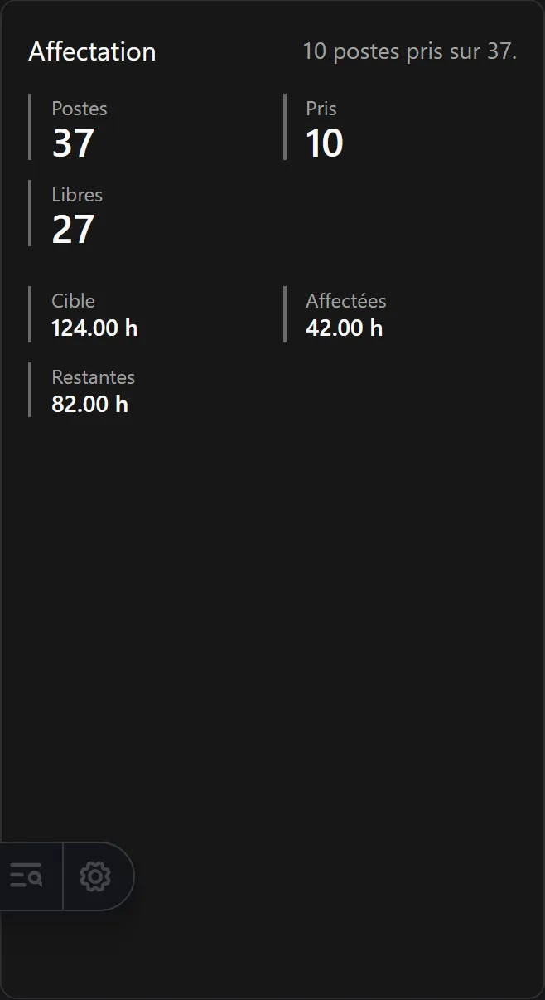

Cette page vous mène d'un navigateur vide à un écran opérationnel. Elle suppose que
quelqu'un a déjà installé et activé le plugin Reparto sur ce site — voir
[Savoir si Reparto Docente est activé ici](/fr/docs/reparto/#savoir-si-reparto-docente-est-activé-ici)

**Sur cette page :** [se connecter](#1-se-connecter) · [le menu](#2-trouver-le-menu) ·
[choisir un processus](#3-choisir-un-processus) ·
[la liste de contrôle](#4-lire-la-liste-de-contrôle) ·
[par quoi commencer](#5-par-quoi-commencer)

---

## 1. Se connecter

Utilisez le lien de compte au bas du menu de gauche, ou allez directement à la page de
connexion du site. Reparto Docente n'a pas de connexion propre : il utilise le même compte
que le reste du site.

Ce que votre compte peut faire dépend de son **rôle**. En bref :

- **Administrateur** ou **Super administrateur** — vous êtes ici le *chef de département*.
  Vous pouvez faire tout ce que décrit ce guide.
- **Rédacteur** — vous pouvez agir sur vos propres enregistrements : votre fiche
  d'enseignant, vos propres choix de poste, votre propre tour.
- **Lecteur** — vous pouvez tout consulter et ne rien modifier.
- **Utilisateur** — cette application ne vous est pas accessible du tout.

Le tableau complet se trouve sur [Qui peut faire quoi](/fr/docs/reparto/roles/).

## 2. Trouver le menu

Quand le plugin est activé, une entrée **Repartition docente** apparaît dans le menu de
gauche. Ouvrez-la et vous y trouverez les trois étapes :

```text
Repartition docente
├── Étape 1 · Configuration
│     Tableau de bord · Processus · Établissements · Années scolaires · Départements
│     Niveaux scolaires · Liste du personnel enseignant · Dotation de la direction
│     Participants au processus · Matières · Classes
│     Matrice groupe-matière · Paramètres du processus
├── Étape 2 · Planification
│     Planification · Besoins horaires · Exports de planification
└── Étape 3 · Affectation
      Affectations · Séance · Mon espace · Écran partagé
      Versions · Exports · Audit
```

Ce menu **est** l'ordre de travail. Le parcourir de haut en bas est une manière valable de
configurer un département en partant de zéro.

:::tip
Chaque page Reparto comporte aussi des liens **Précédent** et **Suivant** en bas, dans le
même ordre. Vous pouvez parcourir toute l'application avec eux seuls.
:::

## 3. Choisir un processus

Presque tout dans Reparto Docente appartient à un **processus d'affectation** : un
département, dans un établissement, pour une année scolaire. Le processus est le conteneur
du travail de toute une année.

La plupart des pages portent en haut une barre **Processus courant**. Si aucun processus
n'est encore sélectionné, cette barre devient un sélecteur : choisissez l'année scolaire,
puis l'établissement, puis le département. Votre choix est mémorisé sur ce navigateur ; vous
ne le ferez donc qu'une fois.


Si aucun processus n'existe encore, créez-le depuis la page **Processus**. Il faudra d'abord
qu'un établissement, une année scolaire et un département existent : le sélecteur propose une
option **Créer** pour chacun, vous pouvez donc tout faire depuis le même écran.

:::note[Le sélecteur ne vous demande jamais d'identifiant]
On choisit un processus par année, établissement et département, jamais par un code long.
Les messages de validation composés par le serveur nomment également le participant concerné.
:::

## 4. Lire la liste de contrôle

Le **Tableau de bord** est la première entrée du menu, et son sommet est une liste de
contrôle intitulée **Configurez votre reparto**. Elle comporte quinze étapes groupées selon
les trois grandes étapes, et vous dit, à l'instant, ce qui est fait et ce qui manque.


Chaque étape indique **Terminé**, **Ouvrir** ou **Non vérifié ici**. Cette dernière mention
n'est pas un échec : elle signifie que cet écran-là ne lit pas cette information — par
exemple, aucun processus n'a encore été sélectionné, donc les étapes de niveau processus ne
peuvent pas être vérifiées.

Les quinze étapes sont :

| # | Étape | Phase |
| --- | --- | --- |
| 1 | Créer un établissement | 1 |
| 2 | Créer une année scolaire | 1 |
| 3 | Créer un département | 1 |
| 4 | Créer un processus d'affectation | 1 |
| 5 | Enregistrer la dotation horaire de la direction | 1 |
| 6 | Ajouter les participants et leurs heures cibles | 1 |
| 7 | Ajouter les matières enseignées | 1 |
| 8 | Ajouter les classes | 1 |
| 9 | Remplir la matrice classe-matière | 1 |
| 10 | Vérifier la configuration et les paramètres de sélection | 1 |
| 11 | Créer le plan d'enseignement | 2 |
| 12 | Équilibrer les heures de classe et la charge enseignante | 2 |
| 13 | Verrouiller le plan d'enseignement | 2 |
| 14 | Générer les créneaux de besoin | 2 |
| 15 | Attribuer les postes en séance | 3 |

Sous la liste, le tableau de bord affiche les deux équilibres, les trois invariants, combien
de postes restent libres et où en est chaque participant.



## 5. Par quoi commencer

Si vous partez de zéro, procédez dans cet ordre. Chaque lien mène aux instructions
détaillées.

1. **[Créer l'établissement, l'année scolaire et le département](/fr/docs/reparto/stage-1-configuration/#configuration-globale)** —
   ils sont partagés par tout le site, ils existent donc peut-être déjà.
2. **[Ajouter les niveaux scolaires](/fr/docs/reparto/stage-1-configuration/#niveaux-scolaires)** —
   *ESO*, *Bachillerato*… Également partagés, et également peut-être déjà créés.
3. **[Ajouter les enseignants à la liste](/fr/docs/reparto/stage-1-configuration/#liste-du-personnel-enseignant)**.
4. **[Créer le processus d'affectation](/fr/docs/reparto/stage-1-configuration/#le-processus-daffectation)**.
5. **[Enregistrer la dotation de la direction](/fr/docs/reparto/stage-1-configuration/#dotation-de-la-direction)**.
6. **[Ajouter les participants et leurs heures](/fr/docs/reparto/stage-1-configuration/#participants)**.
7. **[Ajouter les matières et les classes](/fr/docs/reparto/stage-1-configuration/#matières)**.
8. **[Remplir la matrice classe-matière](/fr/docs/reparto/stage-1-configuration/#la-matrice-classe-matière)**.
9. **[Vérifier les paramètres du processus](/fr/docs/reparto/stage-1-configuration/#paramètres-du-processus)**.
10. Passez à l'**[Étape 2 — Planification](/fr/docs/reparto/stage-2-planning/)**.

:::tip[Vous ne pouvez rien casser en regardant]
Rien ne change dans Reparto Docente du seul fait d'ouvrir une page. Toute action qui modifie
quelque chose vous demande d'abord de confirmer, et celles qui comptent vous demandent en
plus un motif écrit.
:::

---

**Précédent :** [← Comment fonctionne le plugin](/fr/docs/reparto/how-it-works/) ·
**Suivant :** [Qui peut faire quoi →](/fr/docs/reparto/roles/)
