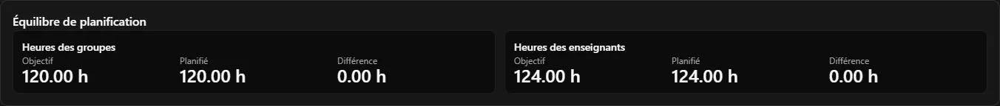
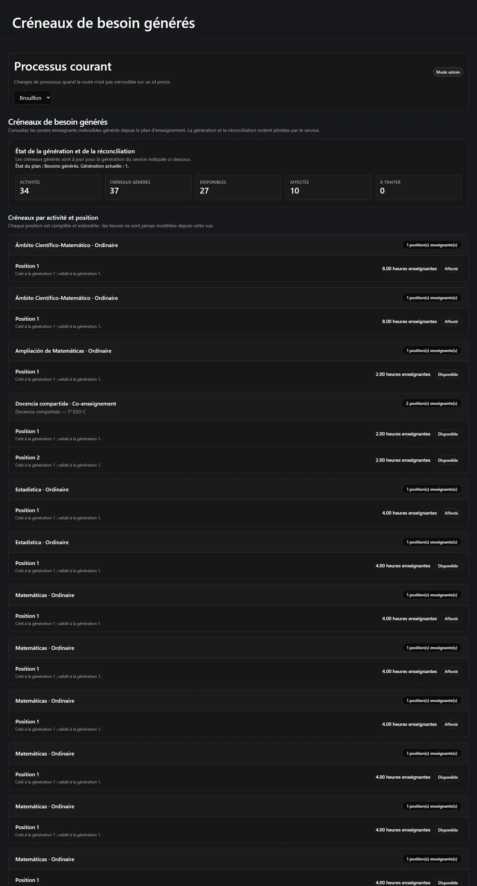
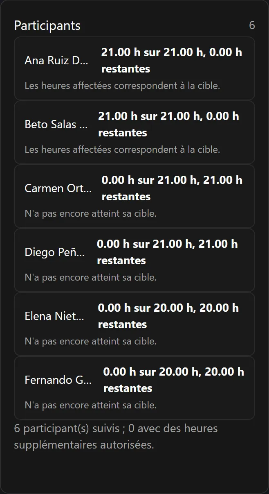
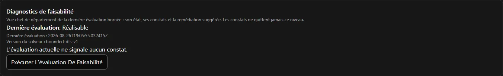

C'est la page à lire si un nombre à l'écran vous semble faux. Neuf fois sur dix il ne l'est
pas : c'est *l'autre* total.

**Sur cette page :** [deux équilibres](#deux-équilibres-jamais-un) ·
[l'exemple](#lexemple-120-et-124) · [le tutorat](#deuxième-exemple-le-tutorat) ·
[plusieurs classes](#troisième-exemple-une-activité-plusieurs-classes) ·
[postes indivisibles](#postes-indivisibles) ·
[cibles exactes](#cibles-exactes-et-heures-supplémentaires-autorisées) ·
[faisabilité](#la-faisabilité-troisième-vérification) ·
[décimales](#comment-sécrivent-les-heures)

---

## Deux équilibres, jamais un

Reparto Docente suit deux totaux entièrement séparés.

**Heures de classe** — ce que reçoivent les *classes*.

```text
heures de classe = Σ ( heures groupe par classe × nombre de classes liées )
cible            = la dotation de la direction courante
```

**Heures enseignant** — ce que travaillent les *enseignants*.

```text
heures enseignant = Σ ( heures enseignant par poste × postes enseignants )
cible             = Σ ( heures de base + heures supplémentaires autorisées de chaque participant )
```

Les deux sont affichés côte à côte, chacun avec sa cible, son total planifié et l'écart. Le
plan est **exact** quand les deux écarts valent `0.00`.



:::danger[Ne les additionnez jamais]
120 + 124 n'est pas un nombre qui signifie quoi que ce soit. Ils mesurent des choses
différentes. L'application ne les additionne jamais, ne les moyenne jamais et n'affiche
jamais un « total d'heures » combiné — et aucun rapport que vous en tirerez ne devrait le
faire non plus.
:::

## L'exemple : 120 et 124

Le département a reçu une dotation de **120** heures de classe hebdomadaires. Ses six
enseignants ont des cibles contractuelles totalisant **124** heures hebdomadaires. Voici
comment un plan satisfait les deux à la fois :

| | Heures de classe | Heures enseignant |
| --- | ---: | ---: |
| 31 activités principales ordinaires | 116 | 116 |
| 2 activités de tutorat (1 h chacune, 2 enseignants chacune) | 2 | 4 |
| 1 activité de co-intervention (2 h, 2 enseignants) | 2 | 4 |
| **Total** | **120** | **124** |

L'écart de 4 heures n'est ni une erreur ni du mou. C'est le *second enseignant* de chacune de
ces trois activités. Deux enseignants dans la même salle pendant deux heures coûtent deux
heures à la classe et quatre au département.

## Deuxième exemple : le tutorat

Une activité de tutorat peut être enregistrée ainsi :

```text
heures groupe par classe      1.00
heures enseignant par poste   2.00
postes enseignants            1
```

Autrement dit : la classe reçoit **une** heure hebdomadaire de tutorat, l'enseignant y
consacre **deux** heures hebdomadaires (la séance plus la préparation et le suivi), et cela
produit **un** poste indivisible de deux heures.

Les heures de classe et les heures enseignant sont des données indépendantes. Il n'y a rien
d'étrange à ce qu'une heure de cours coûte 2 heures à un enseignant.

## Troisième exemple : une activité, plusieurs classes

Si une activité est liée à plusieurs classes, ses heures de classe comptent **une fois par
classe** :

```text
2 heures hebdomadaires × 2 classes = 4 heures de classe
```

Le côté enseignant ne se multiplie pas par les classes, mais par les postes :

```text
heures enseignant par poste × postes enseignants
```

## Postes indivisibles

Une fois le plan verrouillé, l'application génère un **poste** par enseignant dont le plan a
besoin. Chaque poste porte un nombre d'heures fixe, et :

- il va à **un** enseignant, en entier ;
- un poste de 4 heures ne peut pas être coupé en 3 + 1 ;
- deux enseignants ne peuvent pas le partager ;
- un enseignant à qui il reste 3 heures ne peut pas le prendre ;
- deux postes de la *même* activité doivent aller à des enseignants *différents*.

C'est pourquoi le tableau d'affectation n'a pas de case d'heures. Il n'y a rien à saisir : les
heures appartiennent au poste, pas à l'affectation.



## Cibles exactes et heures supplémentaires autorisées

Chaque participant a :

```text
heures de base hebdomadaires        son service contractuel
heures supplémentaires autorisées   un ajout explicite, motivé et tracé
cible                               base + supplémentaires autorisées
```

Chaque participant actif doit atteindre cette cible **exactement** avant que le processus
puisse être clos. En dessous : refusé ; au-dessus : refusé ; et il n'existe nulle part dans
l'application de contrôle permettant de passer outre.

Quand quelqu'un a réellement besoin d'un service plus lourd, le chef de département relève
d'abord ses **heures supplémentaires autorisées**. C'est une action distincte, elle exige un
motif écrit et elle est consignée dans l'audit. Réduire les heures supplémentaires est refusé
si la nouvelle cible passait sous ce que l'enseignant s'est déjà vu attribuer.

Quiconque porte des heures supplémentaires autorisées est signalé comme **surcharge
autorisée** partout où il apparaît.



L'espace propre de l'enseignant affiche ces mêmes cinq chiffres pour lui seul :

```text
Base · Supplémentaires autorisées · Cible · Attribuées · Restantes
```

## La faisabilité, troisième vérification

Que les deux totaux concordent **ne prouve pas** que le plan puisse être réalisé.

Imaginez trois enseignants qui ont chacun besoin d'exactement 5 heures, et des postes de 4, 4,
4, 2 et 1 heures. Les totaux concordent — 15 et 15 — mais il n'y a aucun moyen de donner
exactement 5 heures à chacun avec des morceaux qu'on ne peut pas couper.

Reparto Docente effectue donc une troisième vérification, la **faisabilité du reparto**, qui
demande : *existe-t-il au moins une façon de distribuer ces postes indivisibles pour que
chaque participant tombe exactement sur sa cible ?* Elle répond l'une de ces quatre choses :

| Réponse | Signification |
| --- | --- |
| **Réalisable** | Oui, et l'application conserve un exemple concret de la manière. |
| **Irréalisable** | Non. Aucune combinaison ne fonctionne. Le plan doit changer. |
| **Inconnue** | La vérification a épuisé son effort autorisé sans trancher. Traitée comme « non prouvée », elle bloque donc. |
| **Non évaluée** | Rien n'a été vérifié depuis le dernier changement pertinent. Lancez l'évaluation. |

Les trois doivent être satisfaites avant de pouvoir verrouiller le plan :


:::note[La faisabilité se réinitialise, et c'est voulu]
La faisabilité n'est délibérément *pas* un état du plan. C'est une réponse à part entière, et
tout changement pertinent la ramène à **Non évaluée** au lieu de laisser à l'écran un
résultat périmé. La voir après avoir modifié un participant est normal. Relancez l'évaluation
depuis la page de planification.
:::

Quand un plan est irréalisable, le chef de département — et lui seul — reçoit un panneau de
diagnostic qui explique pourquoi, avec des suggestions concrètes.



### Ce que la faisabilité *ne* prend *pas* en compte

Dans cette version, **tout participant actif peut prendre n'importe quel poste**. Il n'existe
pas de notion d'enseignant habilité pour une matière, restreint à un niveau ou rattaché à une
classe. La légalité ne dépend que de : le participant est actif ; ses heures restantes
exactes ; les postes qu'il détient déjà ; la règle voulant que deux postes d'une même activité
aillent à des enseignants différents ; et les règles de séance.

Les habilitations par matière et restrictions analogues sont une extension future documentée,
pas une fonction cachée — voir
[Limites](/fr/docs/reparto/limitations/#aucune-qualification-ni-règle-déligibilité).

## Comment s'écrivent les heures

Toute valeur horaire est une quantité à deux décimales : `2.50`, `21.00`, `0.00`. Les écarts
peuvent être négatifs : `-4.00`. Les valeurs sont toujours affichées avec deux décimales pour
que deux chiffres se comparent d'un coup d'œil.

Aucun pas d'un quart d'heure ou d'une demi-heure n'est imposé. Toute valeur positive ou nulle
à deux décimales au plus est acceptée. Une troisième décimale est refusée plutôt qu'arrondie :
l'application ne modifie pas en silence un nombre que vous avez saisi.

:::note[Vide n'est pas zéro]
Un champ d'heures vide signifie *« hériter de la valeur par défaut »*. Un `0` saisi signifie
*« réellement zéro »*. L'application les garde distincts partout et aucun formulaire ne les
confond. Pour qu'une cellule de la matrice suive la valeur par défaut de sa matière,
**videz** la case ; ne saisissez pas `0`.
:::

---

**Précédent :** [← Qui peut faire quoi](/fr/docs/reparto/roles/) ·
**Suivant :** [Étape 1 — Configuration →](/fr/docs/reparto/stage-1-configuration/)
