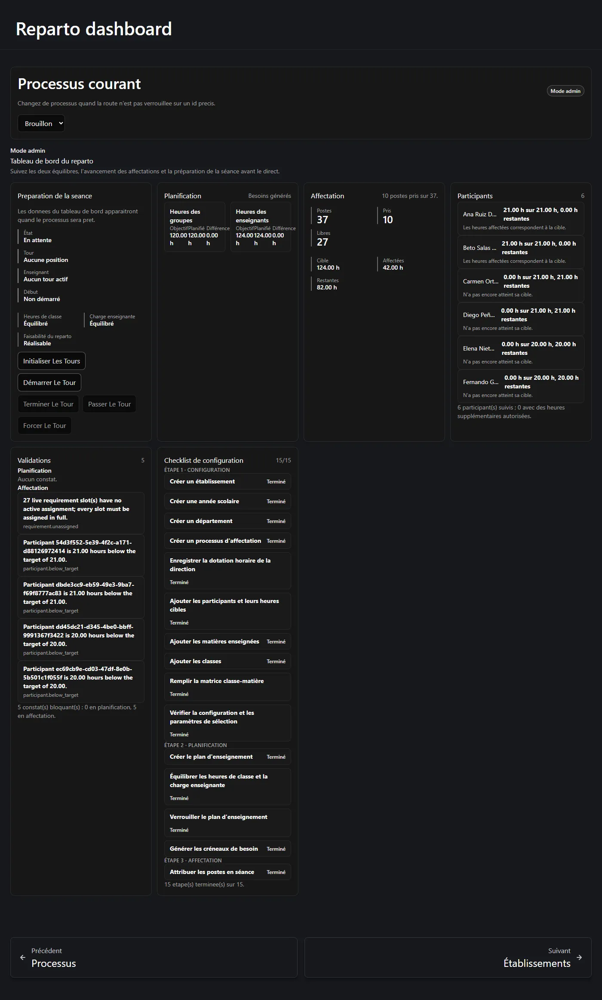

**Reparto Docente** répartit les heures d'enseignement hebdomadaires d'un département entre
les enseignants de ce département. Il remplace le tableur que le chef de département tient
habituellement à la main, et il vérifie les calculs à chaque étape.

Ce guide s'adresse à des personnes qui n'ont jamais utilisé l'application. Aucune
connaissance en programmation, en bases de données ni du vocabulaire des développeurs n'est
nécessaire. Toutes les vues présentées ici sont de véritables captures de l'application en
fonctionnement.

## Le problème qu'il résout

La direction de l'établissement annonce à un département : *« vous disposez de 120 heures
d'enseignement par semaine »*. Le département a des classes, des matières et des
enseignants. Quelqu'un doit transformer ces 120 heures en une liste concrète de « qui
enseigne quoi », dans laquelle :

- chaque classe reçoit les heures qui lui reviennent ;
- chaque enseignant se retrouve avec **exactement** son service : pas une heure de plus,
  pas une de moins ;
- rien n'est perdu ni compté deux fois en chemin.

Reparto Docente vous accompagne à travers **trois étapes**, et il vous empêche d'en sauter
une.

## Les trois étapes en un coup d'œil

| Étape | Ce que vous faites | Où |
| --- | --- | --- |
| **1 · Configuration** | Enregistrer l'établissement, l'année, le département, les enseignants, les classes, les matières et le nombre d'heures accordé par la direction. | [Étape 1 — Configuration](/fr/docs/reparto/stage-1-configuration/) |
| **2 · Planification** | Transformer cette configuration en *plan d'enseignement* : ce qui est réellement enseigné, par combien d'enseignants et pendant combien d'heures. Puis le verrouiller et générer les postes. | [Étape 2 — Planification](/fr/docs/reparto/stage-2-planning/) |
| **3 · Affectation** | Attribuer chaque poste généré à un enseignant, en séance ou un par un. | [Étape 3 — Affectation](/fr/docs/reparto/stage-3-assignment/) |

L'ordre n'est pas une suggestion. Le serveur refuse tout travail d'étape 3 sur un plan qui
n'a pas terminé l'étape 2, et l'étape 2 n'a rien à traiter tant que l'étape 1 n'est pas
renseignée.

## Comment lire ce guide

Si vous configurez l'application pour la première fois, lisez les pages dans l'ordre. Si
vous cherchez un point précis, allez-y directement.

### Commencez ici

1. **[Comment fonctionne le plugin](/fr/docs/reparto/how-it-works/)** — les dix idées qui
   sous-tendent toute l'application, en mots simples. Lisez-la une fois et le reste
   s'éclairera.
2. **[Premiers pas](/fr/docs/reparto/getting-started/)** — se connecter, trouver le menu,
   choisir un processus, et la liste de contrôle qui vous indique ce qui manque encore.
3. **[Qui peut faire quoi](/fr/docs/reparto/roles/)** — les cinq rôles de compte, et
   pourquoi un bouton est parfois tout simplement absent plutôt que grisé.

### Les trois étapes, pas à pas

4. **[Étape 1 — Configuration](/fr/docs/reparto/stage-1-configuration/)** —
   établissements, années, départements, niveaux scolaires, liste du personnel enseignant,
   dotation de la direction, participants, matières, classes, matrice classe-matière et
   paramètres du processus.
5. **[Étape 2 — Planification](/fr/docs/reparto/stage-2-planning/)** — créer le plan,
   matérialiser les activités principales, ajouter le tutorat et la co-intervention, lire
   les validations, verrouiller et générer les postes.
6. **[Étape 3 — Affectation](/fr/docs/reparto/stage-3-assignment/)** — le tableau
   d'affectation, attribuer un poste à un enseignant, annuler et déplacer un poste.

### Notions et référence

7. **[Heures, équilibres et faisabilité](/fr/docs/reparto/hours-and-balances/)** — pourquoi
   il existe **deux** totaux d'heures tous deux corrects, qu'il ne faut jamais additionner,
   et ce que « faisable » veut dire.
8. **[La séance, l'espace enseignant et l'écran partagé](/fr/docs/reparto/meeting-and-lan/)** —
   comment se déroule la séance de sélection en direct, et ce que voient les enseignants et
   le vidéoprojecteur.
9. **[Versions, exports et audit](/fr/docs/reparto/versions-exports-audit/)** — enregistrer
   des instantanés, comparer des années, produire des documents, et la trace de qui a fait
   quoi.
10. **[Référence](/fr/docs/reparto/reference/)** — toutes les adresses de page, la
    permission exigée par chacune, et un glossaire de tous les termes de l'application.

### Quand quelque chose ne va pas

11. **[Limites et notes d'exploitation](/fr/docs/reparto/limitations/)** — les frontières
    délibérées du produit, les bornes du solveur et le premier démarrage.
12. **[Dépannage](/fr/docs/reparto/troubleshooting/)** — les messages que vous pouvez
    rencontrer et ce que chacun signifie réellement.

:::tip[La séance en direct est disponible]
Le chef peut ouvrir et fermer la séance, piloter les cinq actions de tour et suivre les
compteurs de participants. Les limites restantes sont délibérées ou opérationnelles.
:::

## Savoir si Reparto Docente est activé ici

Reparto Docente est une partie **facultative** de ce site. Il n'est présent que si
l'administrateur l'a à la fois installé et relié à un service Reparto en fonctionnement.
S'il est activé, une entrée **Repartition docente** apparaît dans le menu de gauche, avec
trois groupes à l'intérieur : *Étape 1 · Configuration*, *Étape 2 · Planification* et
*Étape 3 · Affectation*.

Si cette entrée n'apparaît pas, le plugin n'est pas activé sur cette installation et rien de
ce guide ne vous concernera. Adressez-vous à la personne qui administre le site.

## À propos des captures de ce guide

Toutes les captures proviennent de l'application en fonctionnement, sur un département de
démonstration nommé **Matemáticas · DEMO** : 17 classes, 14 matières, 6 enseignants, une
dotation de la direction de 120 heures hebdomadaires et un plan terminé de 37 postes
enseignants. Les chiffres que vous verrez — 120 heures de classe face à 124 heures
enseignant — constituent l'exemple auquel ce guide revient sans cesse, expliqué dans
[Heures, équilibres et faisabilité](/fr/docs/reparto/hours-and-balances/).

---

**Suivant :** [Comment fonctionne le plugin →](/fr/docs/reparto/how-it-works/)
