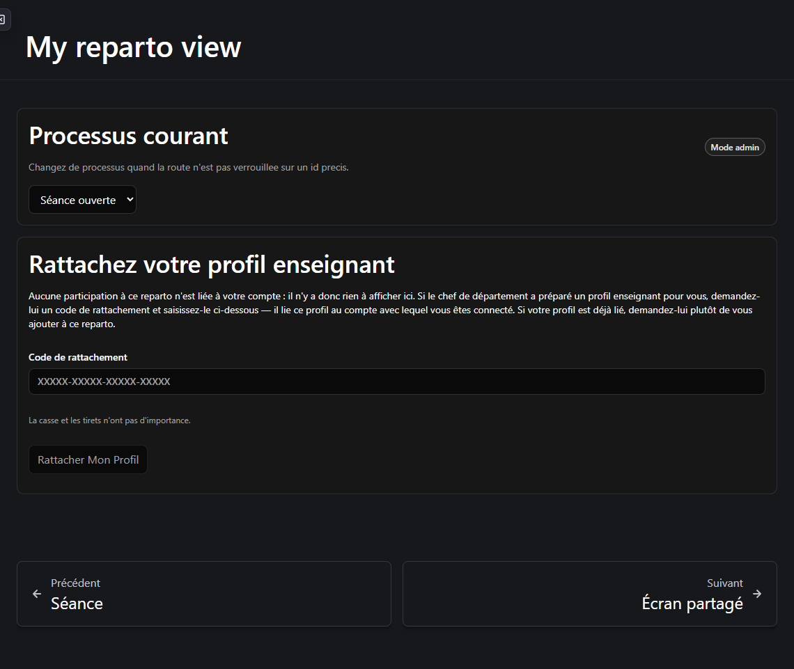
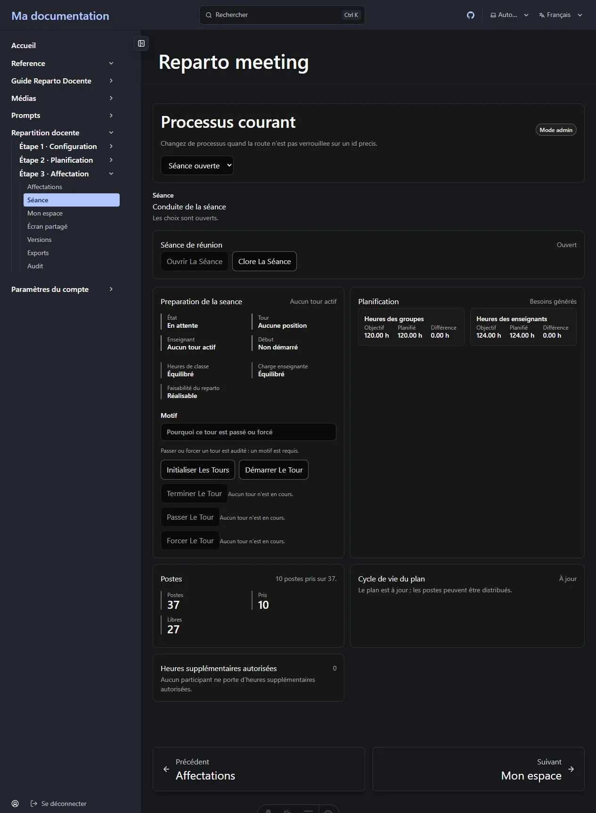

Cette page est volontairement franche. Elle sépare les **blocages** — des choses censées
fonctionner et qui ne fonctionnent pas actuellement — des **limites délibérées**, qui sont des
décisions de conception et ne changeront pas.

Lisez les blocages avant d'organiser une vraie séance.

**Sur cette page :** [blocages](#blocages) · [rugosités](#rugosités) ·
[limites délibérées](#limites-délibérées) · [limites opérationnelles](#limites-opérationnelles) ·
[ce que cela signifie en pratique](#ce-que-cela-signifie-en-pratique)

---

## Blocages

### La séance en direct ne peut pas être conduite depuis l'interface

C'est la plus grande lacune de la version actuelle. L'étape 3 ne peut être menée à bien que
depuis le tableau d'affectation, et par le chef de département. La séance de sélection en
direct — où les enseignants prennent eux-mêmes leurs postes à tour de rôle — ne peut pas être
pilotée depuis ces écrans.

Quatre problèmes distincts s'y conjuguent :

#### Les enseignants ne peuvent pas être liés à leur compte (L1)

Le bouton **Lier le compte** de la liste du personnel enseignant lie le compte
**actuellement connecté**. Un chef de département qui l'utilise se lie *lui-même*, pas
l'enseignant. Il n'existe nulle part de contrôle permettant de lier le compte d'un collègue.

Comme *Mon espace* s'atteint via ce lien, **aucun enseignant ne peut atteindre son propre écran
sur une installation telle qu'elle est livrée**. Ouvrir *Mon espace* avec un compte non lié
affiche :

> *Aucune fiche d'enseignant n'est liée à ce compte.*

Le corriger n'est pas une modification d'une ligne : le service de comptes restreint son annuaire
d'utilisateurs aux super administrateurs ; tout contrôle « lier ce collègue » qui fonctionnerait
a donc besoin d'un annuaire fourni par le site hôte.

**Contournement :** aucun depuis l'interface. Le chef de département attribue tous les postes
depuis le tableau.

#### On ne peut ni ouvrir ni clore une séance (L2)

Créer et clore une séance de sélection, et enregistrer la **position de sélection** d'un
participant pendant la séance, existent en dessous — avec leurs structures de données, leurs
libellés et leurs messages d'erreur — mais aucun écran ne les propose. Il n'y a ni bouton ni
champ de formulaire.

Conséquence directe : l'initialisation des tours échoue toujours, car il n'existe aucune séance à
initialiser.

#### Les contrôles de tour ne font rien (L3)

Les cinq boutons de tour de la séance — *Initialiser les tours*, *Démarrer le tour*, *Terminer le
tour*, *Passer le tour*, *Forcer le tour* — ainsi que les boutons *choisir* et *passer le tour*
de l'enseignant sont affichés mais **ne portent aucune action**. Les presser n'a aucun effet.

Pire pour un débutant : le panneau de préparation ne vérifie même pas qu'une séance existe, si
bien qu'**Initialiser les tours s'affiche activé** alors qu'il n'y a rien à initialiser.

#### La faisabilité passe à Non évaluée en pleine séance (L4)

Toute modification d'un participant invalide le résultat de faisabilité. Enregistrer quelque chose
d'aussi banal qu'un ordre de sélection fait retomber le plan à **Non évaluée** et affiche
*« Faisabilité du reparto : Non évaluée »* sur l'écran du chef en pleine séance.

C'est une **fausse alerte** — le chemin d'affectation en direct utilise des vérifications rapides
et ne dépend pas de l'évaluation mémorisée — mais c'est inquiétant à lire, et l'invalidation est
plus large que nécessaire.

**Contournement :** relancez l'évaluation depuis la page de Planification. Il n'y a rien d'anormal.

#### Il manque deux agrégats à l'écran partagé (L5)

Deux chiffres que la conception demande au vidéoprojecteur sont absents : **combien d'enseignants
sont équilibrés face à ceux qui restent en attente**, et **combien portent une surcharge
autorisée**. Les données agrégées que reçoit l'écran partagé n'en portent aucun.

Les deux seraient des décomptes sans noms : c'est donc une véritable lacune et non une occultation
pour raison de confidentialité.

#### Le vidéoprojecteur a besoin d'un compte participant (L6)

L'accès en lecture à un processus découle de la participation. Un simple « compte de projection »
qui ne participe pas voit *« Aucun processus pour le moment. »* et n'interroge même pas le serveur
sur le processus.

**En pratique :** le vidéoprojecteur doit tourner sur la session du chef de département ou sur
celle d'un participant.

### La compilation de production est inutilisable telle quelle

Lorsque ce site est compilé en paquet statique de production, sa politique de sécurité du contenu
bloque environ six des scripts internes du cadre de documentation lui-même. Résultat : une **mise
en page effondrée**, où la barre latérale recouvre la colonne principale et intercepte les clics
destinés au contenu. Par ailleurs, la racine du site renvoie un 404 depuis la sortie compilée.

**En pratique :** cela concerne le *site hôte*, pas le plugin Reparto, et cela ne se produit pas
avec le serveur de développement, où cette politique est délibérément inerte. En attendant une
correction, utilisez le serveur de développement pour le travail réel, ou corrigez la politique
avant de déployer.

## Rugosités

Elles sont mineures. Elles ne vous empêchent pas de travailler.

### Les participants sont parfois désignés par un identifiant

Certains messages de validation composés par le serveur désignent un participant par un long code
interne plutôt que par son nom :

> *Participant 54d3f552-5e39-4f2c-a171-d88126972414 is 21.00 hours below the target of 21.00.*

La règle rapportée est juste ; seule l'étiquette est peu utile. Recherchez le code sur la page des
participants, ou lisez la même information dans le panneau des équilibres par participant du
tableau de bord, qui utilise bien les noms.

### L'affectation peut s'interrompre pour une réévaluation de faisabilité

Pendant l'affectation, vous pouvez recevoir un refus tel que :

> *La sélection est bloquée car le témoin déterministe n'a pas pu être réparé
> (local_repair_not_found) ; une évaluation administrative de faisabilité est requise.*

C'est le système qui fonctionne comme prévu — il ne vous laisse pas continuer sur une combinaison
qu'il ne peut plus prouver — mais cela survient sans prévenir au milieu d'une série d'affectations.
Relancez l'évaluation depuis la page de Planification et poursuivez. Voir
[Dépannage](/fr/docs/reparto/troubleshooting/#la-sélection-est-bloquée-car-le-témoin-déterministe-na-pas-pu-être-réparé).

### Les enseignants peuvent atteindre plus de données que leurs écrans n'en montrent

Un enseignant participant reçoit actuellement une réponse valide des points d'accès du tableau de
bord du processus et de la liste des participants, qui portent les noms, les heures et le champ de
motif d'heures supplémentaires des autres participants.

**Aucun écran destiné aux enseignants ne demande ces points d'accès**, rien n'est donc affiché, et
tant le flux d'événements de l'enseignant que l'écran partagé sont correctement expurgés. Mais la
permission sous-jacente est plus large que les écrans, et les deux règles qui la régissent n'ont
pas été harmonisées. C'est consigné comme question ouverte, pas comme décision arrêtée.

### Deux chemins de renouvellement ne sont pas coordonnés

Le paquet d'authentification détient deux garde-fous de renouvellement à vol unique non
coordonnés entre eux : l'un utilisé par le client d'API, l'autre par la vérification de
démarrage propre au fournisseur. Si une page monte les deux chemins sur un identifiant
expiré, les deux peuvent déclencher une rotation au lieu d'une seule, ce qui est du travail
gaspillé et, latente, une condition de course.

En pratique, cela se traduit surtout par un renouvellement refusé par chargement de page,
sans conséquence, et une requête d'identité en double à chaque montage d'écran.

**Remarque opérationnelle :** se connecter manuellement sur un compte pendant qu'une
exécution automatisée (une suite de tests, une session scriptée) détient déjà ce même compte
fait révoquer toutes ses sessions par le service de comptes — deux clients présentant un même
identifiant de renouvellement rotatif correspondent exactement au schéma de réutilisation
qu'il est conçu pour détecter. C'est le service d'identité qui fonctionne correctement, pas
cette rugosité ; ne vous connectez pas manuellement sur un compte déjà utilisé par une
exécution automatisée.

## Limites délibérées

Ce sont des décisions, pas des défauts. Ne vous attendez pas à ce qu'elles changent.

### Aucune habilitation ni règle d'éligibilité

**Tout participant actif peut prendre n'importe quel poste.** Il n'existe aucune notion
d'enseignant habilité pour une matière, restreint à un niveau ou une année, rattaché à certaines
classes, ni signalé comme bilingue ou spécialiste.

La légalité ne dépend que de : le participant est actif ; ses heures restantes exactes ; les
postes qu'il détient déjà ; la règle voulant que deux postes d'une activité aillent à des
enseignants différents ; et les règles de séance et de tour.

L'éligibilité restreinte est une extension future documentée. L'ajouter est un changement majeur —
il faudrait de nouvelles données, un calcul de faisabilité différent et des interfaces revues — ce
n'est donc pas quelque chose qui s'active.

:::caution
Puisqu'il n'y a pas d'habilitations, l'application vous laissera volontiers confier un poste de
statistiques de Bachillerato à n'importe quel participant. Décider *qui devrait* enseigner *quoi*
relève de votre jugement, pas de celui de l'application.
:::

### Aucun optimiseur automatique

Reparto Docente **ne** résout **pas** le plan à votre place. Il vous fournit des équilibres en
direct, des limites strictes et une validation immédiate, et c'est vous qui décidez. Les activités
secondaires en particulier s'ajoutent à la main, car les choisir est précisément le travail de
planification.

### Aucune modification manuelle des postes générés

Il n'y a ni création, ni modification, ni création en lot, ni suppression de créneaux de besoin.
Leur identité et leurs heures ne changent que par génération ou réconciliation explicite. C'est ce
qui rend un poste sûr à confier à un enseignant.

### Aucune affectation partielle ou partagée

Un poste va à un enseignant en entier. Il n'y a nulle part dans l'application de case d'heures, de
type de partage ni de moyen de passer outre une sur-affectation. Un enseignant qui a besoin de plus
d'heures reçoit d'abord des **heures supplémentaires autorisées** : un acte distinct, motivé et
tracé, qui relève sa cible.

### Aucun contrôle d'état

L'état du processus appartient au serveur. Il n'existe aucun contrôle de transition nulle part, et
une requête qui tenterait de fixer un état est refusée. Ouvrir une séance de sélection change
l'état d'elle-même.

### Archivé est terminal

Un processus **final** peut être rouvert, avec un motif écrit. Un processus **archivé** ne le peut
pas : l'écran l'explique et ne propose aucun contrôle. L'export final des affectations archive le
processus, d'où la confirmation explicite qu'il demande.

### Rien n'est supprimé

Les activités et les cellules de la matrice sont **retirées**, les affectations sont **annulées**
ou **réaffectées**, et les chiffres de dotation sont **remplacés**. Si vous cherchiez un bouton
supprimer, il n'y en a pas, et c'est bien l'intention.

### Les bases de développement sont réinitialisées, pas migrées

Il n'existe aucune migration de données vers l'arrière ni couche de compatibilité avec l'ancienne
sémantique d'affectation en deux étapes. Une base de développement d'une version antérieure est
réinitialisée plutôt que mise à niveau.

### Désigner le chef de département exige l'annuaire des comptes

Renseigner le champ **Chef de département** d'un département exige de rechercher le compte cible
dans l'annuaire des comptes, et cette recherche est réservée aux super administrateurs. Un
administrateur peut *vider* le champ mais généralement pas le renseigner. C'est une décision propre
au service d'identité sur qui peut utiliser son annuaire, pas une restriction de Reparto, et
Reparto ne peut pas l'élargir.

Comme le champ n'autorise absolument rien
([pourquoi](/fr/docs/reparto/roles/#le-rôle-de-chef-de-département)), cela ne change rien à qui
peut piloter un département.

### La révision de schéma est générée au premier démarrage

Aucun fichier de révision de schéma n'est livré dans le dépôt. Les migrations sont générées à
partir des métadonnées de modèles déclarées, et jamais rédigées déconnectées de celles-ci : la
révision est produite au premier démarrage de l'infrastructure, à partir des modèles tels
qu'ils sont à ce moment-là, et appliquée alors. C'est une politique délibérée, pas un oubli.

**Remarque pour l'exploitant :** une installation doit réussir un premier démarrage avant que
l'application soit utilisable. Si vous vous attendez à trouver dans le dépôt un fichier de
migration déjà écrit, vous ne le trouverez pas ; cette absence est la conception, pas un
manque.

## Limites opérationnelles

La vérification de faisabilité résout un problème véritablement difficile ; elle est donc bornée
plutôt qu'illimitée :

- Elle peut répondre **Inconnue** lorsqu'elle épuise l'effort autorisé. Inconnue est traitée comme
  *non prouvée* et bloque au même titre qu'*Irréalisable*.
- La cible opérationnelle validée est d'environ **30 participants et 100 postes actifs**. Les
  départements plus grands ne sont pas refusés, mais Inconnue devient plus probable.
- Le solveur complet ne s'exécute que par des voies administratives. Il n'est jamais déclenché par
  un enseignant et ne s'exécute jamais pendant l'affectation en direct, qui utilise des
  vérifications rapides et une combinaison mémorisée.

## Ce que cela signifie en pratique

Pour un département qui conduit un reparto **aujourd'hui** :

| Vous voulez… | Est-ce possible ? |
| --- | --- |
| Configurer un département et sa matrice | ✅ Oui, entièrement. |
| Construire, équilibrer, valider et verrouiller un plan | ✅ Oui, entièrement. |
| Générer les postes enseignants | ✅ Oui, entièrement. |
| Attribuer tous les postes en tant que chef de département | ✅ Oui, y compris annuler et réaffecter. |
| Enregistrer des changements de dotation et les réconcilier | ✅ Oui, entièrement. |
| Produire des documents brouillon, provisoires et définitifs | ✅ Oui. |
| Enregistrer des versions, comparer, sauvegarder et auditer | ✅ Oui. |
| Laisser les enseignants choisir leurs postes en direct | ❌ Non — voir [les blocages de la séance](#la-séance-en-direct-ne-peut-pas-être-conduite-depuis-linterface). |
| Tenir une séance ordonnée par tours | ❌ Non — les contrôles ne portent aucune action. |
| Projeter depuis un compte non participant | ❌ Non — utilisez la session du chef ou d'un participant. |
| Déployer en compilation statique de production | ⚠️ Pas en l'état — la mise en page s'effondre. |

En résumé : **le chef de département peut aujourd'hui mener à bien tout le reparto. La séance en
direct pilotée par les enseignants, non.**

---

**Précédent :** [← Versions, exports et audit](/fr/docs/reparto/versions-exports-audit/) ·
**Suivant :** [Dépannage →](/fr/docs/reparto/troubleshooting/)
