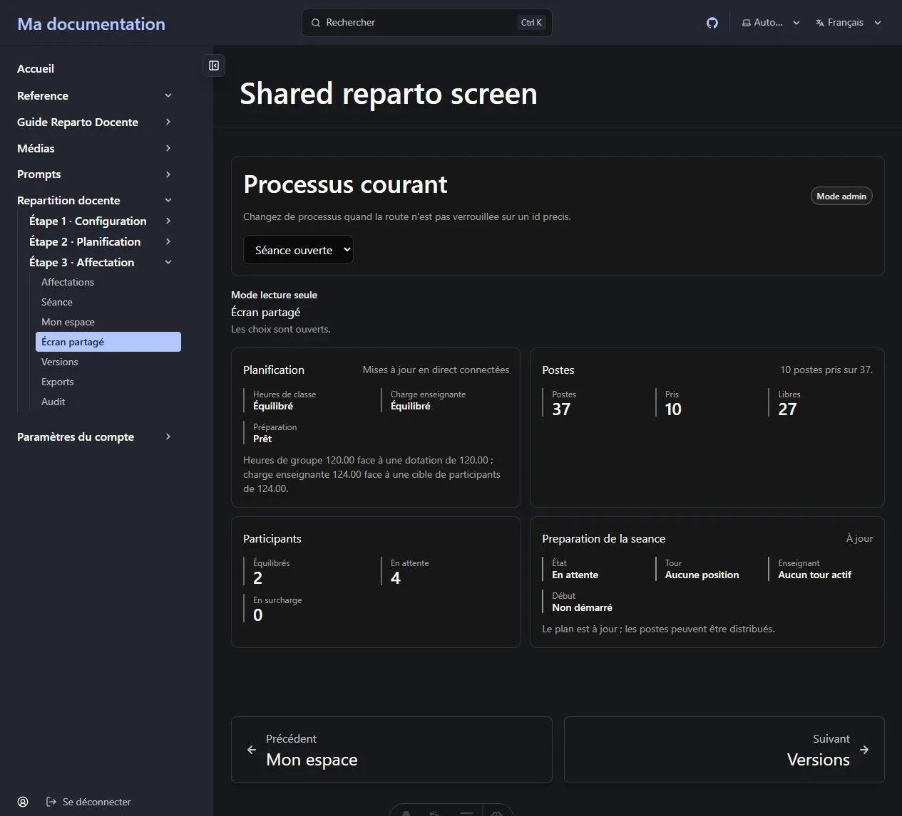

L'étape 3 peut être conduite depuis le [tableau des affectations](/fr/docs/reparto/stage-3-assignment/)
ou comme une **séance de sélection en direct** où les enseignants prennent leurs propres
postes à tour de rôle. Le flux direct est relié de bout en bout dans la version actuelle.

La page **Séance** contient des données réservées au chef de département : même sa lecture
exige **Administrateur** ou **Super administrateur**. *Mon espace* et *Écran partagé*
restent accessibles à partir de **Lecteur**, car ils ne reçoivent jamais les chiffres d'un
autre enseignant.

**Sur cette page :** [rattacher les enseignants](#avant-la-séance-rattacher-chaque-enseignant) ·
[ouvrir la séance](#ouvrir-la-séance) · [gérer les tours](#conduire-les-tours) ·
[Mon espace](#mon-espace-la-vue-enseignant) · [écran partagé](#lécran-partagé) ·
[temps réel](#mises-à-jour-en-direct)

---

## Avant la séance : rattacher chaque enseignant

Dans la **Liste du personnel enseignant**, un Administrateur choisit **Émettre un code de
rattachement** sur chaque fiche non liée. Le code n'est affiché qu'une fois, ne fonctionne
qu'une fois et expire. Transmettez-le en privé à l'enseignant nommé.

L'enseignant ouvre une session avec son propre compte, va dans **Mon espace**, saisit le
code sous **Rattacher mon profil**, puis valide. La fiche est liée au compte connecté ; le
chef ne cherche ni ne choisit un compte dans l'annuaire protégé. Si le code est perdu ou
expiré, émettez-en un nouveau.

L'enseignant doit aussi être participant actif au processus sélectionné. Si une fiche déjà
liée ne voit aucun processus, ajoutez-la dans **Participants au processus**.

## Ouvrir la séance

Le panneau **Séance de réunion**, au-dessus des tours, affiche la dernière séance ou
**Aucune séance ouverte**.

1. Vérifiez le plan, les besoins générés et les réglages d'accès LAN, de sélection directe
   et d'ordre de sélection.
2. Choisissez **Ouvrir la séance**. Les réglages courants sont figés dans la nouvelle séance
   et le processus passe à l'état de réunion.
3. À la fin, choisissez **Fermer la séance** et confirmez. L'accès LAN des enseignants à
   cette réunion est alors retiré.

Sans séance ouverte, toutes les actions de tour sont désactivées et expliquent clairement
qu'**aucune séance de réunion n'est ouverte**.


## Conduire les tours

| Contrôle | Effet |
| --- | --- |
| **Initialiser les tours** | Construit l'ordre depuis les participants et leurs positions. |
| **Démarrer le tour** | Démarre le prochain tour en attente. |
| **Terminer le tour** | Termine le tour actif après résolution du choix. |
| **Passer le tour** | Saute le tour actif avec un motif écrit et audité. |
| **Forcer le tour** | Force le tour actif avec un motif écrit et audité. |

Ces cinq actions appellent l'API des tours. Pendant une requête, les contrôles se ferment ;
un refus apparaît à côté d'eux. Le tour actif vient du serveur. La salle affiche aussi les
deux balances, le cycle de vie du plan, les postes, la faisabilité et le compteur
**En surcharge**, avec les lignes nominatives autorisées. Le décompte agrégé à trois états
appartient à l'Écran partagé.

## Mon espace : la vue enseignant

**Mon espace** ne montre que les cinq valeurs de l'enseignant connecté :

```text
Base · Supplément autorisé · Cible · Affecté · Restant
```

Il montre aussi les postes entièrement libres, le tour courant et la balance agrégée sans
nom. Quand la sélection directe est activée, la séance ouverte, le plan prêt et le tour
correct, l'enseignant peut choisir **Prendre ce poste**. Le serveur revérifie disponibilité,
propriété, heures restantes et témoin de faisabilité. **Passer** son propre tour utilise un
motif sûr par défaut et reste audité.

Sans fiche liée, *Mon espace* affiche le formulaire de code au lieu d'une erreur 404. Si la
fiche est liée mais absente du processus, la page demande de contacter le chef pour l'ajouter.


## L'écran partagé

L'**Écran partagé** affiche les deux balances, l'état et la faisabilité du plan, les postes
pris et libres, le numéro du tour courant, et les compteurs équilibrés, en attente et en
surcharge.



Sa réponse serveur ne contient **aucun nom**, aucune heure par enseignant et aucun motif
d'heures supplémentaires. Il n'existe pas d'habilitation séparée pour un vidéoprojecteur :
utilisez la session d'un Administrateur ou d'un participant du département.

## Mises à jour en direct

Les écrans des étapes 2 et 3 suivent le flux d'événements et indiquent s'il est
**connecté**, **retardé** ou **déconnecté**. Après reconnexion, trou de séquence ou événement
hors ordre, la page recharge l'état faisant autorité.

Les métadonnées propres à la réunion, comme l'ordre de sélection, n'invalident pas la
faisabilité. Seuls les changements utiles au solveur la ramènent à **Non évaluée**. Chaque
public reçoit son flux expurgé : celui d'un enseignant ne contient aucun autre participant,
et celui de l'écran partagé ne nomme personne.

---

**Précédent :** [← Étape 3 — Affectation](/fr/docs/reparto/stage-3-assignment/) ·
**Suivant :** [Versions, exports et audit →](/fr/docs/reparto/versions-exports-audit/)
