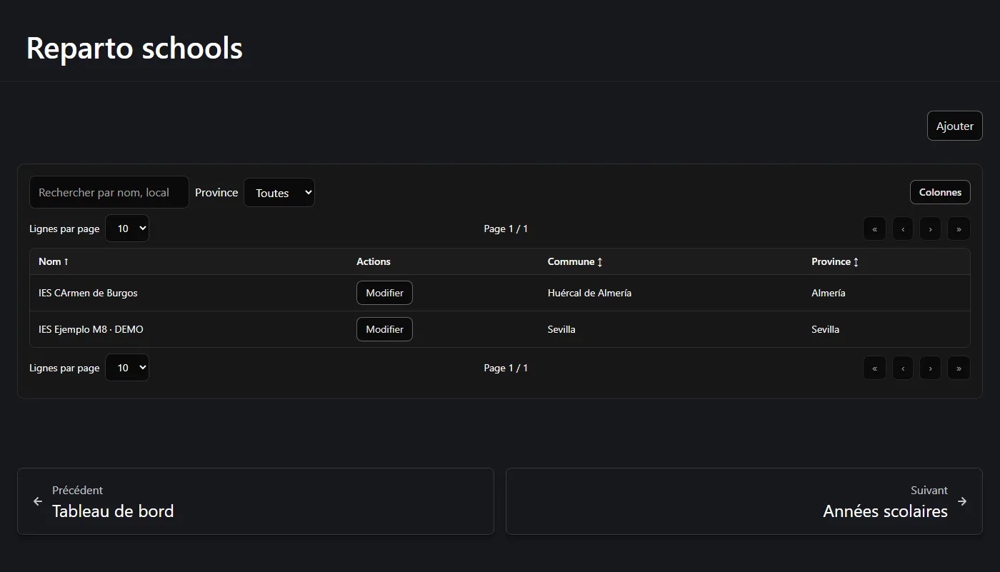
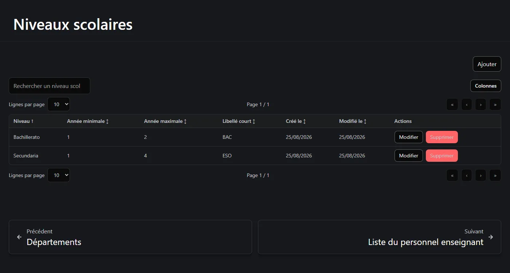
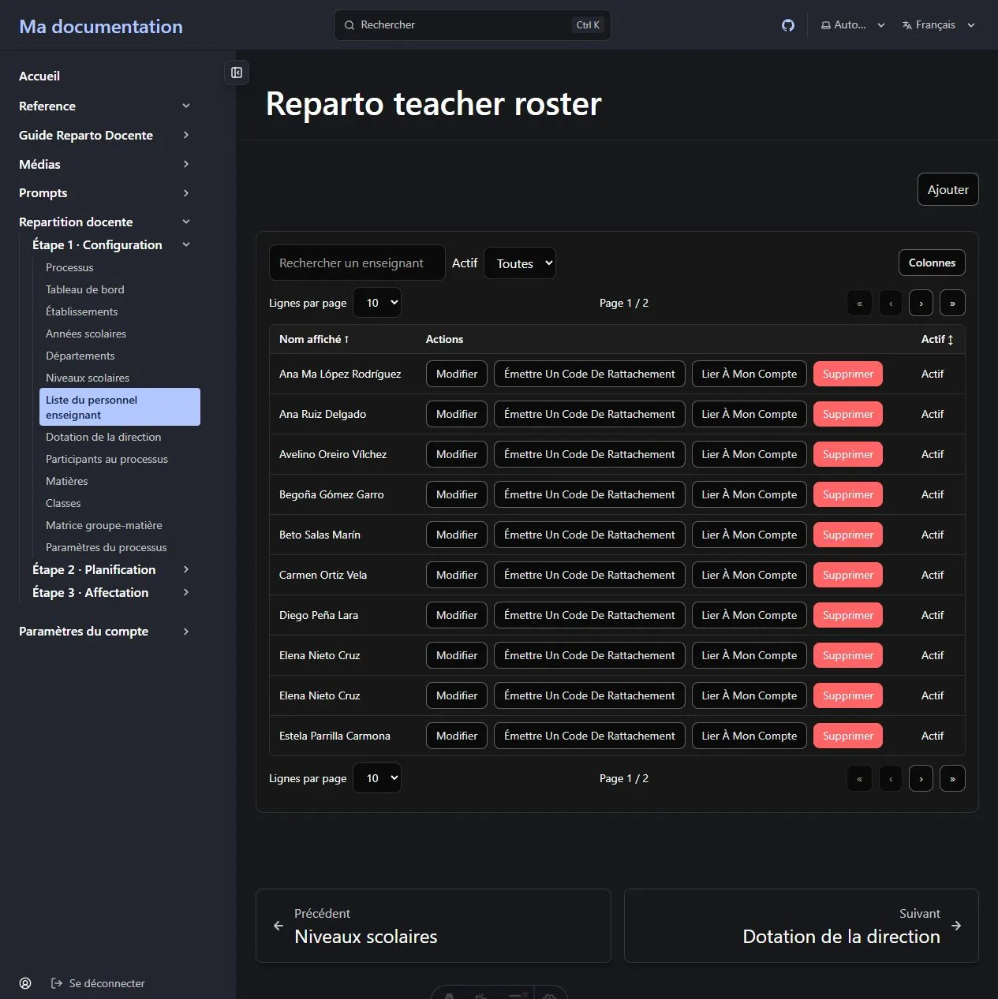
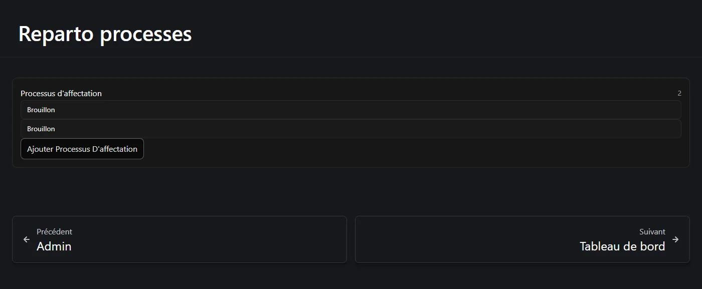
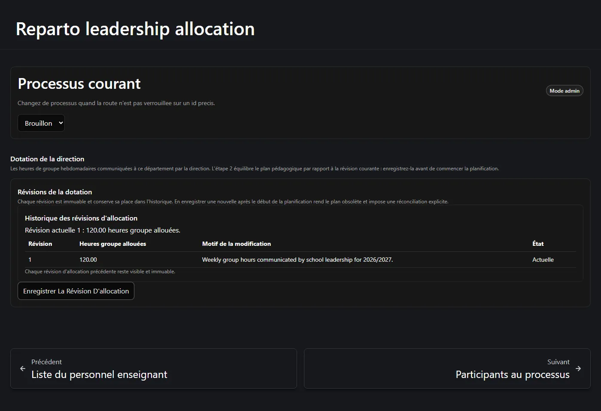
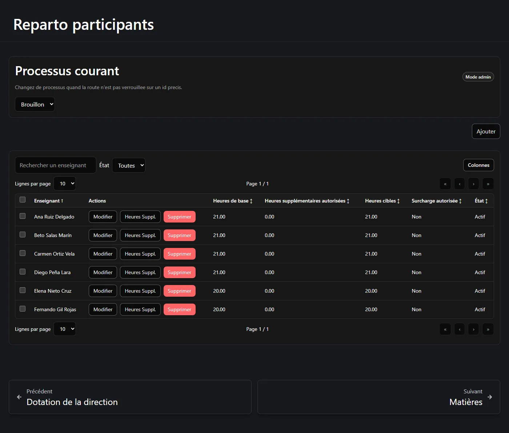
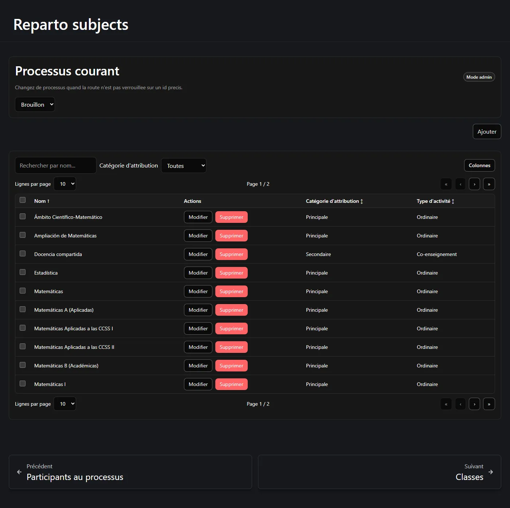
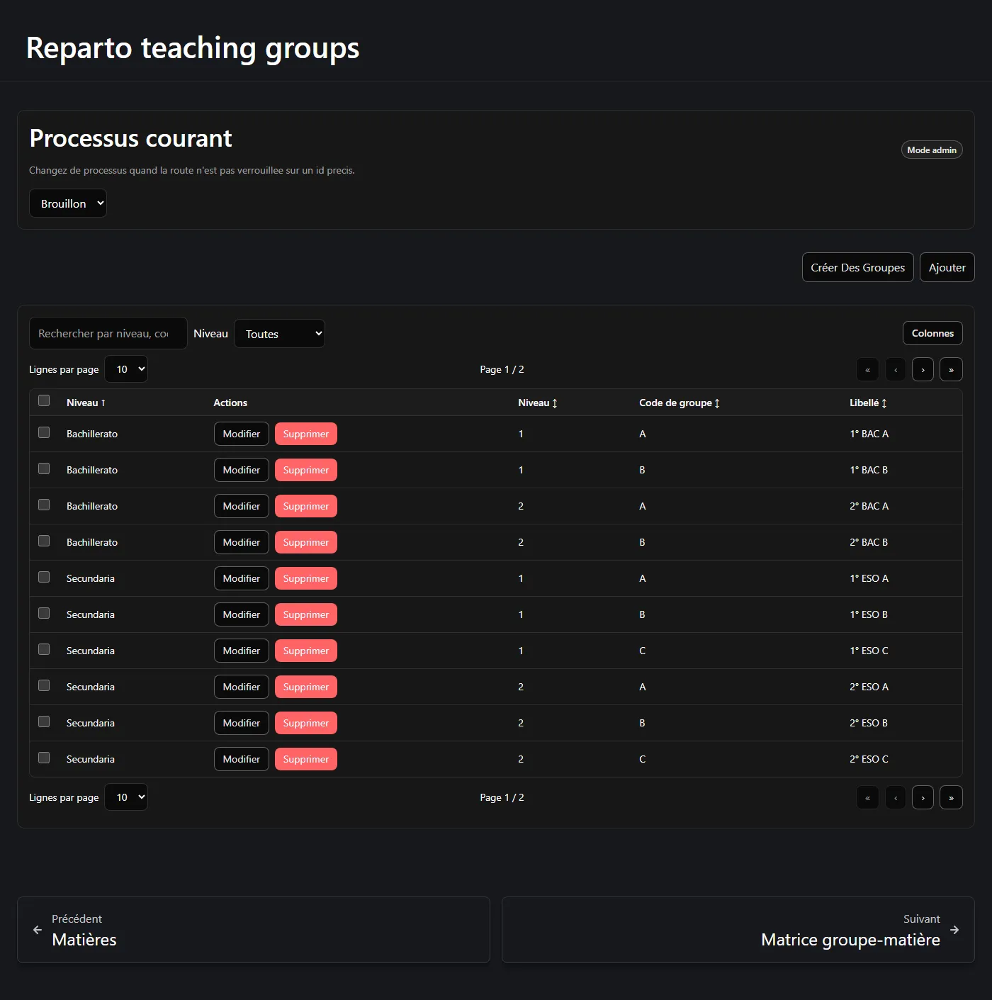
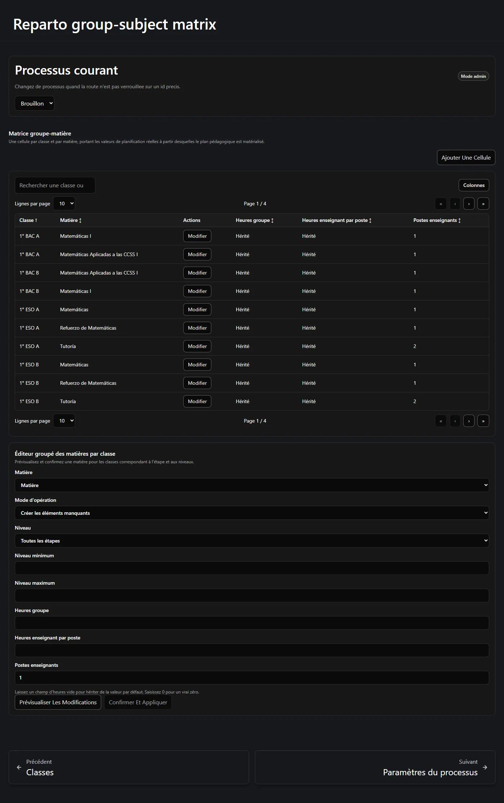
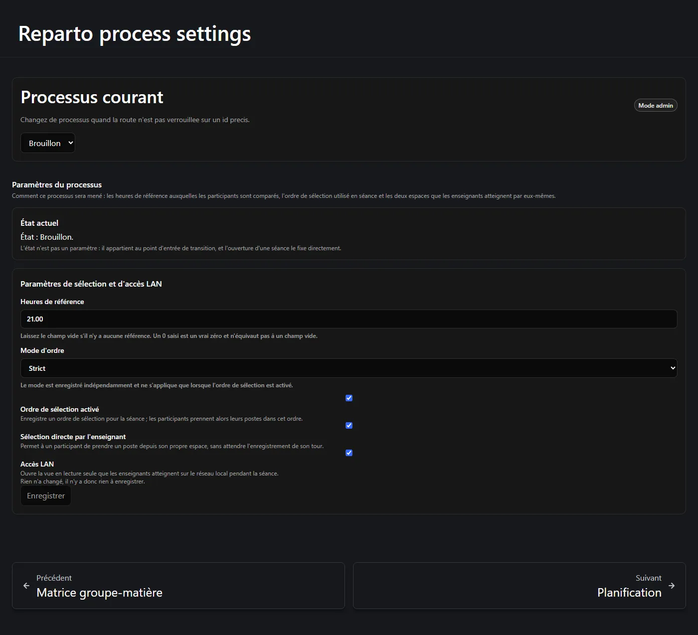

L'étape 1 enregistre les faits. Rien n'est calculé ici : vous vous contentez d'indiquer à
l'application ce qui existe. Parcourez le groupe *Étape 1 · Configuration* du menu de gauche
et vous les ferez dans le bon ordre.

**Sur cette page :** [configuration globale](#configuration-globale) ·
[niveaux scolaires](#niveaux-scolaires) ·
[liste du personnel](#liste-du-personnel-enseignant) ·
[le processus](#le-processus-daffectation) · [dotation](#dotation-de-la-direction) ·
[participants](#participants) · [matières](#matières) · [classes](#classes) ·
[la matrice](#la-matrice-classe-matière) · [paramètres](#paramètres-du-processus) ·
[avant de continuer](#avant-de-continuer)

---

## Configuration globale

**Établissements**, **Années scolaires** et **Départements** sont partagés par tout le site,
pas par un processus. Si votre établissement utilise déjà Reparto Docente, ils existent
probablement — vérifiez avant de créer des doublons.



- **Établissement** — nom et, facultativement, commune, province, région, adresse et notes.
- **Année scolaire** — un libellé comme *2026/2027*, une date de début et une date de fin.
  L'année appartient à un établissement et peut pointer vers l'année précédente, ce qui rend
  ensuite possible la « copie de l'an dernier ».
- **Département** — appartient à un établissement, possède un nom et un slug court. Le champ
  **Chef de département** est purement descriptif et n'accorde aucune permission
  ([pourquoi](/fr/docs/reparto/roles/#le-rôle-de-chef-de-département)).

Les créer exige **Administrateur** ou plus.

## Niveaux scolaires

Un **niveau scolaire** est un cycle d'enseignement : *Secundaria* (libellé court `ESO`,
années 1–4), *Bachillerato* (`BAC`, années 1–2). Ils sont partagés par tout le site et
existent pour qu'une classe soit nommée de façon cohérente.



Chaque niveau a un nom, un **libellé court** utilisé dans les noms de classe, et une année
minimale et maximale. Quand vous créerez ensuite une classe, son année sera contrainte au
niveau choisi et son libellé sera généré ainsi :

```text
{année}° {libellé court} {code de groupe}     →     3° ESO B
```

Un **Lecteur** ou plus peut lire les niveaux ; les créer et les modifier exige
**Administrateur**.

## Liste du personnel enseignant

La **Liste du personnel enseignant** recense le personnel enseignant connu du site,
distinctement des comptes utilisateurs. Une fiche comporte un nom affiché, un indicateur
d'activité et des notes.



Une fiche peut être **liée** à un compte du site, ce qui permet à cet enseignant d'utiliser
*Mon espace* pendant une séance.

:::tip[Rattacher l'enseignant sans ouvrir l'annuaire des comptes]
Un Administrateur choisit **Émettre un code de rattachement**. Le code, affiché une seule
fois, expire et ne fonctionne qu'une fois. L'enseignant connecté le saisit dans **Mon
espace** sous **Rattacher mon profil**. Une fiche liée propose **Délier l'utilisateur** ;
**Me rattacher** reste disponible pour un rattachement administratif volontaire.
:::

Modifier les données propres d'une fiche est possible pour un **Rédacteur** sur sa propre
fiche ; créer une fiche, émettre un code, rattacher, délier et supprimer exigent
**Administrateur**. Utiliser son propre code reste accessible au niveau Lecteur.

## Le processus d'affectation

Un **processus d'affectation**, c'est un département, dans un établissement, pour une année
scolaire. C'est le conteneur de tout ce qui suit.

Créez-le depuis la page **Processus**, en choisissant l'année, l'établissement et le
département. Un nouveau processus démarre à l'état **Brouillon**.



:::note[On ne fixe jamais l'état à la main]
L'état avance de lui-même à mesure que le processus progresse, et l'ouverture d'une séance de
sélection le change directement. Il n'existe aucun contrôle d'état dans l'application, et le
serveur refuse toute requête qui tenterait d'en fixer un. La page de paramètres affiche l'état
courant et l'explique.
:::

## Dotation de la direction

C'est l'étape 2 du parcours et elle a sa propre page : **Dotation de la direction**.
Enregistrez les heures de classe hebdomadaires que la direction de l'établissement a accordées
à votre département.



Pour en enregistrer une, il faut fournir :

- **Heures de classe hebdomadaires attribuées** — strictement positives, deux décimales au
  plus.
- **Un motif** — obligatoire. C'est la trace permanente du *pourquoi* de ce chiffre.

Ce qui se passe ensuite :

- Le chiffre devient la révision **courante**.
- Toute révision antérieure est **remplacée** et conservée en historique : rien n'est écrasé.
- Un événement d'audit est enregistré avec votre nom et l'heure.

:::note[L'absence de dotation au début est normale]
Tant que vous n'avez pas enregistré la première dotation, la « dotation courante » n'existe
tout simplement pas encore, et la page affiche un état vide plutôt qu'une erreur. C'est
attendu pour un nouveau processus.
:::

Il n'y a ni modification ni suppression. Pour changer le chiffre, on enregistre une **nouvelle
révision**, avec son propre motif. Si le processus est déjà `final` ou `archivé`, il faut le
rouvrir d'abord.

## Participants

Les **Participants au processus** sont les enseignants qui prennent part à *ce* processus.
Ajoutez chacun depuis la liste et attribuez-lui :

| Champ | Signification |
| --- | --- |
| **Heures de base** | Son service d'enseignement hebdomadaire contractuel. |
| **Heures supplémentaires autorisées** | Toujours à 0 au départ. Relevées uniquement par l'action distincte exigeant un motif. |
| **Heures cibles** | Calculé : base + supplémentaires autorisées. Non modifiable. |
| **Participe à la sélection** | S'il prend un tour en séance. |
| **Position** | Sa place dans l'ordre de la séance. |
| **État** | Actif ou inactif. |



La somme des **cibles** de tous les participants actifs constitue la cible d'heures enseignant
que le plan doit atteindre exactement. Dans l'exemple, six enseignants à 21, 21, 21, 21, 20 et
20 heures donnent une cible de **124**.

:::caution[Les heures supplémentaires ne se saisissent pas ici]
Les **heures supplémentaires autorisées** ne peuvent pas être saisies dans le formulaire de
participant, ni d'un côté ni de l'autre de la communication. Les relever ou les réduire est une
action distincte qui exige un motif écrit et qui est tracée, dans les deux sens : retirer une
autorisation, c'est la même action avec la valeur `0`. Les réduire est refusé si la nouvelle
cible passait sous ce que l'enseignant détient déjà.
:::

## Matières

Une **matière**, c'est ce qui est enseigné. Chacune porte :

| Champ | Signification |
| --- | --- |
| **Nom** | *Matemáticas*, *Tutoría*, *Docencia compartida*… |
| **Catégorie d'attribution** | **Principale** ou **Secondaire**. Les principales sont des données de planification obligatoires ; les secondaires sont des ajouts facultatifs. |
| **Type d'activité** | *Ordinaire*, *Tutorat*, *Co-intervention*, *Soutien*, *Niveau département*, *Autre*. **Purement descriptif** : ne change jamais le comportement. |
| **Heures groupe par défaut** | Heures suggérées reçues par la classe. |
| **Heures enseignant par poste, par défaut** | Heures suggérées consacrées par un enseignant. |
| **Postes enseignants par défaut** | Combien d'enseignants, par défaut. |
| **Autorise plusieurs / zéro classe** | Si une activité de cette matière peut lier plusieurs classes, ou aucune. |



:::note[Les valeurs par défaut amorcent ; elles ne réécrivent jamais]
Ces valeurs servent lorsqu'une **nouvelle** cellule de la matrice est créée. Modifier une
valeur par défaut plus tard **ne** modifie **pas** les cellules ni les activités existantes.
C'est délibéré : vos décisions classe par classe ne sont jamais écrasées en silence.
:::

Il n'y a pas de case « est principale » : la distinction est la **catégorie d'attribution**, une
liste extensible et non un oui/non.

## Classes

Une **classe** est un groupe d'élèves : *1° ESO A*, *2° BAC B*. Créez chacune avec son niveau
scolaire, son année et son code de groupe. Le libellé est généré pour vous jusqu'à ce que vous
le changiez à la main.



Il existe aussi une boîte de dialogue de création en lot : choisissez un niveau, une année et
une plage de codes (`A` à `D`, bornes comprises), prévisualisez la liste exacte et créez-les
toutes en une seule requête atomique.

## La matrice classe-matière

C'est le cœur de l'étape 1. La **matrice** contient une cellule par couple (classe, matière)
réellement existant, et elle porte les valeurs de planification **réelles** avec lesquelles
travaille l'étape 2.



Chaque cellule contient :

- **Heures groupe** — ou *Hérité*, ce qui signifie « utiliser la valeur par défaut de la
  matière ».
- **Heures enseignant par poste** — ou *Hérité*.
- **Postes enseignants** — toujours un nombre positif explicite ; celui-ci n'a aucune valeur
  par défaut de repli.
- **Active** — si la cellule compte.

La classe et la matière constituent l'**identité** de la cellule et ne peuvent pas changer.
Pour pointer une cellule vers une autre classe ou une autre matière, on la retire et on en crée
une autre.

### Remplir la matrice matière par matière

Ajouter trente cellules une par une est fastidieux ; la page porte donc aussi l'**éditeur en
lot** sous la liste. Il remplit **une matière** sur une plage filtrée de classes :

1. Choisissez la **Matière**.
2. Choisissez le **Mode d'opération** — *Créer les manquantes*, ou les modes qui mettent aussi
   à jour les cellules existantes.
3. Restreignez les classes avec **Niveau**, **Année minimale** et **Année maximale**.
   Laissez-les ouverts pour tout couvrir.
4. Fixez éventuellement **Heures groupe**, **Heures enseignant par poste** et **Postes
   enseignants**. Un champ laissé vide n'est pas touché sur les cellules existantes.
5. Appuyez sur **Prévisualiser les modifications**.
6. Lisez l'aperçu : combien de cellules seront **créées**, **mises à jour** et laissées
   **inchangées**, plus les conflits éventuels et les erreurs de votre sélection.
7. Ce n'est qu'alors que **Confirmer et appliquer** devient disponible.

:::caution[L'application n'est jamais envoyée sans aperçu]
L'application n'émet pas de requête d'application qui n'aurait pas été prévisualisée, et
l'aperçu porte le nombre exact de lignes qu'il s'attend à toucher. Si quelque chose a changé
entre-temps, le serveur refuse l'application et l'aperçu est abandonné. **Prévisualisez à
nouveau** plutôt que d'appuyer une seconde fois sur appliquer.
:::

L'écran énonce lui-même la règle des champs vides : *« Laissez un champ d'heures vide pour
hériter de la valeur par défaut de la matière. Saisissez 0 pour un vrai zéro. »*

## Paramètres du processus

La dernière étape de l'étape 1. Cette page décide de la manière dont le processus sera conduit.



| Paramètre | Rôle |
| --- | --- |
| **Heures de référence** | Le service de référence auquel les participants sont comparés. Laissez vide pour n'en fixer aucun : un `0` saisi est un vrai zéro et n'équivaut pas à un champ vide. |
| **Mode d'ordre** | *Strict*, *Informatif* ou *Aucun*. Ne s'applique que tant que l'ordre de sélection est activé. |
| **Ordre de sélection activé** | Enregistre un ordre de sélection pour la séance ; les participants prennent alors leurs postes dans cet ordre. |
| **Sélection directe par l'enseignant** | Permet à un participant de prendre un poste depuis son propre espace au lieu d'attendre l'enregistrement de son tour. |
| **Accès LAN** | Ouvre la vue en lecture seule que les enseignants atteignent par le réseau local pendant la séance. |

Seuls les champs que vous avez réellement modifiés sont envoyés. Si vous n'avez rien changé, la
page le dit et le bouton d'enregistrement reste inerte.

### Rouvrir un processus clos

Cette page porte également le contrôle de **réouverture**, qui n'apparaît que tant que le
processus est figé :

- **Final** — tout changement est refusé. La réouverture est proposée et exige un motif écrit.
- **Archivé** — terminal. La page l'explique et ne propose aucun contrôle, car il n'y a rien à
  proposer.

## Avant de continuer

L'étape 2 n'a rien à traiter tant que tout ceci n'est pas vrai :

- [x] Un établissement, une année scolaire et un département existent.
- [x] Les niveaux scolaires existent.
- [x] Un processus d'affectation existe et est sélectionné.
- [x] Une révision de dotation de la direction a été enregistrée.
- [x] Des participants existent avec leurs heures de base.
- [x] Des matières existent avec des valeurs par défaut cohérentes.
- [x] Les classes existent.
- [x] **Au moins une cellule de la matrice existe.**
- [x] Les paramètres du processus ont été vérifiés.

La liste de contrôle du tableau de bord vous indique à tout moment lesquels restent ouverts
— tout comme le bouton **Liste de configuration** en haut de la page où vous vous trouvez.
Chacune de ses lignes renvoie à la page où l'étape se fait.

---

**Précédent :** [← Heures, équilibres et faisabilité](/fr/docs/reparto/hours-and-balances/) ·
**Suivant :** [Étape 2 — Planification →](/fr/docs/reparto/stage-2-planning/)
