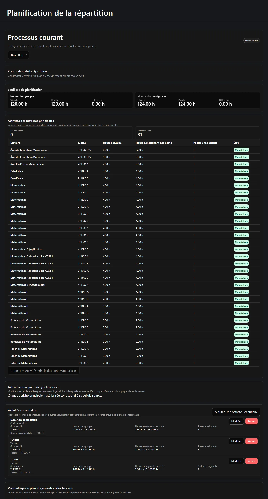
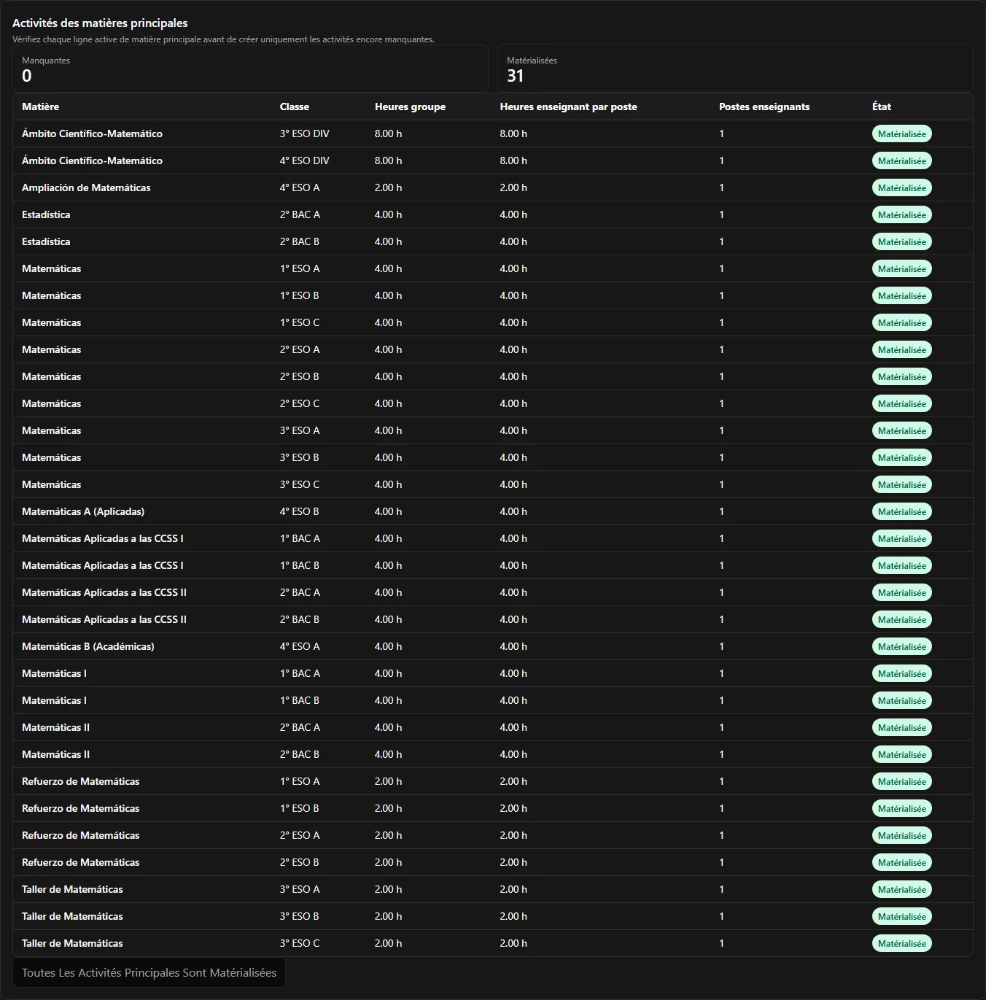
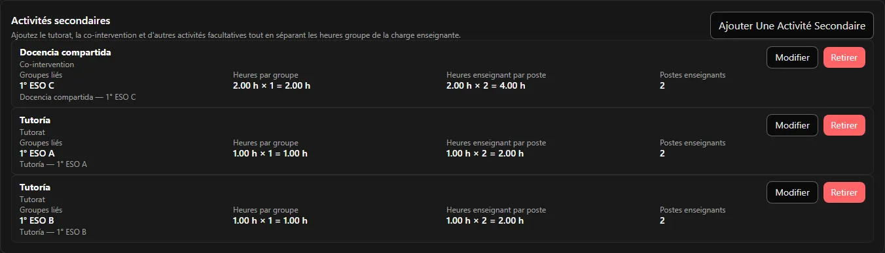
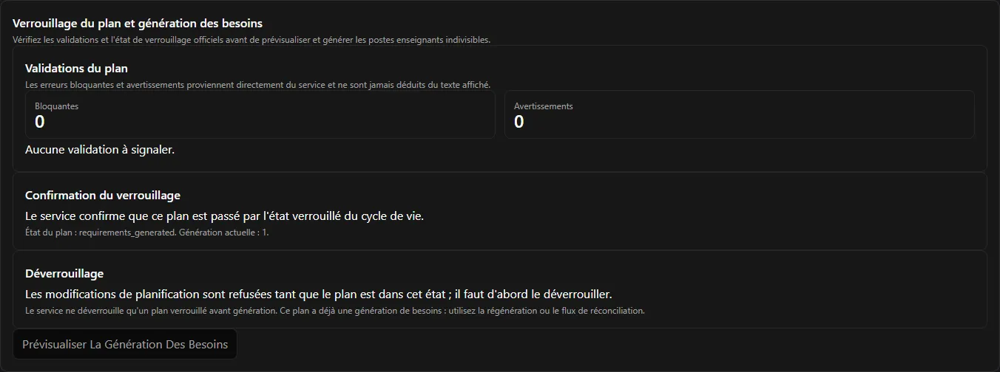
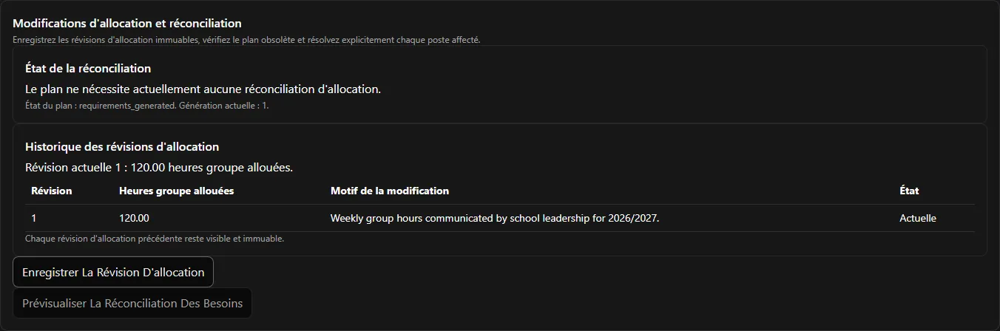

L'étape 2 transforme votre configuration en **plan d'enseignement** : ce qui est réellement
enseigné, par combien d'enseignants et pendant combien d'heures. Quand il est équilibré,
faisable et verrouillé, l'application génère les postes enseignants indivisibles que l'étape 3
distribue.

Tout ce qui figure sur cette page se passe sur un seul écran : **Planification**.



**Sur cette page :** [créer le plan](#0-créer-le-plan-denseignement) ·
[équilibres](#1-surveiller-les-deux-équilibres) ·
[matérialiser](#2-matérialiser-les-activités-principales) ·
[cellules désynchronisées](#activités-principales-désynchronisées) ·
[activités secondaires](#3-ajouter-les-activités-secondaires) ·
[validations](#4-lire-les-validations) · [faisabilité](#5-vérifier-la-faisabilité) ·
[verrouiller](#6-verrouiller-le-plan) · [générer](#7-générer-les-postes) ·
[besoins horaires](#la-page-besoins-horaires) ·
[changements de dotation](#quand-la-dotation-change)

---

## 0. Créer le plan d'enseignement

Un processus possède **au plus un** plan d'enseignement, et le plan n'est pas créé en même
temps que le processus. Tant que personne ne le crée, tous les écrans de l'étape 2 sont vides
— pas cassés.

La page de Planification l'affiche comme un état vide et propose l'action **créer**. Une fois
le plan existant, le panneau disparaît. Si deux personnes appuient sur créer en même temps, la
seconde tentative est refusée avec les propres mots du serveur ; rien n'est dupliqué.

Créer le plan exige **Administrateur** ou plus.

## 1. Surveiller les deux équilibres

L'en-tête d'équilibre se trouve en haut de la page de Planification et reste visible pendant
que vous travaillez. Il ne quitte pas l'écran, car c'est lui qui vous sert de guide.


Deux axes, chacun avec **Cible**, **Planifié** et **Écart** :

- **Heures de classe** — le planifié face à la dotation de la direction courante.
- **Heures enseignant** — le planifié face à la somme des cibles des participants.

Ce sont deux mesures différentes et elles ne s'additionnent jamais. Si cela vous paraît
étrange, lisez d'abord
[Heures, équilibres et faisabilité](/fr/docs/reparto/hours-and-balances/).

Votre objectif à l'étape 2 est de ramener **les deux** écarts à `0.00`.

## 2. Matérialiser les activités principales

Les **activités de matière principale** sont créées pour vous à partir de la matrice. Le
panneau compare chaque cellule active de matière principale aux activités déjà existantes et
étiquette chaque ligne **Manquante** ou **Matérialisée**.



La ligne montre exactement ce qui sera — ou a été — créé :

| Colonne | Provenance |
| --- | --- |
| Matière | la cellule de la matrice |
| Classe | la cellule de la matrice |
| Heures groupe | la cellule, ou la valeur par défaut de la matière si la cellule hérite |
| Heures enseignant par poste | la cellule, ou la valeur par défaut de la matière |
| Postes enseignants | la cellule |

L'action de création n'est disponible que tant qu'il manque des lignes, et elle demande une
confirmation distincte indiquant qu'elle créera **uniquement les manquantes**. On peut appuyer
deux fois sans risque : le point d'accès du serveur est idempotent, une ligne déjà matérialisée
est donc ignorée plutôt que dupliquée.

Dans l'exemple, cela crée **31** activités totalisant **116** heures de classe et **116** heures
enseignant.

### Activités principales désynchronisées

Modifier une cellule de la matrice ne réécrit jamais l'activité qu'elle a créée. L'activité est
au contraire marquée **désynchronisée**, et un panneau plus bas montre chaque différence pour
que vous l'examiniez et l'appliquiez explicitement.

Quand tout concorde, ce panneau dit simplement *« Toutes les activités principales
matérialisées correspondent à leur cellule d'origine. »*

## 3. Ajouter les activités secondaires

Les activités secondaires sont la part discrétionnaire du plan : tutorat, co-intervention,
soutien, tâches de département. Vous les ajoutez à la main, car les décider *est* le travail de
planification.



Chaque activité secondaire demande :

| Champ | Notes |
| --- | --- |
| **Matière** | Choisie parmi les matières du processus. |
| **Type d'activité** | Simple libellé descriptif : ne pilote jamais le comportement. |
| **Classes liées** | Une, plusieurs ou aucune, selon ce que permet la matière. |
| **Heures groupe par classe** | Ce que reçoit chaque classe liée. |
| **Heures enseignant par poste** | Ce qu'y consacre un enseignant. |
| **Postes enseignants** | Un entier strictement positif. |

La ligne vous montre ensuite le calcul, pour que vous voyiez bouger les deux équilibres :

```text
Docencia compartida · Co-intervention
  Heures groupe par classe       2,00 h × 1 = 2,00 h
  Heures enseignant par poste    2,00 h × 2 = 4,00 h
  Postes enseignants             2
```

Cette seule activité ajoute **2** au total classe et **4** au total enseignant — c'est
exactement ainsi qu'un plan atteint 120 et 124 en même temps.

Chaque modification rafraîchit immédiatement les équilibres, les validations, la vue des besoins
et le tableau de bord.

:::note[Les activités sont retirées, pas supprimées]
L'action de la ligne est **Retirer**, pas supprimer. Une activité retirée cesse de compter mais
reste visible avec sa date de retrait. Rien ne disparaît du registre.
:::

## 4. Lire les validations

Le panneau **Validations du plan** montre ce que pense le *serveur*, réparti en nombres de
**Bloquants** et d'**Avertissements**.



Les constats sont imprimés avec le message du serveur lui-même et un code stable. L'interface ne
détient aucune copie des règles et ne devine jamais un constat à partir de ce qu'elle voit à
l'écran : ce que vous lisez ici fait donc autorité.

Un constat que vous rencontrerez tôt est `plan.requirements_not_generated`. Celui-là est attendu
avant la génération et **ne** vous empêche **pas** de verrouiller.

## 5. Vérifier la faisabilité

La faisabilité est le troisième invariant
([ce qu'elle signifie](/fr/docs/reparto/hours-and-balances/#la-faisabilité-troisième-vérification)).
Lancez l'évaluation depuis la page de Planification.


- **Réalisable** — l'application détient une combinaison concrète prouvant que les postes
  peuvent être distribués exactement.
- **Irréalisable** — aucune combinaison n'existe. Un rapport de diagnostic, visible du seul chef
  de département, explique pourquoi et suggère des remèdes.
- **Inconnue** — la vérification a épuisé son effort autorisé. Traitée comme non prouvée, elle
  bloque.
- **Non évaluée** — la valeur par défaut, et celle à laquelle tout changement pertinent ramène.

:::note[Elle se réinitialise souvent, et c'est voulu]
Modifier un champ de participant, une activité ou la matrice qui influence réellement le
solveur ramène la faisabilité à **Non évaluée**. L'ordre de sélection et les métadonnées
propres à la réunion ne l'invalident plus. Relancez l'évaluation après un changement
pertinent, avant de verrouiller.
:::

## 6. Verrouiller le plan

Le verrouillage fige le plan pour que des postes puissent en être générés. L'action de
verrouillage n'est disponible que si **toutes** ces conditions sont réunies :

- heures de classe équilibrées exactement ;
- heures enseignant équilibrées exactement ;
- faisabilité **Réalisable**, évaluée sur le plan tel qu'il est maintenant ;
- aucun constat bloquant comptant contre le verrouillage.

Une confirmation ciblée est ensuite demandée. Le serveur fait autorité en dernier ressort : la
vérification de l'interface ne décide que s'il faut proposer le bouton.

Verrouiller **n'est pas** une porte à sens unique. Le même panneau porte **Déverrouiller**, qui
apparaît dès que l'état du plan refuse les modifications de planification. Le serveur accepte un
déverrouillage pour un plan **verrouillé et non encore généré** uniquement. Une fois les postes
générés, le panneau le dit clairement et vous oriente vers la régénération ou la réconciliation
au lieu de proposer un contrôle qui serait refusé :

> *Le service ne déverrouille qu'un plan verrouillé avant génération. Ce plan possède déjà une
> génération de besoins ; utilisez donc la régénération ou le flux de réconciliation.*

## 7. Générer les postes

La génération devient disponible dès que le serveur signale le plan comme **verrouillé** (ou
**obsolète**). Elle se fait en deux temps.

**Aperçu.** *Prévisualiser la génération des besoins* montre la différence déterministe :

| Groupe | Signification |
| --- | --- |
| **Créer** | Nouveaux postes que cette génération ajoutera. |
| **Conserver** | Postes déjà existants et inchangés. |
| **Retirer** | Postes que le plan ne soutient plus. |
| **Conflit** | Postes qui ne peuvent pas être modifiés automatiquement, généralement parce que quelqu'un les détient déjà. |

**Appliquer.** La confirmation effectue la génération. Le résultat affiche le **numéro de
génération** et le décompte faisant autorité des postes actifs.

Dans l'exemple, cela produit **37** postes à la génération **1** :

```text
21 postes × 4,00 h   (matières principales ordinaires)
 2 postes × 8,00 h   (les activités Ámbito)
10 postes × 2,00 h   (soutien, atelier et co-intervention)
 4 postes × 1,00 h   (tutorat)
───────────────────────
37 postes, 124,00 heures enseignant
```

:::caution[Les conflits désactivent l'application]
Si l'aperçu signale des conflits, l'application est désactivée et vous êtes orienté vers le flux
de réconciliation. Un conflit signifie que quelqu'un détient déjà un poste que la génération
devrait modifier, et cela ne se fait jamais en silence.
:::

## La page Besoins horaires

**Besoins horaires** est le résultat, en lecture seule. Elle groupe les postes générés par
activité d'enseignement et par numéro de position (affiché à partir de 1), et énonce le cycle de
vie de chacun : **Disponible**, **Attribué**, **Obsolète** ou **Réconciliation requise**.


Il n'y a délibérément **aucune** création, modification, création en lot ni suppression manuelle
ici. L'identité et les heures d'un poste ne changent que par génération ou réconciliation
explicite : c'est ce qui rend un poste suffisamment fiable pour être confié à un enseignant.

## Quand la dotation change

La direction de l'établissement peut réviser la dotation à tout moment, y compris après votre
planification et vos affectations. Enregistrer une nouvelle révision :

1. remplace la précédente, qui reste visible et immuable ;
2. marque le plan d'enseignement **obsolète** ;
3. recalcule les deux équilibres ;
4. **bloque les nouvelles opérations d'affectation** ;
5. laisse en place toutes les activités, postes et affectations existants ;
6. exige une **réconciliation** explicite avant que le processus puisse continuer.

Le panneau **Changements de dotation et réconciliation** de la page de Planification est
l'endroit où cela se passe.



Le panneau porte l'historique des révisions — *« Toute révision de dotation antérieure reste
visible et immuable »* — et deux actions : **Enregistrer une révision de dotation** et
**Prévisualiser la réconciliation des besoins**.

L'aperçu de réconciliation garde visibles les postes inchangés et les affectations existantes,
identifie chaque poste attribué concerné et propose pour chacun l'action manuelle de
**libérer/remplacer** ou **libérer/retirer**. Appliquer exige un motif écrit **et** le nombre
exact de conflits de l'aperçu.

:::caution[Un aperçu périmé est abandonné, jamais réessayé]
Si quelque chose a changé entre l'aperçu et l'application, le serveur refuse et l'aperçu est
jeté. **Prévisualisez à nouveau** ; n'appuyez pas une seconde fois sur appliquer. Rien n'est
jamais corrigé de façon destructive ou automatique : aucun changement de dotation ne supprime
une affectation dans votre dos.
:::

Une fois les conflits résolus, la régénération crée un **nouveau numéro de génération** et le
plan revient à un état généré.

Si le processus est `final`, il faut le rouvrir avant que sa dotation puisse changer.

---

**Précédent :** [← Étape 1 — Configuration](/fr/docs/reparto/stage-1-configuration/) ·
**Suivant :** [Étape 3 — Affectation →](/fr/docs/reparto/stage-3-assignment/)
