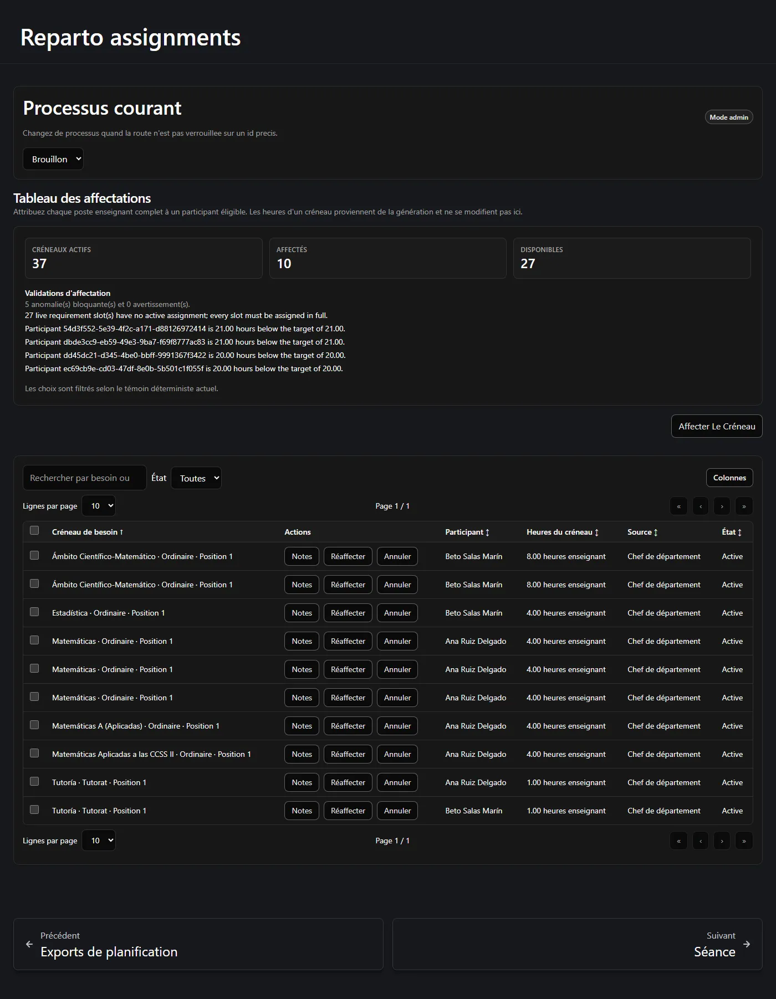
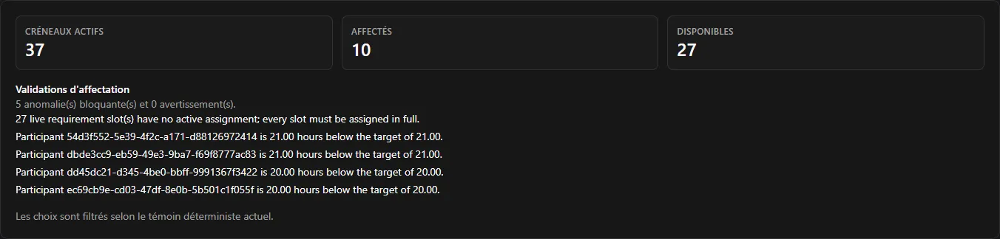

L'étape 3 distribue les postes générés par l'étape 2. Une ligne, c'est un participant qui
détient un poste complet, en entier.

**Sur cette page :** [le tableau](#le-tableau-daffectation) ·
[attribuer](#attribuer-un-poste-à-un-enseignant) ·
[pourquoi un choix est bloqué](#pourquoi-un-choix-est-proposé-bloqué-ou-absent) ·
[annuler](#annuler-une-affectation) · [réaffecter](#réaffecter-déplacer-un-poste) ·
[annulation groupée](#annuler-plusieurs-lignes-à-la-fois) ·
[terminer](#quand-létape-3-est-elle-terminée)

---

## Le tableau d'affectation

Ouvrez **Affectations**. Le tableau commence par le nombre de postes actifs, combien sont
attribués et combien restent libres, suivi des constats de validation du serveur lui-même.

Chaque ligne de la table indique :

| Colonne | Signification |
| --- | --- |
| **Créneau de besoin** | L'activité, son type et le numéro de position : *Matemáticas · Ordinaire · Position 1*. |
| **Participant** | Qui le détient. |
| **Heures du créneau** | Les heures enseignant que coûte ce poste. **Lecture seule.** |
| **Source** | Comment il a été attribué : *Chef de département*, ou le choix propre d'un enseignant. |
| **État** | *Active* ou *Annulée*. |

:::note[Il n'y a pas de case d'heures, et c'est délibéré]
Le tableau n'a ni saisie d'heures, ni type de partage, ni moyen de passer outre une
sur-affectation. Les heures viennent du poste généré et ne peuvent pas être modifiées ici. Un
poste se prend entier ou pas du tout.
:::

## Attribuer un poste à un enseignant

Appuyez sur **Attribuer un créneau**. La boîte de dialogue propose :

1. **Un poste** — uniquement ceux qui sont actifs et libres.
2. **Un participant** — uniquement ceux que le serveur accepterait réellement.

La seconde liste est la plus importante. Les participants qui ne peuvent pas prendre le poste
sélectionné **sont listés avec la raison** plutôt que retirés en silence, pour que vous voyiez
pourquoi :

| Raison | Signification |
| --- | --- |
| Le participant est inactif | Il n'est pas actif dans ce processus. |
| Il détient déjà un autre poste de la même activité | Deux postes d'une activité doivent aller à des enseignants différents. |
| Cela le ferait dépasser ses heures restantes | Le poste est plus grand que les heures qui lui restent, et il ne peut pas être coupé. |

Comme un poste ne peut pas être coupé, l'« ajustement exact » est vérifié partout : on ne
proposera jamais un poste de 4 heures à un enseignant à qui il reste 3 heures.

### Le filtre de choix sûr

Quand le plan est réalisable, le tableau consulte aussi la combinaison mémorisée par le serveur
et applique un filtre supplémentaire prudent. Un choix qui la casse de façon démontrable est
affiché **désactivé** ; le choix qu'utilise la combinaison elle-même est marqué **sûr** ; les
autres restent disponibles et sont vérifiés de manière faisant autorité par le serveur au
moment où vous confirmez.

Le tableau vous dit dans quel état il se trouve : *« Les choix sont filtrés selon le témoin
déterministe courant. »* Si cette information est périmée ou indisponible, le filtre **échoue en
mode fermé** : il cesse d'orienter plutôt que d'orienter à tort.

:::note[C'est une aide, pas la règle]
Le filtre est un confort. Le serveur revérifie chaque affectation au moment où vous la
confirmez, et c'est lui qui tranche. Il n'est par ailleurs jamais montré aux enseignants ni au
vidéoprojecteur : ceux-ci ne voient que l'état de préparation simple.
:::

## Pourquoi un choix est proposé, bloqué ou absent

Trois choses différentes peuvent empêcher une affectation, et elles se lisent différemment :

| Ce que vous voyez | Ce que cela signifie | Que faire |
| --- | --- | --- |
| Le participant apparaît avec une raison | Une règle métier refuse cette combinaison. | Choisissez un autre participant ou un autre poste. |
| Un refus mentionnant le témoin déterministe | La combinaison mémorisée n'a pas pu être ajustée à la volée pour ce choix. | Relancez l'évaluation de faisabilité depuis la page de Planification, puis réessayez. |
| Tout le tableau refuse les nouvelles affectations | Le plan est obsolète ou requiert une réconciliation. | Voir [Étape 2 — quand la dotation change](/fr/docs/reparto/stage-2-planning/#quand-la-dotation-change). |

Le deuxième cas mérite d'être anticipé. Un message tel que :

> *La sélection est bloquée car le témoin déterministe n'a pas pu être réparé
> (local_repair_not_found) ; une évaluation administrative de faisabilité est requise.*

n'est pas une panne. Il signifie que la vérification rapide à la volée n'a pas pu prouver que
les postes restants s'ajustent encore, et qu'elle réclame une réévaluation en bonne et due
forme. Lancez-la et poursuivez — voir
[Dépannage](/fr/docs/reparto/troubleshooting/#la-sélection-est-bloquée-car-le-témoin-déterministe-na-pas-pu-être-réparé).

## Annuler une affectation

**Annuler** libère un poste et rouvre le tour terminé de celui qui le détenait. Cela exige un
**motif écrit** et est réservé à **Administrateur** ou plus.

La ligne annulée reste au tableau à titre d'historique, sans boutons d'action : c'est la trace
d'une décision prise puis revenue en arrière, pas une erreur à effacer.

## Réaffecter : déplacer un poste

**Réaffecter** déplace un poste d'un enseignant vers un autre. C'est une seule opération
atomique, pas une suppression suivie d'une création, si bien que le poste n'est jamais
brièvement non attribué. Cela exige également un **motif écrit** et **Administrateur** ou plus.

La liste des participants de remplacement est filtrée comme pour une nouvelle affectation.

## Annuler plusieurs lignes à la fois

Plusieurs lignes actives peuvent être annulées ensemble à l'aide des cases de sélection de la
table. Une seule boîte de dialogue recueille **un** motif, l'enregistre sur chaque ligne et les
applique une à une.

Si l'une d'elles est refusée, l'exécution **s'arrête là** et signale combien sont passées. Les
lignes déjà annulées le restent : l'opération n'est pas annulée en bloc. Lisez le décompte du
résultat avant de supposer que tout a été libéré.

## Quand l'étape 3 est-elle terminée ?

Le panneau de validation du tableau vous dit ce qui reste en suspens. Le processus est complet
quand :

- chaque poste actif a une affectation active ;
- chaque participant actif a atteint sa cible **exactement** ;
- le plan n'est pas obsolète et ne requiert aucune réconciliation.

Ce n'est qu'alors que l'export final strict devient disponible — et il archive le processus.
Voir
[Versions, exports et audit](/fr/docs/reparto/versions-exports-audit/#lexport-final-des-affectations).

:::note[Les constats nomment le participant]
Les messages de validation composés par le serveur utilisent le nom affiché du participant,
avec son identifiant seulement comme repli si la fiche n'est plus disponible.
:::

---

**Précédent :** [← Étape 2 — Planification](/fr/docs/reparto/stage-2-planning/) ·
**Suivant :** [La séance, l'espace enseignant et l'écran partagé →](/fr/docs/reparto/meeting-and-lan/)
