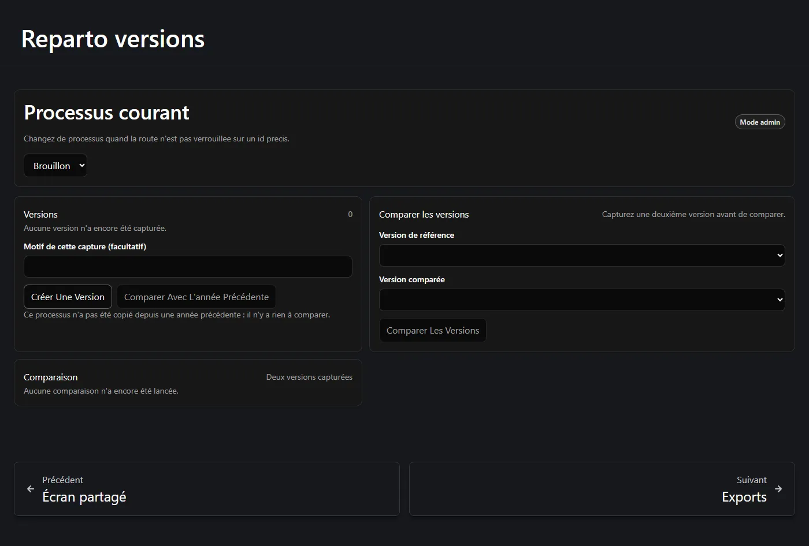
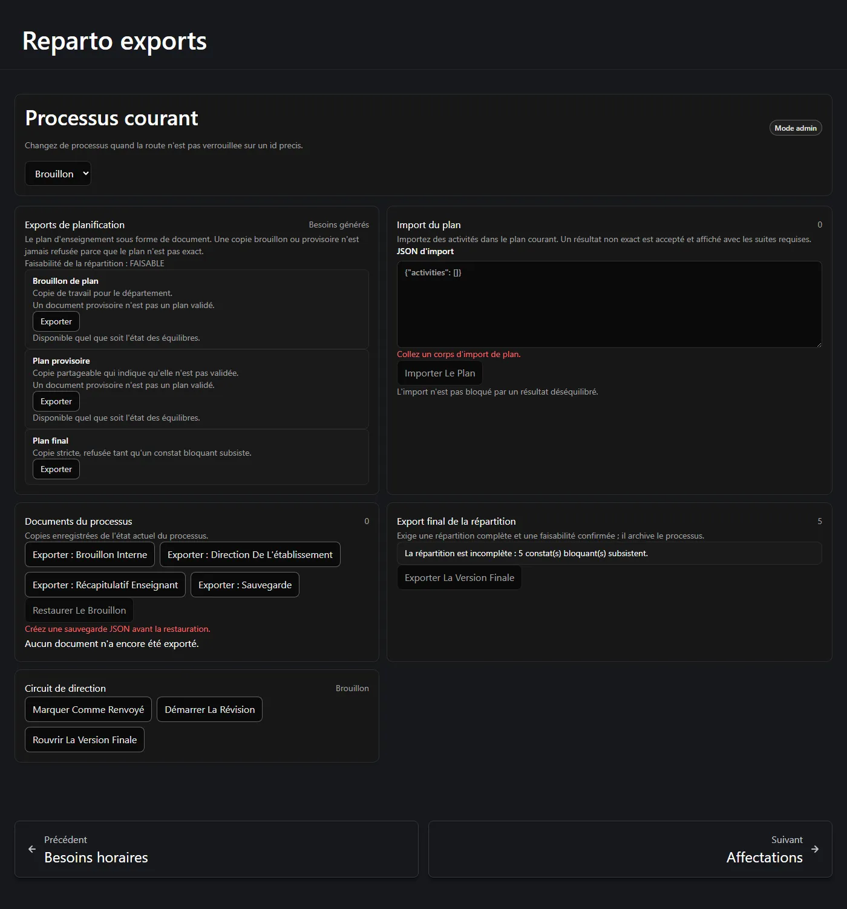
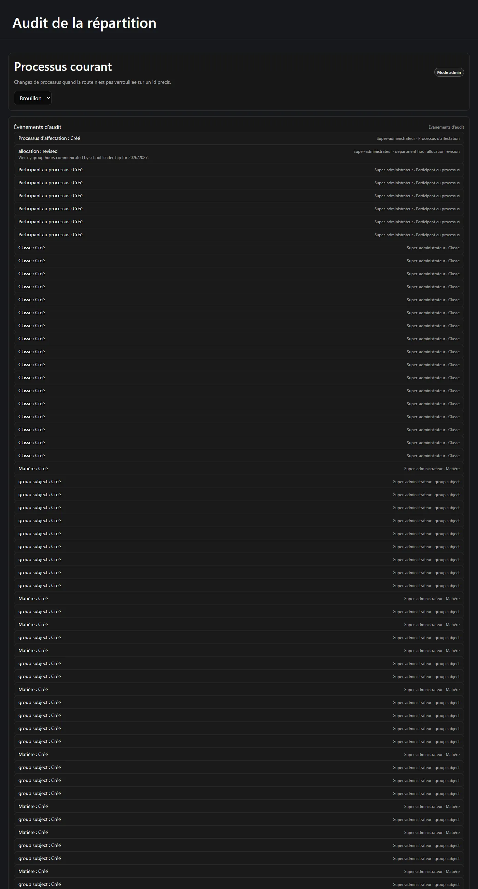

Ces trois écrans sont la façon dont un reparto sort de l'application : sous forme d'instantané
auquel revenir, de document à envoyer, et de registre de qui a fait quoi.

**Sur cette page :** [versions](#versions) · [comparaison](#comparer-deux-versions) ·
[exports de planification](#exports-de-planification) ·
[import](#import-de-planification) ·
[documents et sauvegarde](#documents-du-processus-et-sauvegarde) ·
[export final](#lexport-final-des-affectations) · [audit](#la-trace-daudit)

---

## Versions

Une **version** est un instantané immuable de tout le processus, pris à la demande. Ajoutez-y
une note facultative expliquant pourquoi vous l'enregistrez, puis validez.

Un instantané capture tout ce qui compte :

- les révisions de dotation et celle qui était courante ;
- le plan d'enseignement et son état ;
- la matrice classe-matière ;
- les activités d'enseignement et leurs classes liées ;
- les deux récapitulatifs horaires ;
- les postes générés ;
- les heures de base et supplémentaires de chaque participant ;
- l'état de réconciliation.

## Comparer deux versions

La comparaison est la réponse du serveur lui-même, pas une différence de texte. Elle rend compte
de **neuf dimensions nommées**, chacune avec un écart signé lorsque cela s'applique :

| Dimension |
| --- |
| La dotation de la direction a changé |
| Les heures de classe ont changé |
| La charge enseignante a changé |
| La catégorie d'une matière a changé |
| Une activité a été ajoutée ou retirée |
| Un lien de classe a été ajouté ou retiré |
| Le nombre de postes enseignants a changé |
| La cible base/supplémentaires d'un participant a changé |
| La génération des besoins a changé |

Une dimension peut se lire **non comparable** — par exemple un écart de dotation lorsque l'un des
deux côtés n'a aucune dotation. C'est une vraie réponse, distincte de « aucun changement ».

Le même écran pilote également la **comparaison avec l'année précédente**, qui rend possible un
bilan d'une année sur l'autre.

:::note[Ce que « copier de l'an dernier » apporte et n'apporte pas]
Copier depuis une année antérieure apporte les matières et leurs valeurs par défaut, les classes,
les lignes de la matrice et les participants **sans** leurs autorisations d'heures
supplémentaires. Cela n'apporte délibérément **pas** la dotation de la direction comme révision
active, ni aucune affectation, séance, tour ou autorisation d'heures supplémentaires. Une
dotation antérieure peut être affichée à titre de suggestion, jamais adoptée en silence.
:::

## Exports de planification

La page **Exports** sépare trois familles de documents, car elles suivent des règles différentes.

Les **exports de planification** sont le plan d'enseignement sous forme de document :

| Document | Règle |
| --- | --- |
| **Brouillon de planification** | Copie de travail pour le département. *Disponible quoi que disent les équilibres.* |
| **Plan provisoire** | Copie partageable qui indique qu'elle n'est pas validée. *Disponible quoi que disent les équilibres.* |
| **Plan final** | Strict. Refusé tant qu'un constat bloquant subsiste. |

:::note[Le brouillon et le provisoire ne sont jamais retenus]
Un plan déséquilibré, inexact ou obsolète peut tout de même être enregistré, importé, exporté en
brouillon ou en copie provisoire, transmis provisoirement à la direction, inclus dans une
sauvegarde et versionné. Être imparfait bloque *le démarrage de l'étape d'affectation* ; cela ne
bloque pas sa mise par écrit. Chaque offre provisoire imprime la faisabilité d'affectation
courante pour que le destinataire sache ce qu'il a en main : *« Assignment feasibility:
FEASIBLE »*.
:::

## Import de planification

L'**import de planification** réinjecte un document de planification dans le plan courant. Collez
le contenu et importez.

L'import n'est délibérément **pas** conditionné aux équilibres : *« L'import n'est pas bloqué par
un résultat déséquilibré. »* Ce que vous récupérez est l'équilibre double faisant autorité après
l'import, plus tous les constats consécutifs, de sorte qu'un import imparfait reste visible au
lieu d'être accepté en silence.

## Documents du processus et sauvegarde

Les **documents du processus** sont des copies enregistrées de l'état courant du processus, et
pas seulement du plan :

- **Exporter le brouillon interne** — pour l'usage propre du département.
- **Exporter pour la direction** — la copie qui remonte.
- **Exporter le récapitulatif enseignant** — le récapitulatif par enseignant.
- **Exporter une sauvegarde** — une sauvegarde complète au format JSON.
- **Restaurer un brouillon** — restaure une sauvegarde dans un processus à l'état brouillon.

La restauration est délibérément malaisée. Elle n'est disponible que derrière une confirmation
ciblée, elle restaure dans un processus **brouillon**, et la page refuse de la proposer tant
qu'une sauvegarde n'existe pas : *« Créez une sauvegarde JSON avant de restaurer. »*

Une sauvegarde conserve la précision décimale, restaure l'historique de dotation, le plan et les
activités, et ne contient jamais aucun secret ni identifiant.

Le panneau **Flux avec la direction** porte les étapes de niveau processus qui suivent l'envoi
d'un reparto : *Marquer comme retourné*, *Démarrer une révision* et *Rouvrir le final*.

## L'export final des affectations

Celui-ci est strict, et il est à part pour une raison.

> *Nécessite un reparto complet et une faisabilité confirmée, et archive le processus.*

Il ne devient disponible que lorsque tous les postes actifs sont attribués, que tous les
participants ont atteint leur cible exactement et que la faisabilité est confirmée. D'ici là, le
panneau énumère précisément ce qui manque sous forme de constats stables et dénombrables :

> *Le reparto est incomplet : il reste 5 constat(s) bloquant(s).*

Comme il **archive le processus**, il demande en outre une confirmation explicite. Archivé est
terminal : un processus archivé ne peut pas être rouvert
([voir l'étape 1](/fr/docs/reparto/stage-1-configuration/#rouvrir-un-processus-clos)).

## La trace d'audit

**Audit** énumère ce qui est arrivé à ce processus, dans l'ordre, avec l'auteur de chaque action.

Tout ce qui compte est enregistré : la création du processus, les révisions de dotation, les
autorisations d'heures supplémentaires et leurs motifs, les verrouillages du plan, les
générations, les réconciliations, les affectations, les annulations et les réaffectations.

Le motif que vous avez saisi lorsque l'application vous l'a demandé est conservé ici. Il est
visible du chef de département et n'est **jamais** montré aux enseignants ni sur l'écran partagé.

---

**Précédent :** [← La séance, l'espace enseignant et l'écran partagé](/fr/docs/reparto/meeting-and-lan/) ·
**Suivant :** [Limites et notes d'exploitation →](/fr/docs/reparto/limitations/)
